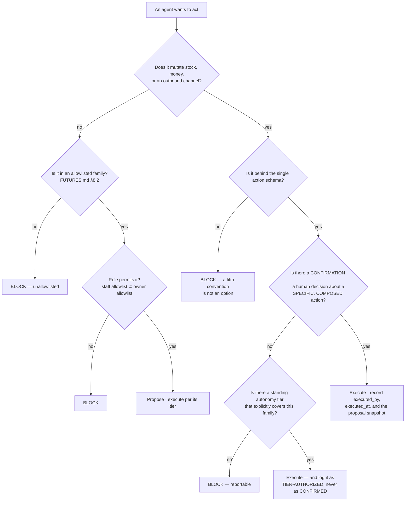

# Action Safety & the Human Gate — Directive

How *this* team decides. The shape is a **classifier**, not an approval chain: the
question is never "should this be allowed", it is "**what kind of action is this, and
therefore what does it require**".

## The classifier

**Node `F` carries this team's core definition.** A **confirmation** is a human
decision about a *specific, composed* action. A standing approval for a class of future
actions is an **autonomy tier**. Both are legitimate. **Conflating them is the
failure** — and it is live today, because `recurring_order_agent.py`'s own feature list
says *"auto-execution with manager approval"* and it is genuinely unclear which of the
two that means.

Node `I` is why the distinction is operational rather than philosophical: a
tier-authorized execution must **never appear in the audit trail as a confirmation**.
The audit trail's value is entirely in that distinction.

## Decision rights

| Decision | Ours? | Note |
|---|---|---|
| Whether an action family requires a human tap | **Yes** | The core mandate |
| Whether the guarantee itself may be relaxed | **No — and nobody's** | `FUTURES.md` §8.1 is not a tunable. Changing it is a supersede-ADR, the way [[README]] §5 treats the agent-native-UI verdict |
| The allowlist contents | **Yes**, with named co-owners | Guest PII → [[compliance-privacy-charter|compliance-and-privacy-charter]]; billing → Finance |
| The confirmation **surface** | **No** | → [[design-charter]] |
| The **friction floor** on money/stock families | **Yes** | Contested; see [[action-safety-the-human-gate-charter]] §Seam |
| Executing the action | **No** | *"Existing services are the executors"* — `FUTURES.md` §8.1 |
| Whether the proposal was **good** | **No** | → [[agent-evaluation-gates-charter]]. Permitted ≠ correct |
| Lifecycle, retry, DLQ | **No** | → [[harness-runtime-charter]]. Deliberately separate: the team that executes must not decide whether execution is permitted |

## Three standing rules

**1. This team cannot waive its own gate.** A team that could waive its own gate is not
a gate. Requests for a temporary exemption — for a demo, a customer, a deadline — are
escalations, not decisions, and the escalation goes outside this team.

**2. Autonomy tiers move asymmetrically.** Moving a family **toward more autonomy**
requires an ADR. Moving it **toward less** is a PR. The asymmetry is deliberate:
loosening should be slow and visible, tightening should be fast and cheap.

**3. The allowlist must be able to shrink.** Every addition names what it would take to
remove it. The five families gated hardest by `FUTURES.md` §8.2 — *"mass deletes,
changing billing, granting permissions, sending email without draft review, guest PII
exports"* — require an ADR to move at all. A quarter with additions and zero removals
is a finding ([[action-safety-the-human-gate-premortem]] #4).

## What this team measures that is not compliance

Counting unconfirmed mutations is the easy half, and it will read zero almost always.
The hard half — and the reason this is a team rather than a lint rule — is whether the
confirmations that *did* happen were **decisions**.

So: `median_time_to_confirm` **as a distribution**, and `rejection_rate`. A healthy
gate has a long tail of slow confirmations, because some were actually thought about,
and a non-trivial rejection rate, because some proposals were wrong. A spike near zero
with no tail and a 100% confirmation rate describes a gate that is architecturally
present and behaviorally absent — passing every compliance check on the way down.

## Escalation trigger

1. **`safety.unconfirmed_mutation_count` non-zero.** Immediate, and it is reported as
   an **incident**, not filed as a bug (`technology.md:443-445`).
2. **Anyone proposes relaxing the `FUTURES.md` §8.1 guarantee.** Straight to
   [[decision-office-charter]] as a supersede-ADR. Not negotiable at team level, not at
   department level.
3. **The `time_to_confirm` distribution loses its long tail**, or `rejection_rate`
   approaches zero.
4. **A new mutation path ships outside the action schema.** A fifth convention is not
   an option; the point of the schema is that there is one.
5. **A quarter passes with allowlist additions and zero removals.**
6. **An auto-execution path is found outside the one-tap action center.**
   `recurring_order_agent.py` is the open instance today.

For [[red-team-charter]]: attack #1, not the bypass. The cheapest demonstration that
this team has failed is a distribution plot of `time_to_confirm` — and it will be
available before any incident is.
