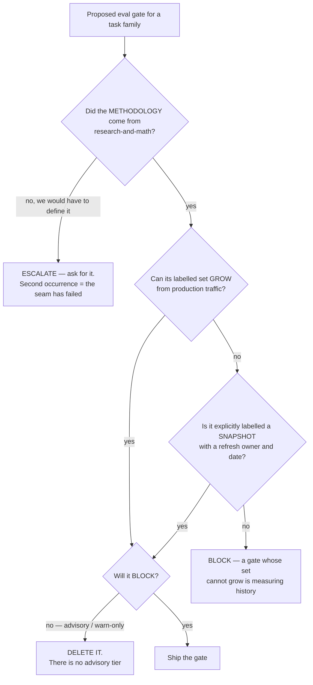
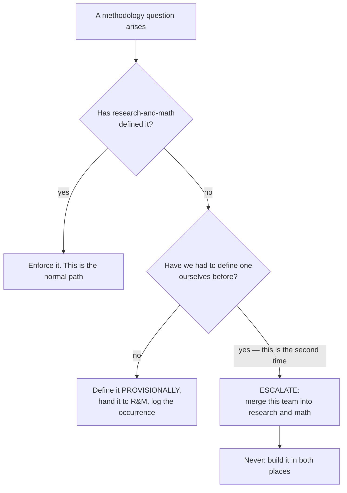

# Agent Evaluation & Gates — Directive

How *this* team decides. Two shapes, because this team has two jobs: deciding whether
a gate may exist, and deciding whether this team should.

## Shape 1 — may this gate exist?

**Node `C` is `eval_merge_policies.py:9-16` promoted from a comment to a rule:**
*"Every new menu added to `datasets/menu_corpus/extracted` strengthens this gate
automatically; nobody hand-labels anything."* That sentence is the most valuable line
in the repo's evaluation corpus, and it currently exists in exactly one file.

### The blocking rule — no advisory tier

**A gate blocks, or it is deleted.** If a gate is too noisy to block, the acceptable
responses are: fix it, narrow its scope, or remove it. All three leave an honest state.

An advisory gate does not. It prints a warning into a CI log nobody reads while
appearing on a dashboard as coverage — a control that has become a decoration, which is
the species of failure this whole department is organised against
([[agent-evaluation-gates-premortem]] #3). The tell is the word *temporarily* in a
commit message, and the first occurrence is the one to escalate, not the fourth.

### The confidence rule

A confidence score may gate **autonomy** only once it has a **calibration curve from
paired confidence/outcome data**. Until then it is a **sort key, not a threshold** — it
may order a review queue; it may not decide whether a human sees something. This
applies today to `services/quality_scorer.py`, `services/field_confidence.py`, and
`governance.py:227 compute_overall_confidence`.

## Shape 2 — should this team exist?

**The threshold is two, and it is deliberate.** Once is a coordination miss — R&M was
busy, a release was waiting, someone wrote a working definition. Twice is the
methodology/operations line failing in the way `technology.md:402-406` anticipated, and
the fix it names is a **merge**:

> *"If that line proves unworkable, the fix is to merge this team into Research &
> Math — not to duplicate it."*

`technology.md:845`: **"Duplication here is worse than either answer."** This team is
required to advocate for its own dissolution when the trigger fires. That is an odd
thing to write into a charter and it is the most important sentence in this directive.

> ✅ **Prerequisite met: the fork's ID is `TECH-F3`.** `technology.md:845` originally
> numbered it OD-21; `OPEN-DECISIONS.md:142` already spends OD-21 on the Obsidian
> structural workflow, so the Decision Office renamespaced it ([[FORK-REGISTRY]]).
> **A fork that cannot be cited cannot be closed**, and an uncloseable fork is exactly
> how duplication becomes permanent. → [[decision-office-charter]].

## Decision rights

| Decision | Ours? | Note |
|---|---|---|
| Whether a gate blocks CI | **Yes** | And it blocks, or it is deleted |
| What the pass threshold is for a task family | **Yes**, operationally | The *methodology* is R&M's |
| **What a doneability verdict means; NF-A definitions** | **No** | → [[research-math-charter|research-and-math-charter]]. Enforcing ≠ defining |
| Whether a model substitution passes | **Yes** | The second key in [[model-routing-inference-economics-directive]]'s two-key gate |
| Fixing an agent that fails a gate | **No** | → [[agent-fleet-charter]]. We report the regression; they fix the agent |
| Grading a data row | **No** | → `[[substrate-quality-coverage-charter|dat-substrate-quality]]` |
| Whether this team should exist | **We escalate it**, we do not decide it | Shape 2 |

## Escalation trigger

1. **Second occurrence of this team defining rather than enforcing.** The escalation is
   *"merge"* (Shape 2).
2. **A gate is proposed as advisory**, or an existing gate is made non-blocking.
3. **A cost saving is proposed for a task family with no verdict** — arriving from
   [[model-routing-inference-economics-directive]] §1. Our answer is *not yet*, and the
   escalation is the coverage gap.
4. **A gold set has not grown in a quarter** while its task family shipped changes.
5. **A confidence threshold is used as an autonomy boundary with no calibration
   curve.**
6. **Coverage is published as one aggregate number** anywhere outside this team.

For [[red-team-charter]]: the attack surface here is a green coverage number over a
corpus that only contains the easy half. Start by asking which task family the number
excludes.
