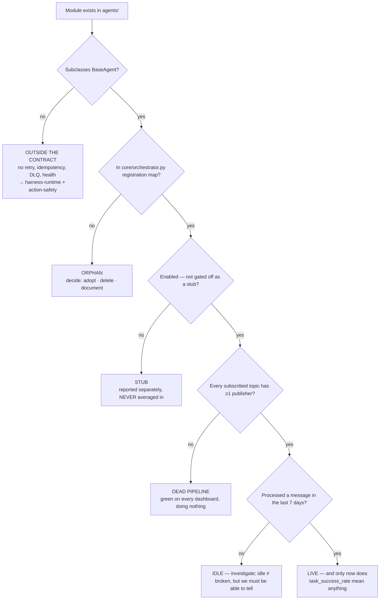

# Agent Fleet — Directive

How *this* team decides. The shape is a **liveness ladder**, because this team's
recurring mistake is not choosing wrong — it is treating a module that exists as a
module that works.

## The ladder — an agent's real state

**Only the bottom node counts.** `fleet.live_agent_ratio` counts `LIVE`, and every
other node is published as its own number rather than folded in. Each rung is a real
failure the repo has hit or is one commit away from hitting — `S4` is
`core/orchestrator.py:198-206` verbatim, and `S1` is
`agents/recurring_order_agent.py:14` today.

## Decision rights

| Decision | Ours? | Note |
|---|---|---|
| Agent behavior, prompts, subscriptions | **Yes** | The core mandate |
| Whether an agent is registered and enabled | **Yes** | `core/orchestrator.py:174-211` |
| Whether an agent's output is *good enough* | **No** | → [[agent-evaluation-gates-charter]]. A team that grades its own agents is what [[ORG_STRUCTURE]] §3 rejects |
| Retry policy, DLQ mechanics, lifecycle | **No** | → [[harness-runtime-charter]] |
| Which model an agent uses | **No** | → [[model-routing-inference-economics-charter]] |
| Whether an agent may execute a mutation unconfirmed | **No** | → [[action-safety-the-human-gate-charter]]. Not tunable |
| Guardian agent **code** | **Yes** | `state_invariant_enforcer`, `drift_agent`, `inequality_detector` + 2 stubs |
| Guardian **findings** and alert thresholds | **No** | → `[[sre-state-integrity]]` — OD-24, open |
| Deleting an agent module | **Yes**, with an ADR | Deletion is cheap; a silently rotting orphan is not |

## Three standing rules

**1. Stubs are never averaged in.** `nf_a.task_success_rate` reports stubs separately
(`technology.md:348-350`). The reason is arithmetic, not presentation: a stub whose
`process_message()` logs and returns **succeeds every time**. Including stubs inflates
the fleet figure rather than diluting it, which is the worst possible direction for a
number that will be read by someone writing a deck.

**2. Registration is necessary, never sufficient.** The repo has already paid for this
lesson once (`core/orchestrator.py:198-206`): registration exposed two further defects
that the missing registration had been hiding. So a "wire it up" change is not done
when the agent appears in the map — it is done when its subscriptions resolve to real
publishers and it has processed a real message.

**3. A new agent module lands with its registration in the same PR, or not at all.**
Three orphans exist because that rule did not. Passing tests are exactly what make an
orphan invisible; CI will never complain about it.

## Escalation trigger

Escalate to [[ai-orchestration-directive]], and onward to
[[decision-office-charter]], when:

1. **An agent count is published outside `services/agent-orchestrator/` without the
   live/stub split.** Escalate on the *format*, before the number is wrong — that is
   the whole point of [[agent-fleet-premortem]] #1.
2. **A customer or roadmap commitment names a stub agent.** Immediate, and it goes to
   Product, not only to Engineering.
3. **A guardian agent's finding rate is zero for a full review period.** Either
   excellent news or a broken detector, and neither team can currently tell. This is
   the operational form of OD-24.
4. **`fleet.orphan_modules` rises above 3**, or an orphan decision is deferred twice.
5. **A prompt change is proposed with no eval verdict available for its task family.**
   The escalation is not about the prompt — it is that
   [[agent-evaluation-gates-charter]] has no coverage for a family we are shipping
   changes into.
</content>
