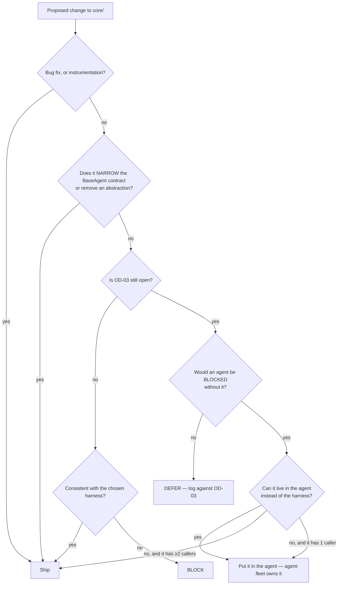

# Harness & Runtime — Directive

How *this* team decides. The shape is a **diet gate**, because the dominant fact about
this team is not what to build — it is that OD-03 makes some building a bet.

## The diet gate

**The pivot is node `F`.** While OD-03 is open, "would be nice" and "an agent is
blocked" are treated as different categories, and only the second buys a widening of
`core/`. That is not conservatism for its own sake: `harness.core_lines_added_since_od03_opened`
is the size of the write-off if the fork resolves away from in-house
([[harness-runtime-premortem]] #1).

**Node `G` carries the two-caller rule.** An abstraction in `core/` with exactly one
caller is a feature of that caller, not of the harness. Two callers is the floor for a
harness concept — the same anti-sprawl logic [[README]] §3.3 applies to skills, one
layer down. It exists because the quiet way OD-03 resolves itself is by accretion:
enough single-caller abstractions and "extend in-house" becomes the only option that
can express what the fleet already depends on ([[harness-runtime-premortem]] #4).

## Decision rights

| Decision | Ours? | Note |
|---|---|---|
| Retry policy, backoff, circuit-breaker thresholds | **Yes** | The mechanism |
| Whether a *sustained* retry rate is acceptable | **No** | That is a defect signal → [[agent-fleet-charter]] |
| Registry tiers and startup order | **Yes** | `agent_registry.py:27,401` |
| Whether an agent is registered *at all* | **No** | → [[agent-fleet-charter]] |
| DLQ mechanics — declaration, routing, replay | **Yes** | `message_bus.py:524`, `base_agent.py:791` |
| Triage verdict on a DLQ entry | **Shared** | We classify; the assignee owns the fix |
| Saga/compensation mechanics | **Yes** | `base_agent.py:823-905` |
| Whether an action may execute without a human tap | **No** | → [[action-safety-the-human-gate-charter]]. Deliberately not ours: the team that executes actions must not decide whether execution is permitted (`technology.md:432-433`) |
| Deploys, paging, uptime | **No** | → [[reliability-charter]] |
| **The OD-03 answer** | **No** | We run the bake-off. We do not pick |

## The retry/defect boundary — stated because it will be argued

The harness's job is to make failure **survivable**, not to make it **quiet**. Those
diverge exactly when a retry succeeds: the user sees success, the harness sees a
recovered failure, and the agent's defect is now invisible in every aggregate.

So: **a retry that succeeds is still a defect signal**, and this team owns saying so
out loud even when the success rate looks fine. Mechanically, per-agent retry rate
with a per-agent baseline — never a fleet aggregate, which is where
[[harness-runtime-premortem]] #5 hides.

## Escalation trigger

Escalate to [[ai-orchestration-directive]], and onward to
[[decision-office-charter]], when:

1. **A change cannot pass the diet gate but an agent genuinely cannot ship without
   it.** The escalation is *"OD-03 is now blocking delivery"* — which is the most
   useful thing that can happen to a stale fork.
2. **The scheduled bake-off date passes without the bake-off running.**
3. **DLQ depth is monotonic for two consecutive weekly reviews.** No consumer, or a
   consumer that does not close entries. Either way, `loop-harness-health` is not
   closing.
4. **`harness.agents_without_harness_guarantees` rises above 1.** One is a known,
   documented exception. Two is a pattern, and a pattern means the harness contract is
   being routed around rather than used.
5. **A `core/` abstraction reaches its second caller after being deferred under the
   two-caller rule.** Not a failure — a signal the rule worked, and a prompt to
   promote it deliberately rather than by accident.
