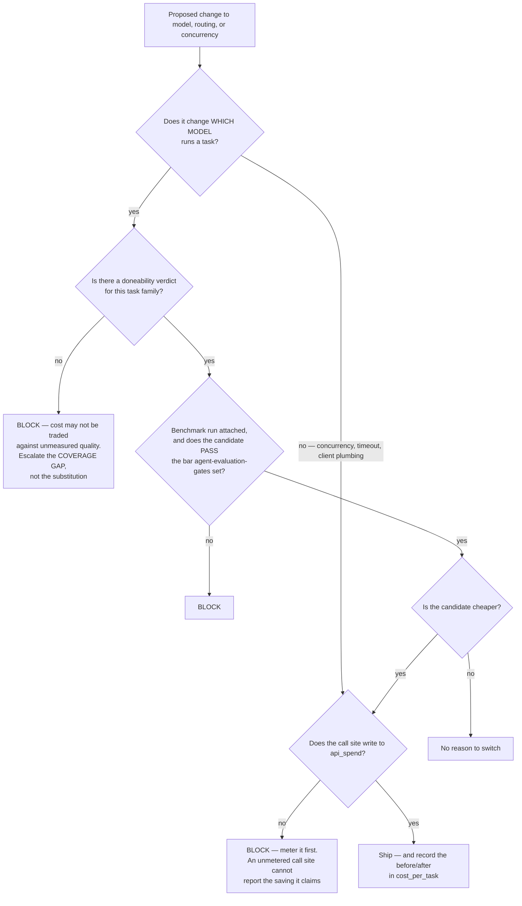

# Model Routing & Inference Economics — Directive

How *this* team decides. The shape is a **two-key gate**, because the single failure
this team must not have is trading measured cost against unmeasured quality.

## The two-key gate

**Two keys, held by two teams.** This team turns key one: *is it cheaper, and is the
call metered*. [[agent-evaluation-gates-charter]] turns key two: *does it pass*. The
gate cannot be opened from one side, and that is the entire reason these are separate
teams rather than one (`technology.md:399-400`).

**Node `M` is the rule most likely to be argued with**, because it blocks work that
looks purely beneficial. It stands: a call site that does not write to `api_spend`
cannot report the saving it claims, so a "cost improvement" there is an assertion, not
a measurement. Metering first is not bureaucracy — it is the difference between the
two.

## Decision rights

| Decision | Ours? | Note |
|---|---|---|
| Client construction, concurrency limits, timeouts | **Yes** | `model_clients.py:52,73,93`; semaphore at `:93` |
| Retry policy **at the model boundary** | **Yes** | [[harness-runtime-charter]] owns retry at the message boundary |
| Which model runs which task | **Yes**, subject to the two-key gate | Never on price alone |
| **What "passes" means** | **No** | → [[agent-evaluation-gates-charter]]. The load-bearing non-goal |
| Token accounting and the `api_spend` schema | **Yes** | `spend_logger.py`; table at baseline migration `:2231` |
| Prompt content | **No** | → [[agent-fleet-charter]] |
| Whether an endpoint is guarded | **No** | → [[security-charter]] + Engineering. **We own noticing the spend** |
| Turning cost-per-task into a customer price | **No** | → `[[unit-economics-pricing-charter|fin-unit-economics-pricing]]` |
| Adopting a non-Anthropic provider | **No, not yet** | Held here until OD-03 closes; OD-04 (`OPEN-DECISIONS.md:25`) no longer names it as the blocker |

## Two standing rules

**1. Cheapest that passes, never cheapest.** The phrase is from
`technology.md:399-400` and it is a constraint, not a slogan. Operationally: when no
verdict exists for a task family, the answer to "can we use a cheaper model here" is
**not yet** — and the escalation is *the missing coverage*, not the substitution.

**2. Report `routed_client_share` weighted by spend, always alongside the count.**
Consolidating the three cheapest call sites first produces a flattering count and
leaves the bill untouched. The two numbers diverging **is**
[[model-routing-inference-economics-premortem]] #2, visible from week one.

## Escalation trigger

Escalate to [[ai-orchestration-directive]], and onward to
[[decision-office-charter]], when:

1. **A cost saving is proposed for a task family with no doneability verdict.** The
   escalation is the coverage gap. Deferring the saving is the correct interim answer,
   and saying so out loud is this team's job.
2. **`routed_client_share` by count and by spend diverge by more than a modest
   margin.** The migration is going down the easy path.
3. **An `api_spend` row is written with no task correlation ID**, after the correlation
   ID ships. That is the join quietly not happening.
4. **Cost per restaurant per day crosses an anomaly threshold** — the abuse signal for
   [[README]] §0 finding 1. Goes to [[security-charter]] the same day, not to a
   weekly review.
5. **A per-tenant or per-restaurant routing override is proposed.** Not because it is
   wrong, but because the first one is where a declarative policy starts becoming a
   program nobody can reason about ([[model-routing-inference-economics-premortem]] #5).
   It needs a decision, not a merge.
6. **Anyone proposes evaluating a non-Anthropic model before OD-03 closes.**
   OD-04 (`OPEN-DECISIONS.md:25`) no longer puts the roster downstream of the harness
   choice, so this hold is this directive's own and lifting it takes a decision.
