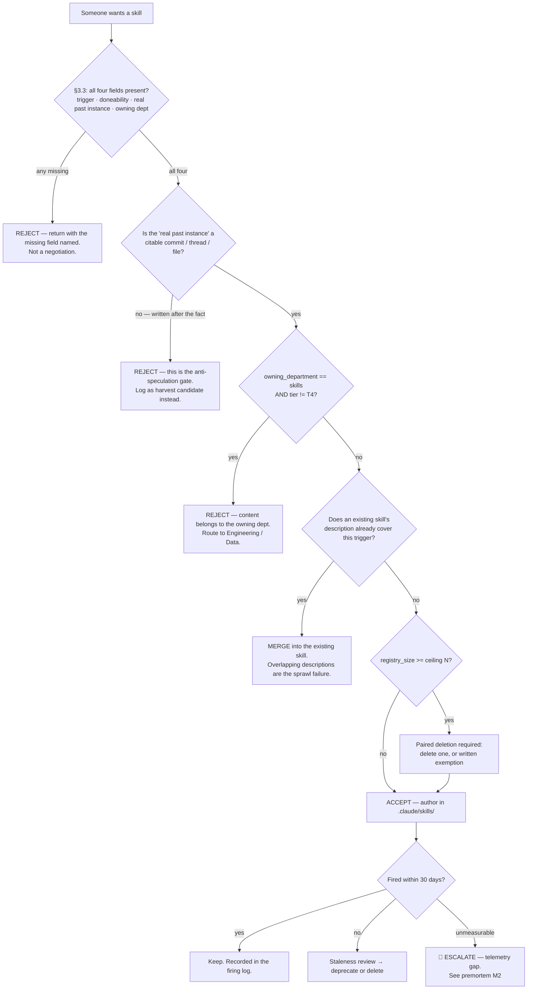

# Skills — Directive

How *this* department decides. The shape is a **gate with a paired-deletion clause**,
because the department's whole reason to exist is that unconstrained creation is the
default and constraint is not.

## The gate

## Decision rights

**Decided here, no escalation:**

- Accept, reject, or merge a proposed skill against the §3.3 protocol.
- The `SKILL.md` contract: required frontmatter, body conventions, review checklist.
- Deprecate or delete a skill whose firing evidence is absent for 30 days.
- Where a skill file physically lives and how it is indexed.
- Whether a `scripts/` procedure is a harvest candidate.

**Not decided here — escalates to `OPEN-DECISIONS.md`** (CLAUDE.md §0.1: nothing is
decided until it is written in `.planning/decisions/`):

| Escalation | Why it is not ours |
|---|---|
| The registry ceiling **N** | It is the brake's setting; a department that sets its own brake has no brake. Founder call. |
| Who runs the weekly skill-health job | [[README]] §6 says Research & Math, [[technology]] §4.2 says us. Cross-department; see [[skills-agenda-full]] §Questions. |
| **OD-14** root `SKILLS.md` retire-vs-rewrite | Named open decision. |
| **OD-22** three teams or two | Named open decision. |
| Adding `skill_id` to the NF-A event | Schema is [[research-and-math-charter]] / OD-11's; we are a consumer requesting a field. |
| Staffing [[skill-harvesting-charter]] early | Its trigger is written; overriding a written trigger is a decision, not a judgement. |

## Escalation trigger

Escalate immediately, without waiting for a review cycle, when **any** of these fire:

1. **Telemetry gap blocks a deletion.** A skill is 30 days old and firing is
   unmeasurable. This is [[skills-premortem]] M2 arriving; it must surface as an
   escalation rather than a defaulted "keep".
2. **A quarter closes with additions > 0 and deletions == 0.** M1. Report to
   [[red-team-charter]] as well as the founder — a department reporting only to
   itself on its own core failure mode is the arrangement [[ORG_STRUCTURE]] §3 rejects.
3. **`skills.script_to_skill_ratio` stays above 1:1 for two quarters.** M3: the
   department is being routed around, and the fix is not more enforcement.
4. **A domain department asks us to write a skill's body.** M4. Say no once in
   writing, then escalate if it recurs — the erosion is by kindness, so the counter
   has to be procedural.
5. **2026-11-24 checkpoint: fewer than 5 committed, firing skills.** Trigger the
   self-retirement conversation in [[skills-premortem]] M5. Pre-agreed, dated.

## Tie-break rule

When accept and reject are genuinely balanced, **reject**. The asymmetry is
deliberate and mirrors the false-merge asymmetry in `scripts/eval_merge_policies.py`:
a skill that should exist and does not costs one request's inconvenience; a skill
that should not exist and does costs selection quality for every invocation
thereafter, forever, and will not be deleted (M1). These two errors are not
symmetric and must never be summed into one score.
