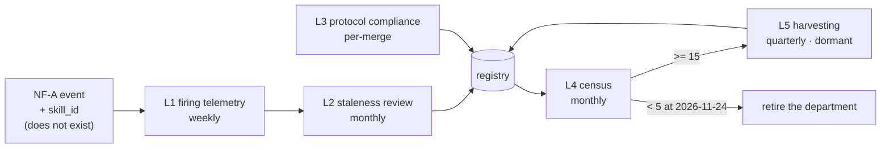

# Skills — Loops

Every loop names its close-time. A loop that cannot state how fast it closes is a
diagram, not a loop ([[ORG_STRUCTURE]] §5).

> **Honest status:** five loops, **none currently closing**. L1 and L2 are blocked
> on the same missing thing — a firing signal. That single dependency is the
> department's critical path, and stating it here rather than burying it in a plan
> is the point of this file.

---

## L1 — Skill firing telemetry → registry contents

The core loop. Nothing else in this department works until this one does.

```yaml
type: loop
id: skill-firing-telemetry
owner: skills
measures: [skills.firing_rate_30d, nf_a.skill_id]
changes: [skills.registry, skills.deprecation_queue]
inputs_from: [ai-orchestration, reliability-sre]
outputs_to: [skills, engineering, data]
close_time: weekly
status: blocked
```

**Blocked on:** `skill_id` does not exist on the NF-A event, and L4 emits nothing
([[README]] §1). Until then `firing_rate_30d` is undefined, not zero — the
distinction matters, because undefined defaults to "keep" and zero defaults to
"delete".

---

## L2 — 30-day staleness review → deletion

```yaml
type: loop
id: skill-staleness-review
owner: skills
measures: [skills.firing_rate_30d, skills.deletions_per_quarter]
changes: [skills.registry]
inputs_from: [skills]
outputs_to: [skills, ai-orchestration]
close_time: monthly
status: blocked
```

**Rule:** [[README]] §3.3 — a skill that has not fired in 30 days is reviewed for
deletion. **Success criterion is deletions, not reviews.** A month of thorough
reviews producing zero deletions is [[skills-premortem]] M1, not diligence.
Blocked on L1.

---

## L3 — Protocol compliance at the gate

The one loop that can close today, because it needs no telemetry — only a reviewer
and a checklist.

```yaml
type: loop
id: skill-protocol-compliance
owner: skills
measures: [skills.protocol_compliance_rate]
changes: [skills.contract, skills.ci_guard]
inputs_from: [engineering, data, ai-orchestration, security]
outputs_to: [skills]
close_time: per-merge
status: proposed
```

**Close-time is per-merge, deliberately.** A compliance loop that closes weekly
lets a week of non-compliant skills land first. The enforcement target is a
`check_*.sh`-grade CI guard in `.github/workflows/ci.yml`, alongside the five that
already exist.

---

## L4 — Registry census against the harvesting trigger

```yaml
type: loop
id: skill-registry-census
owner: skills
measures: [skills.registry_size, skills.script_to_skill_ratio]
changes: [skills.team_staffing, skills.harvest_queue]
inputs_from: [skills]
outputs_to: [people-and-agent-ops, decision-office]
close_time: monthly
status: proposed
```

**Two readings from one count.** Against **15**, it decides whether
[[skill-harvesting-charter]] staffs ([[technology]] §4.3). Against **5 at
2026-11-24**, it decides whether this department continues to exist
([[skills-premortem]] M5). Both thresholds are written; neither is a judgement call
at census time.

---

## L5 — Harvest candidates from real past work

Dormant by design. Documented now so the loop is not invented under pressure later.

```yaml
type: loop
id: skill-harvest-candidates
owner: skills
measures: [skills.harvested_firing_rate_30d, skills.script_to_skill_ratio]
changes: [skills.harvest_queue, skills.registry]
inputs_from: [engineering, data, reliability-sre]
outputs_to: [skills]
close_time: quarterly
status: dormant
```

**Gate:** does not run until L4 reports ≥15 skills. Until then, harvesting is a
recurring task inside [[skill-registry-authoring-charter]], not a loop with an owner.
**Anti-pattern this loop must avoid:** harvesting all 59 `scripts/` entries at once
and handing L2 fifty-nine stale skills on day one — sprawl delivered by the
mechanism meant to prevent it ([[technology]] §4.3 premortem).

---

## Loop dependency



**Read this as: one missing field blocks two of five loops.** L3 closes without it.
L4 counts files and closes without it. L5 is gated on L4. Everything that actually
constrains sprawl — L1 and L2 — waits on `skill_id`.
