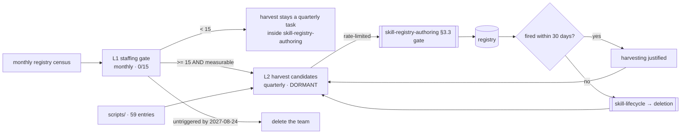

# Skill Harvesting — Loops

Every loop names its close-time ([[ORG_STRUCTURE]] §5).

> **Two loops, both dormant, and one of them is about the team itself.** A gated
> team's first loop is the one that decides whether it exists — writing that as a
> loop rather than as a note is what stops the gate from being a sentence nobody
> re-reads.

---

## L1 — The staffing gate

The loop that runs even while the team does not. It is owned by the department, not
by this team, for the reason in [[skill-harvesting-directive]]: a gated team that
evaluates its own gate has no gate.

```yaml
type: loop
id: skill-harvest-staffing-gate
owner: skills
measures: [skills.registry_size, skills.protocol_compliance_rate, skills.firing_rate_30d]
changes: [skills.team_staffing]
inputs_from: [skills]
outputs_to: [decision-office, people-and-agent-ops]
close_time: monthly
status: proposed
```

**Thresholds, all pre-written so the monthly close is arithmetic rather than
judgement:**

| Reading | Threshold | Consequence |
|---|---|---|
| `registry_size` | ≥ 15 | staffing gate opens ([[technology]] §4.3) |
| protocol-compliance green | 2 consecutive quarters | alternate opening condition |
| `firing_rate_30d` defined | proposed clause (OD-22) | without it, the disband metric is unevaluable |
| Date | **2027-08-24**, untriggered | proposed sunset — delete the team and its 7 docs |

**This loop closes monthly and closes today: 0/15, do not staff.** A gate evaluated
on a schedule can neither be jumped ([[skill-harvesting-premortem]] M1) nor quietly
ignored (M3) — the two opposite failures with the same root cause.

---

## L2 — Harvest candidates → registry → firing evidence

The team's actual work loop. Dormant until L1 opens.

```yaml
type: loop
id: skill-harvest-candidates
owner: skills
measures: [skills.harvested_firing_rate_30d, skills.script_to_skill_ratio]
changes: [skills.harvest_queue, skills.registry]
inputs_from: [engineering, data, reliability-sre]
outputs_to: [skills]
close_time: quarterly
status: dormant
```

**The loop must close on firing, not on admission.** A harvest loop that closes when
a candidate is admitted measures its own throughput and nothing else. It closes when
the harvested skill has fired — or has not, 30 days later, which is the more
informative outcome and the one that feeds
[[skill-lifecycle-anti-sprawl-loops]] L2 a deletion.

**Self-referential by design:** `harvested_firing_rate_30d` is simultaneously this
loop's output and the team's disband condition
([[technology]] §4.3: *"if it does not, the team has no reason to exist"*). That is
unusual and correct — the loop that proves the work is the loop that retires the team.

**Rate limit is part of the loop, not a policy bolted beside it.** Admissions per
quarter are capped by [[skill-lifecycle-anti-sprawl-charter]]'s review capacity.
Without the cap, this loop can out-produce the department's single deletion engine
by an order of magnitude in one sprint — M1.

---

## Loop map



Both branches out of `fired within 30 days?` return to L2. That is the point: the
team learns as much from a harvested skill that never fires as from one that does,
and if the *no* branch dominates, L1's sunset is the correct response rather than a
harder harvest.
