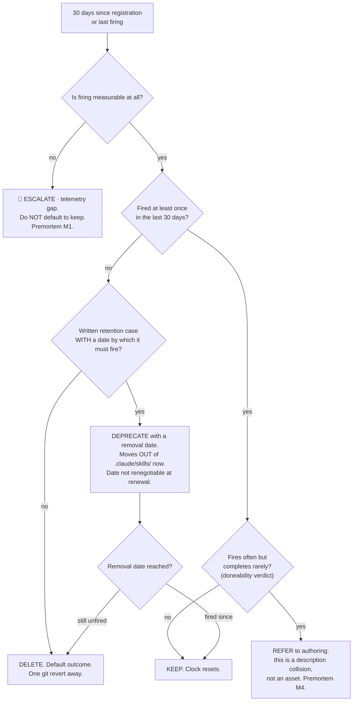

# Skill Lifecycle & Anti-Sprawl — Directive

How *this* team decides. Shape: **a default-delete review with an inverted burden of
proof**. Where [[skill-registry-authoring-directive]] is a gate that defaults to
reject, this is a clock that defaults to delete. Both defaults point the same way,
and that is deliberate.

## The review

**The critical node is B.** An unmeasurable skill must escalate, never default to
keep. Every version of [[skill-lifecycle-anti-sprawl-premortem]] M1 runs through a
system that quietly treats *unknown* as *fine*.

## Decision rights

**Ours, no escalation:**

- Delete or deprecate any registered skill under the review above — **including over
  the author's objection**. Deletion authority contingent on author consent is not
  deletion authority.
- Set the retention-case bar and reject a retention case as unsubstantiated.
- Set the weekly job's thresholds and what it reports as loud failure.
- Refer a high-firing / low-completing skill back to
  [[skill-registry-authoring-charter]] for narrowing.
- Adopt the crude fallback invocation log without waiting for the NF-A schema.

**Escalates to [[skills-directive]] → `OPEN-DECISIONS.md`:**

| Escalation | Why |
|---|---|
| Registry ceiling **N** | A team scored on deletions must not set the trigger that produces them |
| Ownership of the weekly skill-health job | [[README]] §6 vs [[technology]] §4.2 — cross-department |
| Deletion authority over **founder-authored** skills | Say it out loud now, or discover it as M3 later |
| `skill_id` on the NF-A event | Schema is [[research-math-charter|research-and-math-charter]] / OD-11's; we are a requesting consumer |
| Any permanent exemption from the 30-day clock | A permanent exemption is a policy change, not a review outcome |

## Escalation trigger

Escalate immediately, without waiting for the next review cycle:

1. **A skill reaches 30 days and firing is unmeasurable.** M1 arriving. Escalate
   rather than defaulting to keep — the default *is* the failure.
2. **A quarter closes with additions > 0 and deletions == 0.** M2. Report to
   [[red-team-charter]] as well as the founder; a team reporting on its own core
   failure mode only to itself is the arrangement [[ORG_STRUCTURE]] §3 rejects.
3. **A second deprecation is renewed at its removal date.** Once is a schedule slip.
   Twice is M3 — deprecation has become a quiet keep.
4. **Any `archive/`, `deprecated/`, or `experimental/` subdirectory appears inside
   `.claude/skills/`.** If the harness can still select it, it was not deprecated.
5. **The NF-A negotiation slips a second time.** Stop waiting; adopt the fallback
   log and say so plainly. A crude signal that exists beats a clean one that is blocked.

## Standing rule

**Unknown is not a reason to keep.** Everywhere else in this repo, uncertainty
argues for caution — a false merge is unrecoverable, an unconfirmed mutation is a
reportable incident. Skills are the exception, and the exception is structural: a
deleted skill is recovered with one `git revert`, while an unnecessary skill degrades
every future selection and is never removed once its author has moved on. The
asymmetry runs the opposite way from the rest of the org, and this team is the only
one that should behave as if it does.
