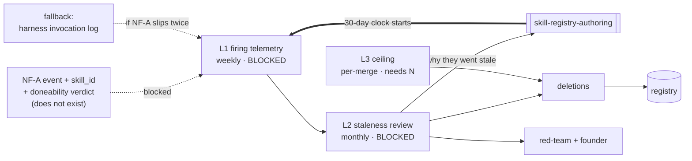

# Skill Lifecycle & Anti-Sprawl — Loops

Every loop names its close-time ([[ORG_STRUCTURE]] §5).

> **All three loops are blocked on the same missing field.** Saying so once, at the
> top, is more useful than repeating it three times: without `skill_id` on the NF-A
> event (or a fallback invocation log), this team measures nothing and therefore
> changes nothing.

---

## L1 — Firing telemetry → registry contents

The department's core loop, and the only one that matters until it closes.

```yaml
type: loop
id: skill-firing-telemetry
owner: skills
measures: [skills.firing_rate_30d, nf_a.skill_id]
changes: [skills.registry, skills.deprecation_queue]
inputs_from: [ai-orchestration, reliability-sre]
outputs_to: [skills, engineering, data]
close_time: weekly
status: blocked
```

**Blocked on:** `skill_id` does not exist; L4 emits nothing ([[README]] §1); OD-11
open. **Unblock path, in order:** (a) request `skill_id` **and** the doneability
verdict in one ask; (b) if it slips twice, adopt a harness-side append-only
invocation log and close the loop on the crude signal.

**Note the field pair.** Firing count alone selects for vague, high-collision skills
([[skill-lifecycle-anti-sprawl-premortem]] M4). The verdict is what distinguishes
*invoked* from *useful*, and it is already on the NF-A event shape
([[README]] §4.2) — so it costs nothing extra to ask for.

---

## L2 — Staleness review → deletion

```yaml
type: loop
id: skill-staleness-review
owner: skills
measures: [skills.deletions_per_quarter, skills.registry_size]
changes: [skills.registry, skills.contract]
inputs_from: [skills]
outputs_to: [skills, red-team, decision-office]
close_time: monthly
status: blocked
```

**Success criterion is deletions, not reviews.** A month of thorough reviews
producing zero deletions is [[skill-lifecycle-anti-sprawl-premortem]] M2, not
diligence.

**Second-order output, easy to miss:** *why* skills go stale feeds back into the
`SKILL.md` **contract**, not only into the registry. Three skills stale for the same
reason — triggers too narrow, descriptions too speculative — is evidence about the
gate upstream, and it routes to [[skill-registry-authoring-loops]] L1.

**Outputs to `red-team` deliberately.** A zero-deletion quarter is reported outside
the department. Self-reporting on one's own core failure mode is what
[[ORG_STRUCTURE]] §3 rejects.

---

## L3 — Ceiling pressure → paired deletion

```yaml
type: loop
id: skill-ceiling-paired-deletion
owner: skills
measures: [skills.registry_size, skills.deletions_per_quarter]
changes: [skills.admission_policy]
inputs_from: [skills]
outputs_to: [skills, decision-office]
close_time: per-merge
status: proposed
```

**Dormant until the founder sets N.** Above N, a skill-adding PR must delete one or
carry a written exemption. Crude, and implementable as a sixth `check_*.sh` guard
alongside the five already in `.github/workflows/ci.yml`.

**Closes per-merge because a ceiling that is checked monthly is not a ceiling** —
it is a monthly apology. This is the only loop here that is not blocked on
telemetry: it counts files.

---

## Loop map



**Read the dotted lines as the team's whole risk.** Two of three loops depend on a
field nobody has committed to adding, on a table that does not exist, gated by an
open decision. The fallback is drawn because it is the plan, not a footnote.
