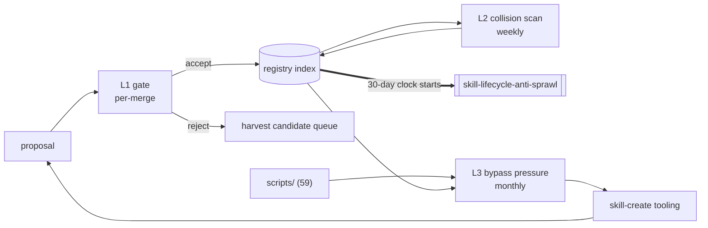

# Skill Registry & Authoring — Loops

Every loop names its close-time ([[ORG_STRUCTURE]] §5).

> Three loops. **Two can close today** — they need a reviewer and a grep, not
> telemetry. That makes this team the department's only unblocked unit.

---

## L1 — Protocol compliance at the gate

```yaml
type: loop
id: skill-protocol-gate
owner: skills
measures: [skills.protocol_compliance_rate]
changes: [skills.contract, skills.ci_guard]
inputs_from: [engineering, data, ai-orchestration, security, reliability-sre]
outputs_to: [skills]
close_time: per-merge
status: proposed
```

**Measures → changes.** Every rejected proposal is evidence about the *contract*,
not only about the proposal. Three rejections for the same missing field means the
field is badly specified or badly tooled — the loop changes the contract, not the
authors. Closes per-merge because a weekly close lets a week of non-compliant skills
land first.

---

## L2 — Description collision scan

```yaml
type: loop
id: skill-description-collision
owner: skills
measures: [skills.description_disambiguation_rate]
changes: [skills.registry, skills.contract]
inputs_from: [skills]
outputs_to: [skills, ai-orchestration]
close_time: weekly
status: proposed
```

**Why weekly *and* at the gate.** The gate ([[skill-registry-authoring-directive]]
node G) catches collisions between a new skill and existing ones. It cannot catch
drift — two descriptions that were distinct when written and converge as both are
edited. The weekly scan is for drift; the gate is for arrival. Both are needed and
they catch different things.

**Informative only above n≈10.** Stated so the metric is not declared healthy at
n=1, which it trivially is.

---

## L3 — Bypass pressure: are procedures landing as scripts or as skills?

```yaml
type: loop
id: skill-authoring-bypass-pressure
owner: skills
measures: [skills.script_to_skill_ratio]
changes: [skills.authoring_tooling, skills.contract]
inputs_from: [engineering, data, reliability-sre]
outputs_to: [skills, decision-office]
close_time: monthly
status: proposed
```

**The loop that measures whether the team is being ignored.** Baseline **59:0**.
Critically, the *change* this loop drives is **tooling, not enforcement** — if the
compliant path is slower than `touch scripts/thing.py`, tightening the gate raises
the bypass rate rather than lowering it
([[skill-registry-authoring-premortem]] M3). A loop that responds to being routed
around by adding rules is a loop pointing the wrong way.

---

## Handoff



**The double line is the department's central seam.** This team's loops end where
the firing clock starts; [[skill-lifecycle-anti-sprawl-loops]] picks it up there.
Neither team closes the other's loop — that separation is the anti-sprawl mechanism
([[technology]] §4.2), not an org-chart artefact.
