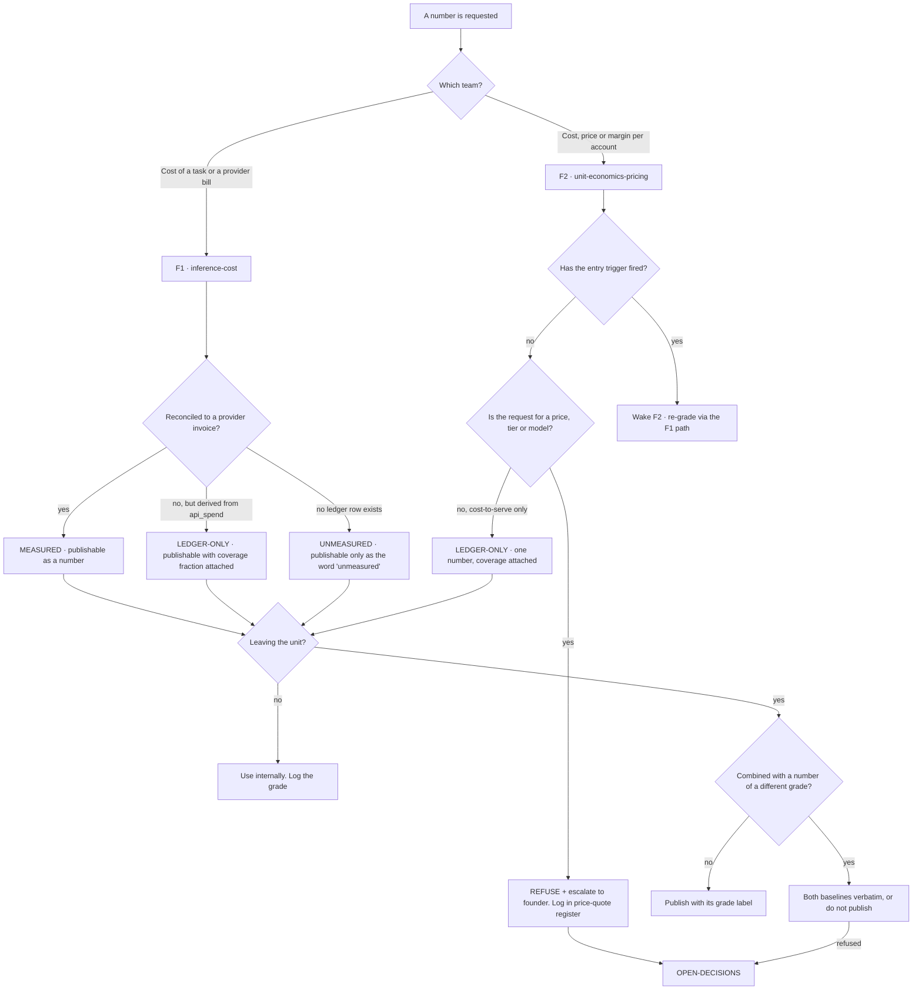

# Finance & Pricing — Directive

How *this* sub-layer decides. Shape differs per unit by design.

Engineering's decision graph splits on **reversibility**. This one splits on a different
axis, because a finance number cannot be reverted in any useful sense — once a figure has
been quoted, the quote is the artifact. The question is therefore:

> **Is this number going to leave the unit, and does it carry its own uncertainty when it
> does?**

Every failure in [[finance-pricing-premortem]] is a number travelling further than its
evidence. D1 is a figure that lost its second half. D2 is a figure that was never checked
against ground truth. D3 is a price that escaped before there was a model. So the graph
grades numbers by **how they were obtained**, and each grade has a different publication
rule.

## The three grades, and what each permits

| Grade | Means | Publication rule |
|---|---|---|
| **MEASURED** | Reconciled against a provider invoice within the last close-time | Publishable as a bare number |
| **LEDGER-ONLY** | Derived from `api_spend` but never checked against ground truth | Publishable **only** with `fin.metered_invocation_coverage_pct` attached in the same sentence |
| **UNMEASURED** | No ledger row exists for the population being asked about | Publishable **only** as the word "unmeasured". Never as zero, never as a dash, never omitted |

**Every F1 number is LEDGER-ONLY today** and every F2 number is UNMEASURED. That is not a
temporary embarrassment to be worked around; it is the state the grades exist to make
legible. An omitted metric reads as green — the same rule
[[engineering-loops]] applies to its eight-wrongness board.

## Decision rights

| Level | Decides | Examples |
|---|---|---|
| **Team** | Anything inside one ledger, reversible, and not leaving the unit | Query shape, report format, the callsite census, an internal cost breakdown |
| **Sub-layer** | Any number leaving the unit; any change to a metric's *definition*; any cap change; the grade assigned to a figure | Publishing cost per task to Research & Math; changing the denominator from API calls to completed tasks |
| **Growth (parent)** | Cadence and reporting line only | When the board is reviewed; who sees it first |
| **Founder / [[OPEN-DECISIONS]]** | Pricing in any form. The revenue target. Cap changes that raise a hard cap. Whether `SpendLogger.log()`'s new parameter is required | OD-23; the `$20–50` provenance; any tier table |

**The pricing rule is absolute and testable.** No artifact under
`01-org/commercial/finance-pricing/teams/unit-economics-pricing/` may contain a proposed
price, tier, or per-unit rate before the entry trigger fires. This is enforced the way
the repo already enforces its other invariants — a grep guard, in the shape of
`scripts/check_no_direct_stock_writes.sh` and `scripts/check_no_guest_name_matching.sh` —
not by remembering. See [[unit-economics-pricing-directive]].

**The no-summing rule.** A MEASURED number and an UNMEASURED number are never combined
into one figure, and no aggregate over the two teams exists. If a consumer wants one
number, the answer is two numbers and a sentence explaining why.

**The denominator rule.** Cost per *completed task* is the published metric; cost per
*API call* may never appear without it. A cheaper model that retries more lowers the
second and raises the first ([[inference-cost-premortem]] M4), and publishing only the
falling number would satisfy the cost-efficiency mandate while making the company more
expensive.

**The coordination rule.** F1 does not author a schema change to the neural-footprint
surface alone. [[neural-footprint-instrumentation-charter]] owns the event contract;
[[harness-model-routing-charter]] owns the routing decision our numbers feed. F1 owns the
money view. Any migration touching `api_spend` carries an RM-3 sign-off and a written
retirement condition tied to OD-11, or it is the fifth private footprint RM-3's premortem
already predicts.

## Escalation trigger

Escalate to `OPEN-DECISIONS.md` when **any** of these holds:

1. **A price, tier, or rate is requested** — from anyone, in any framing, including
   "just illustrative" or "for the deck". First request, not the tenth. Log it in the
   price-quote register regardless of outcome.
2. **A number must be published at a grade it has not earned** — e.g. a LEDGER-ONLY
   figure requested as a bare number for an outward artifact.
3. **`fin.spend_reconciliation_variance_pct` exceeds 5%** — the meter and the invoice
   disagree materially and every downstream number is suspect until it is explained.
4. **A hard cap raise is proposed without a cost-to-serve figure behind it**
   ([[finance-pricing-premortem]] D5's counter-pressure).
5. **Three consecutive close-times where every loop's `outputs_to` is outside Commercial**
   — CM-F4 goes to [[decision-office-charter]] with the loop table attached
   ([[finance-pricing-premortem]] D4).
6. **Three consecutive no-action reconciliation runs** — the anti-sprawl rule fires on
   this unit before it fires on anyone else's (`foundation README §6`).

**Advisory is findings-only** ([[ORG_STRUCTURE]] §3). [[red-team-charter]] attacks the
decisions above — the `$20–50` provenance gap and the required-vs-optional parameter
trade are the two worth attacking first — and produces findings, not vetoes.
[[decision-office-charter]] owns whether OD-23 closes or drifts.
