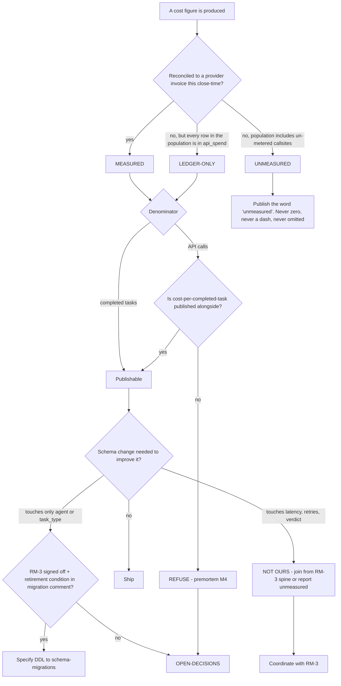

# Inference Cost — Directive

How *this* team decides. Shape differs per unit by design.

F1's decision graph splits on one question that no sibling has to ask:

> **Can this number be reconciled to a provider invoice — and if not, what exactly is
> the population it is silent about?**

The team's entire premortem is variations of *a number that is confidently wrong*: a
silent meter (M1), a partially-adopted parameter (M2), a duplicated ledger (M3), the wrong
denominator (M4), a cap that tracks rather than constrains (M5). None is a failure to
compute. All five are failures to know what a computed figure omits. So the graph grades
by **provenance**, and each grade has a different permission.

## The three grades

| Grade | Means | Permission |
|---|---|---|
| **MEASURED** | Reconciled against the provider console within the last close-time | Publishable as a bare number |
| **LEDGER-ONLY** | Every row is in `api_spend`, but the ledger has never been checked against ground truth | Publishable **with `fin.metered_invocation_coverage_pct` in the same sentence** |
| **UNMEASURED** | The population includes callsites that write no row at all | Publishable **only** as the word "unmeasured" |

**Today every F1 figure is LEDGER-ONLY at best**, and any figure whose population spans
the NestJS runtime or the enrichment scripts is UNMEASURED — not low, not zero,
**unmeasured**. An omitted metric reads as green; a zero reads as free.

## Decision rights

| Level | Decides | Examples |
|---|---|---|
| **Team** | Query shape, report format, the callsite census, internal breakdowns, the grade assigned to a figure | How cost is bucketed by model; the census document; adding a daily liveness query |
| **Sub-layer** ([[finance-pricing-directive]]) | Any figure leaving the team; metric *definitions*; cap threshold changes within the hard cap | Publishing cost-per-task to RM-1; changing the denominator |
| **Cross-team with RM-3** | Any schema change to the neural-footprint surface | The `agent` / `task_type` bridge |
| **Founder / [[OPEN-DECISIONS]]** | Required-vs-optional parameter; hard cap raises; whether the NestJS runtime is instrumented now or after OD-03; whether off-ledger script spend is backfilled | Q1–Q4 of [[inference-cost-agenda-full]] |

## Standing rules

**The denominator rule.** The published metric is cost per **completed** task — a task
carrying a passing verdict from [[agent-evaluation-gates-charter]]. `cost_per_api_call`
never appears without `cost_per_completed_task` beside it. A cheaper model that retries
more lowers the first and raises the second ([[inference-cost-premortem]] M4); publishing
only the falling number would satisfy the cost-efficiency mandate while making the company
more expensive. RM-1's own metric definition already reads this way
(`.planning/foundation/teams/intelligence.md:96-98`) — the two teams sharing a denominator
is what makes the routing loop trustworthy.

**The two-column rule.** F1 authors **`agent` and `task_type`** on `api_spend` and nothing
else. Latency, retries and doneability verdict belong to
[[neural-footprint-instrumentation-charter]] and arrive by join. If the spine is not
ready, those dimensions report *unmeasured*. Adding them as F1 columns is
[[inference-cost-premortem]] M3, which is also the failure RM-3's own premortem predicts.

**The retirement rule.** Every bridge column carries its retirement condition **in the
migration comment**, tied to OD-11 closing ([[OPEN-DECISIONS]]:20). A retirement condition
written in a planning document is one nobody finds.

**The all-callsites rule.** A parameter added to `SpendLogger.log()` is added to **all 16
callsites in the same change**. Thirteen "next sprint" produces a confident number over a
fifth of the spend. If the parameter must remain optional for the never-raise contract,
the column ships `NOT NULL DEFAULT 'unattributed'` so a gap is a visible row.

**The absence rule.** Liveness is never inferred from `api_spend` alone. The hourly cap
check reads the same table it is meant to police (`spend_tasks.py:34-58`), so a stopped
meter looks like a quiet month. The liveness signal correlates row age against **pipeline
activity**, which lives outside the ledger.

**The never-raise rule stands.** Nothing this team does may make `SpendLogger.log()`
capable of interrupting a pipeline at runtime (`spend_logger.py:7-8`). Where a measurement
would require that, the measurement is redesigned — or the trade goes to the founder.

## Escalation trigger

Escalate to `OPEN-DECISIONS.md` when **any** of these holds:

1. **`fin.spend_reconciliation_variance_pct` exceeds 5%** — the meter and the invoice
   disagree materially; every downstream number is suspect until explained.
2. **A figure is requested at a grade it has not earned** — a LEDGER-ONLY number wanted as
   a bare number for an outward artifact.
3. **A schema change beyond `agent` / `task_type` is proposed** — that is RM-3's contract,
   and reaching for it is M3 beginning.
4. **A cap raise is proposed without a cost-to-serve figure** from
   [[unit-economics-pricing-charter]].
5. **`fin.spend_attribution_coverage_pct` is above 0% and flat below 100% for two
   consecutive close-times** — partial adoption is worse than none, because it produces a
   number.
6. **A cost-per-call figure is requested without its completed-task twin.** First request,
   not the tenth.

**Advisory is findings-only** ([[ORG_STRUCTURE]] §3). [[decision-office-charter]] owns
whether OD-04 and OD-11 close or drift — and OD-04 is currently blocked on this team's
first assignment, which makes the drift this team's problem to surface.
