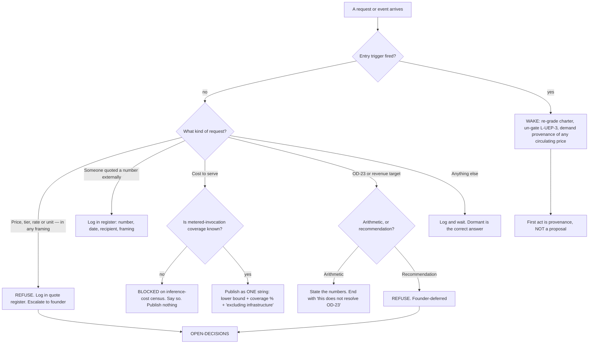

# Unit Economics & Pricing — Directive

How *this* team decides. Shape differs per unit by design.

This graph is deliberately **mostly closed**. F1's directive grades numbers by provenance;
this one is shaped by a single question asked before anything else:

> **Has the entry trigger fired — and if not, is this request for a price?**

A dormant team's decision graph should look like a gate with two open side-doors, because
that is what it is. Almost every path leads to *log it and wait*. The two paths that stay
open pre-trigger — the trigger watch and the quote register — are open precisely because
[[unit-economics-pricing-premortem]] M1 and M2 say those are the failures that happen while
nobody is doing anything wrong.

## The rule that makes the deferral real

**No artifact under `01-org/commercial/finance-pricing/teams/unit-economics-pricing/` may
contain a proposed price, tier, rate, or per-unit charge before the entry trigger fires.**

This is enforced **mechanically**, not socially — a grep guard in the shape of the repo's
existing invariant guards, `scripts/check_no_direct_stock_writes.sh` and
`scripts/check_no_guest_name_matching.sh`. The precedent matters: this codebase already
enforces its most important invariants with cheap greps rather than good intentions, and a
founder deferral deserves the same treatment.

Without it, [[unit-economics-pricing-premortem]] M4 is near-certain, because the request
that breaks the rule will be reasonable, small, and framed as illustrative. It is exactly
how `$20–50/mo` came to be described as "locked" in [[OPEN-DECISIONS]]:27 with no ADR
behind it.

**Citing an existing number is not proposing one.** Recording that `$20–50` is in
circulation, and that it has no decision record, is the team doing its job. Repeating it
as this team's recommendation is not.

> **The guard is not as simple as it sounds, and pretending otherwise would be the same
> kind of false comfort this document warns about.** A naive grep for `$` followed by a
> digit would flag this team's **own** artifacts — [[unit-economics-pricing-charter]] and
> [[unit-economics-pricing-agenda-full]] both contain `$20–50`, `$20,000 ÷ $50 = 400`, and
> the `$40`/`$16` cap figures, all of which are *citations and arithmetic*, which this
> directive explicitly permits. So the guard needs one of: an explicit allowlist of
> citation lines, a marker convention (e.g. a required `<!-- cited -->` annotation), or a
> narrower pattern targeting proposal grammar rather than currency. **Designing it is part
> of the proposal, not a solved problem** — and until it is designed, the rule is enforced
> at review time by a human, which is exactly the weaker mechanism M4 predicts will fail.
> Naming that gap is better than shipping a guard that either blocks everything or, worse,
> passes green while proving nothing — the same failure Engineering's premortem M4 records
> for grep-shaped guards elsewhere in this repo.

## The arithmetic / advocacy line

The single most likely way this team oversteps is by being helpful about OD-23
([[unit-economics-pricing-premortem]] M5). The line:

| May state | May not state |
|---|---|
| $20,000 ÷ $50 = 400 restaurants; ÷ $20 = 1,000 | Whether 400 in 30 days is achievable |
| The denominator is one restaurant, and it is not connected (`DEP-06` unchecked) | Whether the target should be lowered |
| No payment processor, no `/pricing` route, no billing code | Which pricing model to adopt |
| `PROJECT.md:135` says "No revenue pressure: Build right, not fast" | Which of the two conflicting statements is right |
| Caps of `$40`/`$16` would trip within hours at 400 accounts | Whether to raise them |
| `$20–50/mo` has no ADR behind it | Whether it is the right range |
| The precedent at `YC_WEDGE_PLAN.md:31-33` — "asked" vs "received" — bears on committed-deal counting | Whether to count committed deals |

**Every OD-23 artifact from this team ends with the sentence: *this does not resolve
OD-23.*** [[decision-office-charter]] owns whether it closes.

## The one-string rule

`fin.cost_to_serve_per_restaurant_month` is published as a **single inseparable string**:

> *cost-to-serve ≥ $X per restaurant-month, covering Y% of known model invocations,
> excluding infrastructure*

Never a bare figure, never in a cell on its own, never as a subtrahend. Three verified
reasons it is a lower bound rather than a cost: `restaurant_id` is nullable and enrichment
passes `None` by design (`spend_logger.py:59`); the NestJS runtime writes no spend rows at
all; and `~$10-20/month` of infrastructure (`.planning/PROJECT.md:136`) is not in the
ledger.

**And it is not published at all while Y is unknown** — which it is today, pending
[[inference-cost-charter]]'s callsite census. A blocked number stated as blocked is more
useful than a clean number that is wrong.

## Decision rights

| Level | Decides | Examples |
|---|---|---|
| **Team** | The register's format; the trigger query's shape; how arithmetic is presented | Adding a column to the register; the wording of the weekly founder question |
| **Sub-layer** ([[finance-pricing-directive]]) | Any figure leaving the team; the grade attached to it | Publishing cost-to-serve once unblocked |
| **Founder / [[OPEN-DECISIONS]]** | **Pricing in every form.** The revenue target. The trigger's precise definition. Whether a quoted number becomes a decision | OD-23; the `$20–50` provenance; "is a signed-but-unbilled account a trigger?" |

## Escalation trigger

Escalate to `OPEN-DECISIONS.md` when **any** of these holds:

1. **A price, tier, or rate is requested** — from anyone, in any framing, including "just
   illustrative" or "for the deck". **First request, not the tenth.** Log it in the
   register regardless of outcome; the refusal is the deliverable.
2. **A number is quoted externally** by anyone — logged first, escalated if it was framed
   as final.
3. **The trigger fires** — a non-design-partner restaurant appears, or the founder
   un-defers pricing. The team wakes and its **first act is to demand provenance of any
   circulating price**, not to propose one.
4. **The trigger's definition is ambiguous in a live case** — e.g. a signed but unbilled
   account, or a paid pilot. Ambiguity resolved quietly is how M2 happens.
5. **A recommendation on OD-23 is requested** rather than arithmetic.
6. **A cap raise is proposed** citing this team's cost-to-serve figure while that figure is
   still blocked.

**Advisory is findings-only** ([[ORG_STRUCTURE]] §3). [[red-team-charter]] should attack
the `$20–50` provenance gap — it is an unattributed decision, which is exactly its remit —
and [[decision-office-charter]] owns whether OD-23 closes or drifts.
