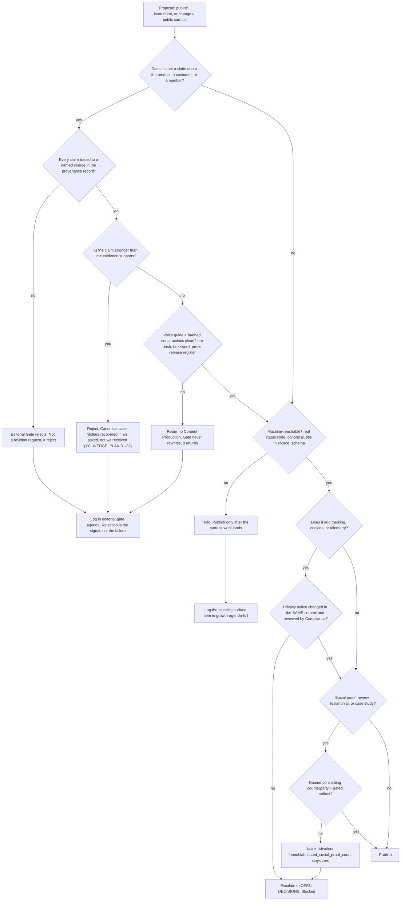

# Growth — Directive

How *this* department decides. Shape differs per unit by design.

Growth's decision graph is organised around the one property that separates it from every
other department in the company: **almost everything it produces is published, and
publishing is irreversible in the only way that matters.** A deploy can be rolled back. A
page that was crawled, cached, summarised into an assistant's answer, and screenshotted by
a prospect cannot be. So the graph does not ask "is this good?" — it asks, in strict order:

1. **Is it true, and can we show the source?** → [[editorial-gate-charter]] has a veto.
2. **Can a machine reach and parse it?** → [[technical-seo-ai-answer-surface-charter]].
3. **Does it ask the visitor for something we can honour?** →
   [[conversion-funnel-charter]] and [[compliance-privacy-charter]].

A "no" at step 1 ends the discussion. A "no" at step 2 delays publication. A "no" at step 3
escalates, because it means the page would make an existing promise false.

## Decision rights

| Level | Decides | Examples |
|---|---|---|
| **Team** | Anything reversible and inside one team's boundary | Which keywords enter the queue; article structure; which of the ten questions to answer first; a canonical tag; a CTA's wording |
| **Editorial Gate, alone** | Whether a specific unit publishes | Reject for unsourced claim; reject for overstated claim; return for voice. **No other unit, including the department, overrides a reject** |
| **Department** | Anything crossing a seam between two Growth teams; the definition of any primary metric; publication *sequencing* | Whether the FAQ layer ships before the article is indexed; whether a checklist item may be graded while its outcome metric is unreadable; capping production at gate throughput |
| **Founder / [[OPEN-DECISIONS]]** | The publishing target; the domain; any change to the published privacy position; anything touching pricing | Where content lives; whether to add a consent banner; whether to un-defer pricing (Growth proposes nothing here) |

**The gate's veto is asymmetric and that is deliberate.** [[editorial-gate-charter]] can
stop a publication and cannot compel one. It has no throughput target, because a gate with
a throughput target is a queue. The department may argue with a rejection in the agenda; it
may not overturn one. This is the same independence argument [[ORG_STRUCTURE]] §3 makes for
advisory functions, applied inside a department because the founder specified the human
pass as mandatory.

## The three seams, and who is accountable

A seam with two owners has none. For each, the **left** unit decides and the **right** unit
is accountable for the objection.

| Seam | Left — decides | Right — objects | The line |
|---|---|---|---|
| The 404 | [[technical-seo-ai-answer-surface-charter]] | [[conversion-funnel-charter]] | G4 owns the **status code** (currently 200 for every unmatched URL: `vercel.json:12-15`, then `apps/web/src/App.tsx:302`). G5 owns **what the page says and where its CTA goes**. Neither can ship the item alone |
| The FAQ link graph | [[content-production-charter]] | [[technical-seo-ai-answer-surface-charter]] | G2 authors the pages and the back-links; G4 objects on thin-content and duplicate-intent grounds before publication, not after |
| Funnel instrumentation | [[conversion-funnel-charter]] | [[compliance-privacy-charter]] *(Corporate)* | G5 states what must be measured; Compliance holds the pen on every word of the notice. Growth never drafts privacy copy |

## Standing rules

**Sequencing rule.** The publishing target precedes the first draft. No article is
commissioned before a URL exists that can serve one. This is the direct counter-pressure to
[[growth-premortem]] M1 and it is a department decision, not a preference.

**Checklist rule.** A checklist item is never graded in isolation. Each is bound to an
outcome metric, and an item whose outcome metric is unreadable is recorded as *unreadable*,
never as done. An omitted metric reads as green.

**Capacity rule.** Published throughput is capped at gate throughput. If the editor can
clear two units a week, the target is two. Building a draft queue larger than the gate is
how [[growth-premortem]] M2 begins.

**Coupling rule.** Tracking configuration and the privacy notice change in the same commit
or neither changes (`apps/web/src/pages/Privacy.tsx:8-11` states this contract in the
codebase already). Enforced in CI, not by memory.

**Deference rule.** Growth proposes no pricing, no tiers, and no number attached to either.
[[unit-economics-pricing-charter]] owns that decision and it is founder-deferred. A page
that would require a price does not get designed "for later".

## Escalation trigger

Escalate to [[OPEN-DECISIONS]] when **any** of these holds:

1. The publishing target is still undecided at the start of a close-time. It blocks
   everything and its cost compounds silently.
2. A publication would require adding tracking, a cookie, or a consent banner — the
   **first** such request escalates, not the tenth.
3. A gate rejection is disputed by the department, or the gate is proposed to be suspended
   for any reason including a deadline. `editorial.gate_bypass_count` leaving zero is an
   automatic escalation with no discussion step.
4. A checklist item cannot be completed without an Engineering change
   ([[client-surfaces-charter]], [[platform-api-charter]]) and has been blocked for two
   close-times.
5. Social proof is proposed without a named consenting counterparty.
6. A claim's provenance is contested between Growth and [[design-partner-operations-charter]] —
   most likely on the recovery number, which is the claim the whole company wants to make
   and the one the evidence does not yet support.

**Advisory is findings-only** ([[ORG_STRUCTURE]] §3). [[red-team-charter]] attacks the
*decisions* in this graph — particularly the capacity rule, which is the one a deadline will
argue with — and its findings land in `questions.md` and [[OPEN-DECISIONS]], never as a
veto. [[decision-office-charter]] owns whether these escalations actually close.
