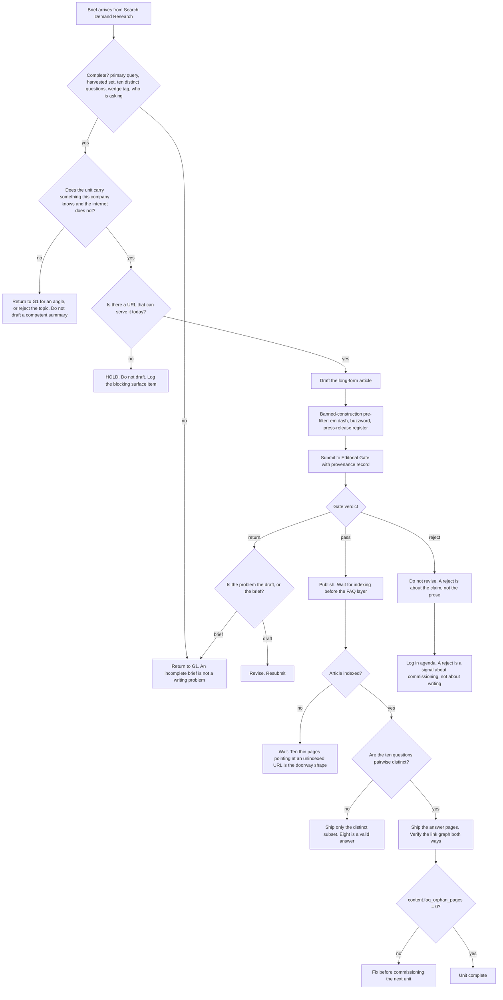

# Content Production — Directive

How *this* team decides. Shape differs per unit by design.

G2's graph is a **commissioning decision followed by a revision decision**, and its most
important property is what it does *not* contain: there is no branch where G2 decides
something is good enough to publish. That branch belongs to [[editorial-gate-charter]] and
its absence here is the point.

## Decision rights

| Level | Decides | Examples |
|---|---|---|
| **Team** | Structure, headings, length, which of the ten questions ship, whether a returned draft is revised or abandoned, when to retire an article | Cutting two of ten questions for duplicate intent; abandoning a draft rather than revising it |
| **[[editorial-gate-charter]]** | Whether it publishes. **Not appealable to G2 or to the department** | Reject for an unsourced claim |
| **[[search-demand-research-charter]]** | Which topic, and the ten questions | G2 may return a brief; it may not substitute its own |
| **Department** | Commission rate, sequencing, whether the FAQ layer ships before indexing | Capping production at gate throughput |
| **Founder / [[OPEN-DECISIONS]]** | Content repository shape; publishing target; the domain | Markdown in-repo vs CMS |

## Standing rules

**Originality rule.** A unit that carries nothing beyond a competent summary of the
consensus is not commissioned. This is checked at commissioning, not at the gate — the gate
checks truth, and a true article with no original content passes it correctly every time
([[content-production-premortem]] M3).

**Do-not-draft-without-a-target rule.** If no URL can serve the piece, the answer is HOLD,
not draft-and-stockpile. Fourteen finished articles and no publishing surface is
[[growth-premortem]] M1, and it begins with a single reasonable-looking decision to get ahead.

**Distinctness-before-drafting rule.** Ten questions is a specification of the *maximum
distinct set*, not a quota. A set that fails pairwise distinctness ships short.

**Index-before-FAQ rule.** The article is indexed before its answer pages ship.

**Retirement rule.** Retiring or heavily revising an article carries its answer pages with
it: re-parent them or retire the cluster. Never orphan them. This is the single rule that
prevents [[content-production-premortem]] M4.

**No-price rule.** No draft implies a price, a tier, a discount, or a "starting at".
Pricing is founder-deferred and belongs to [[unit-economics-pricing-charter]]. A page
written "so we can add pricing later" is a pricing decision made by a writer.

**Voice-guide rule.** G2 writes inside [[brand-identity-charter]]'s guide. Where the guide
is silent, G2 asks rather than inventing precedent — an invented precedent becomes the guide
by default.

## Escalation trigger

Escalate to [[growth-directive]]:

1. Draft queue depth exceeds **two weeks of gate throughput**. That is an intake problem for
   [[search-demand-research-charter]], and it is the first visible symptom of
   [[content-production-premortem]] M2.
2. Any proposal to exempt a category of content from the gate — including "these are just
   FAQ answers". The **first** such proposal escalates.
3. `content.faq_orphan_pages` leaves zero and is not fixed within one publication cycle.
   Sustained, this is the evidence that would settle fork **CM-F2**.
4. A brief cannot be filled with anything original after two attempts. The topic is wrong,
   which is a queue decision, not a writing failure.
5. The gate's return rate on briefs (rather than on drafts) exceeds the return rate on
   prose. That inverts the normal reading: it means G1 and G2 disagree about what a brief is.
