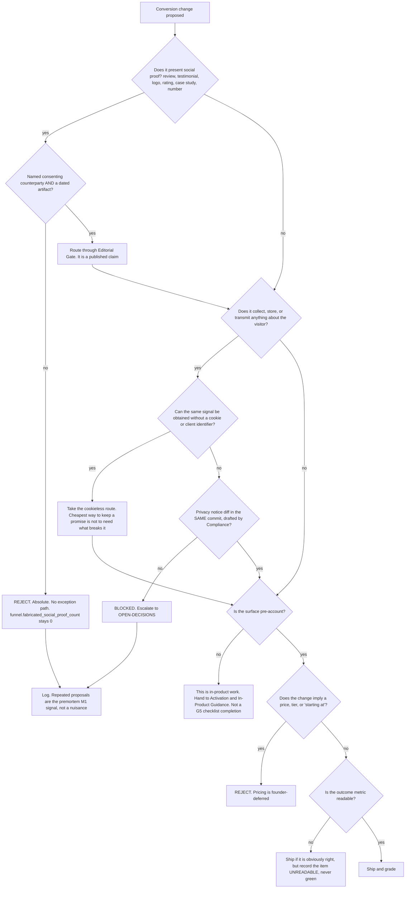

# Conversion & Funnel — Directive

How *this* team decides. Shape differs per unit by design.

G5's graph splits on a question none of its siblings has to ask: **does this change ask
something of a visitor that we can honour?** Conversion work is, structurally, a set of
requests made to a stranger — believe this claim, accept this cookie, click this button, give
us this email. Each of those can be made in a way the company cannot back up, and two of them
are one PR away from making a live page false.

## Decision rights

| Level | Decides | Examples |
|---|---|---|
| **Team** | Page layout, CTA placement and wording, the 404 page's content, the honest empty state, funnel step definitions | Where the 404's CTA points; how the one-design-partner statement reads |
| **Team, with [[technical-seo-ai-answer-surface-charter]]** | The 404, jointly. G5 the page, G4 the status code | Neither ships the item alone |
| **[[editorial-gate-charter]]** | Whether any social-proof element may be published | Rejecting an unsourced testimonial |
| **[[compliance-privacy-charter]] / [[privacy-engineering-charter]]** | Every word of the privacy notice, and whether a tracking approach is permissible | Growth never drafts privacy copy |
| **[[design-partner-operations-charter]]** | What the recovery evidence supports, and whether the partner may be named | G5 presents what S1 verified and nothing more |
| **Department** | **The definition of "activated"**, the commission of new funnel steps, checklist scope | Any proposal to redefine activation as signup |
| **Founder / [[OPEN-DECISIONS]]** | Whether to change the published privacy position; whether to ship a consent banner | The first such proposal escalates, not the tenth |

## Standing rules

**Social-proof rule.** Named consenting counterparty plus a dated artifact, or it does not
ship. There is no exception path and no severity scale.
`funnel.fabricated_social_proof_count` is an absolute zero on the department board. **The
soft version is the real risk** — a case study built on politeness, a figure phrased as
*dollars recovered* when it means *we asked*, the word "restaurants" in the plural. Each is
covered by this rule.

**Cookieless-first rule.** Before proposing any tracking that requires a consent surface,
demonstrate that the signal cannot be obtained from server logs or cookieless first-party
counting. `funnel.measurable_steps` going from 0 to 3 without a consent banner is a better
outcome than going to 8 with one.

**Coupling rule.** Tracking configuration and the privacy notice change in the same commit or
neither changes. Enforced in CI. `apps/web/src/pages/Privacy.tsx:8-11` already states this
contract in a code comment, which is precisely where an automated check cannot see it.

**Activation-definition rule.** *Activated* means **first POS-connected day**. Changing it is
a department decision under [[growth-directive]]'s metric-definition right, never a team
choice. Signups may appear in `funnel.step_dropoff`; they never become the denominator
([[conversion-funnel-premortem]] M4).

**Pre-account-scope rule.** The checklist applies to surfaces a stranger can reach. Work
completed on authenticated routes is handed to
[[activation-in-product-guidance-charter]] and does not count as a G5 completion.

**No-price rule.** No CTA reads "see pricing"; no page is laid out around a price block "for
later". Pricing is founder-deferred and belongs to [[unit-economics-pricing-charter]].

**No-rate-without-steps rule.** No conversion rate is reported while
`funnel.measurable_steps` is 0. A rate over an invisible funnel is a number with no referent.

## Escalation trigger

Escalate to [[growth-directive]], and to [[OPEN-DECISIONS]] where it names a decision:

1. **Any proposal to present social proof without provenance.** The **first** one, not the
   tenth, because the second one is easier than the first.
2. Any proposal that would require changing `apps/web/src/pages/Privacy.tsx`. This is a
   founder decision and a [[compliance-privacy-charter]] drafting job, never a Growth PR.
3. Any proposal to redefine "activated".
4. The 404 remains a soft 404 for two consecutive close-times after both halves of the seam
   have owners. It is the cheapest real fix available and its persistence means something
   else is wrong.
5. `conversion.checklist_items_green` moves for three close-times while
   `funnel.measurable_steps` stays 0.
6. A case study is requested before [[design-partner-operations-charter]] has produced a
   verified credit memo.

**Advisory is findings-only** ([[ORG_STRUCTURE]] §3). [[red-team-charter]] should attack the
absence of an exception path in the social-proof rule and the activation definition — both
will be argued with eventually, and both are better attacked now than during the week they
become inconvenient.
