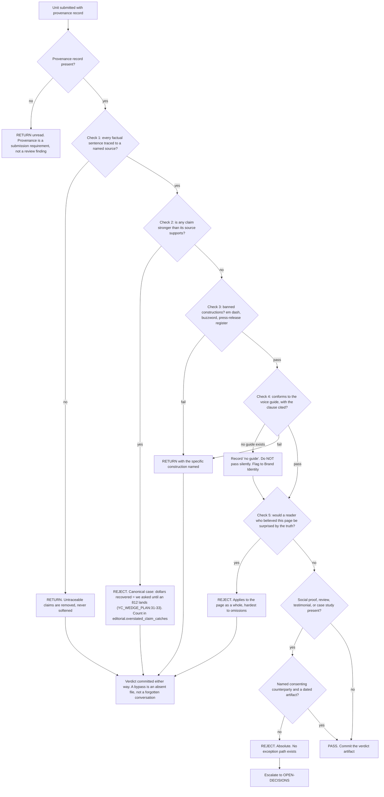

# Editorial Gate — Directive

How *this* team decides. Shape differs per unit by design.

G3's graph is the only one in Growth with a **terminal reject**, and its checks run in a
fixed order for a reason recorded in [[editorial-gate-premortem]] M2: the fast checks will
otherwise crowd out the slow one. A draft that fails check 1 never reaches check 3, so a
claim problem is never delivered inside a list of comma notes.

## Decision rights

| Level | Decides | Examples |
|---|---|---|
| **Team, unappealable** | Whether a unit publishes | Reject for an unsourced claim; reject for overstatement; return for register |
| **Team** | The provenance format; the banned-construction list and its entries; the verdict artifact's shape | Adding an entry to the banned list with a recorded reason |
| **[[brand-identity-charter]]** | The voice guide G3 enforces | G3 records cases the guide does not cover; M1 amends. **The case becomes the rule, never the arguer** |
| **[[design-partner-operations-charter]]** | What the recovery evidence actually says | G3 refuses anything stronger; it does not produce the number |
| **Department** | Commission rate, sequencing, capacity | Capping production at gate throughput |
| **Founder / [[OPEN-DECISIONS]]** | Whether the gate is mandatory at all; any exception path | A change here is a change to the pipeline's specification |

**The veto is asymmetric and deliberate.** G3 can stop a publication. G3 cannot compel one,
cannot commission a replacement, and has no throughput target. The department may argue with
a rejection in the agenda; it may not overturn one. This is the same independence argument
[[ORG_STRUCTURE]] §3 makes for advisory functions, applied inside a department because the
founder specified the pass as mandatory.

## Standing rules

**Order rule.** Claims first. Always. A return stops at the first failed check.

**No-rewrite rule.** The gate returns; it never rewrites. A gate that rewrites has become a
co-author and can no longer judge its own work. This is the rule most likely to be broken out
of helpfulness rather than pressure.

**Verdict-is-a-file rule.** Every unit gets a committed verdict artifact with one field per
check, whether it passed or not. This is the entire mechanism by which
`editorial.gate_bypass_count` is measurable: a bypass is a published page with no verdict
object in version control.

**No-guide rule.** Where [[brand-identity-charter]]'s voice guide is silent or absent, check 4
records **"no guide"** and the case is sent to M1. It does not pass silently. A silent pass
converts a missing document into an invisible one.

**Return-versus-reject rule.** Return is about prose and G2 revises. Reject is about the
claim, and revision is not the remedy. These are different verdicts, not two points on a
severity scale.

**Social-proof rule.** Any testimonial, logo, star rating, review, or case study requires a
named consenting counterparty and a dated artifact. **No exception path exists**, and
`funnel.fabricated_social_proof_count` is a department-level absolute
([[conversion-funnel-charter]]).

**Scope rule.** The banned-construction list governs published, outward-facing content only.
It does not govern this vault, planning documents, code comments, or commit messages. Stated
so it is not attempted.

## Escalation trigger

Escalate to [[growth-directive]], and to [[OPEN-DECISIONS]] where it names a decision:

1. **Any proposal to suspend, sample, or exempt** — including exempting a category, adding an
   expedited lane, or "backfilling the edit after publication". The **first** proposal
   escalates, not the tenth. This is [[editorial-gate-premortem]] M1 at its earliest visible
   moment.
2. `editorial.gate_bypass_count` leaves zero. Automatic, with no discussion step.
3. `editorial.rejection_rate` reads 0% for two consecutive close-times.
4. A rejection is disputed by the department or by [[content-production-charter]].
5. A claim's provenance is contested with [[design-partner-operations-charter]] — most likely
   the recovery number, which is the claim the whole company wants and the evidence does not
   yet support.
6. The voice guide has been absent for two consecutive close-times while units are being
   gated. Check 4 has been recording "no guide" that whole time and the record should force
   the conversation.

**Advisory is findings-only** ([[ORG_STRUCTURE]] §3). [[red-team-charter]] should attack the
decisions in this graph, particularly the absence of an exception path — the argument for one
will be made eventually and is better attacked now, unloaded, than during a launch week.
[[decision-office-charter]] owns whether these escalations close.
