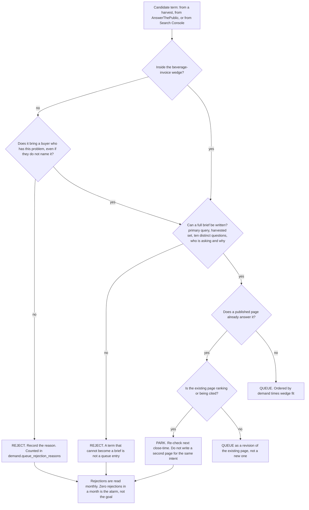

# Search Demand Research — Directive

How *this* team decides. Shape differs per unit by design.

G1's decision graph has exactly one shape: **a candidate term arrives, and the team decides
queue, reject, or park.** Everything else is bookkeeping. The graph is written to make
*reject* an ordinary, frequent, recorded outcome, because a queue that accepts everything is
[[search-demand-research-premortem]] M1 and M3 at the same time.

## Decision rights

| Level | Decides | Examples |
|---|---|---|
| **Team** | Queue, reject, park, and ordering. The ten distinct questions per topic. The wedge tag on any individual term | Rejecting "restaurant management software"; ordering invoice-discrepancy terms above delivery-shortage terms |
| **Department** | The wedge **floor** — how low `demand.wedge_share_of_corpus` may fall before intake is restricted; the commission rate against G1's stated capacity | Capping intake at one topic a week; pausing off-wedge intake entirely |
| **[[narrative-collateral-charter]]** | What the wedge *is* | G1 tags against that definition and never authors it |
| **Founder / [[OPEN-DECISIONS]]** | Language scope; tooling budget; whether the wedge is fixed or still open | Whether the corpus includes non-English demand |

**The wedge tag is applied at intake and by this team, not audited later by the
department.** An audit finds the problem after the corpus has been built around it. The
tag is cheap at intake and expensive afterwards, which is the whole argument.

## Standing rules

**Rejection-is-output rule.** Every term looked at and refused gets a written reason. Zero
rejections in a close-time is an alarm state read exactly like a 0% editorial rejection
rate: not clean input, absent judgement.

**Brief-or-nothing rule.** The queue's unit is a brief. A bare term is not a queue entry, it
is a note. This is what stops the queue becoming a four-hundred-row list that
[[content-production-charter]] cannot consume.

**One-intent rule.** Two queue entries that resolve to the same searcher intent are one
entry. Enforced here, at intake, because the alternative is
[[content-production-charter]] discovering it as duplicate content after ten FAQ pages have
shipped.

**Blocked-signal rule.** The Search Console loop does not run while the crawl surface is
broken. A demand report from a site returning HTTP 200 for every unmatched URL is an
artefact of `vercel.json:11-13`, and acting on it is worse than recording the loop as
blocked ([[search-demand-research-loops]] L-G1-2).

**Capacity-honesty rule.** If the harvest is manual, its rate is published as a number.
Growth sets the commission rate against that number. A cap nobody wrote down becomes a cap
nobody can plan around.

## Escalation trigger

Escalate to [[growth-directive]], and to [[OPEN-DECISIONS]] where it names a decision:

1. `demand.wedge_share_of_corpus` falls for two consecutive close-times while the corpus
   grows. That combination is [[search-demand-research-premortem]] M1 in progress.
2. The intake finding concludes that any of the three sources is unusable at the volume the
   pipeline implies. The pipeline's shape is founder-specified, so a broken stage is the
   founder's decision, not a workaround G1 invents.
3. The wedge definition is still open when intake would otherwise begin.
4. A commissioned article's primary term was not the highest-priority unclaimed queue entry,
   with no recorded reason. This means the ordering has stopped being real.
5. The Search Console loop has recorded **blocked** for three consecutive close-times. At
   that point the blockage is a Growth-level sequencing failure, not a G1 status.
