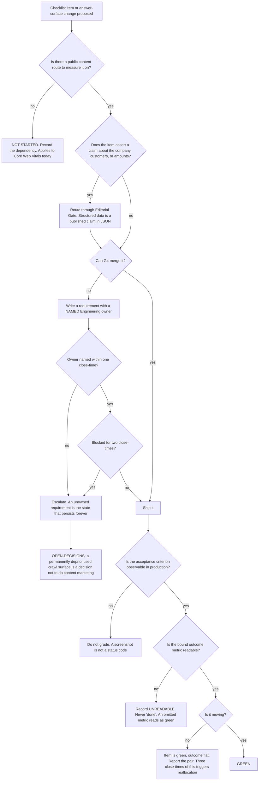

# Technical SEO & AI Answer Surface — Directive

How *this* team decides. Shape differs per unit by design.

G4's graph is built around an uncomfortable fact stated plainly in its charter: **this team
owns requirements it cannot merge.** `robots.txt` needs a deploy to `apps/web`; the 404
status lives in `vercel.json`; a server-rendered title needs a rendering change on a Vite SPA
with `"framework": null`. So the graph's central question is not "should we do this" but
**"can we grade this, and who ships it?"** — and its most important branch is the one that
refuses to mark something green.

## Decision rights

| Level | Decides | Examples |
|---|---|---|
| **Team** | Crawl directives' contents; schema.org types and the never-list; canonical policy; what a requirement says; whether an item is gradable | Writing `robots.txt` restrictively; refusing `AggregateRating` |
| **Team, with [[conversion-funnel-charter]]** | The 404, jointly. G4 the status code, G5 the page | Neither ships the item alone |
| **[[security-charter]]** | Which routes are intentionally public | G4 requests classification; it never classifies |
| **[[client-surfaces-charter]] / [[release-engineering-charter]]** | Whether and how a requirement is implemented | Server rendering; host config |
| **[[editorial-gate-charter]]** | Whether a structured-data claim may be asserted | Any markup about customers, ratings, or recovery |
| **Founder / [[OPEN-DECISIONS]]** | The domain; the rendering approach; whether to ship a consent banner | All three are upstream of every item on the checklist |

## Standing rules

**Emit-no-claim rule.** *Emit no claim rather than a weak one*, adopted verbatim from
`apps/api-gateway/src/vendor-portal/vendor-portal.service.ts:119-120`. A structurally valid
document that says something untrue is the exact failure that comment prevents, and
structured data is read by machines that cannot see a hedge.

**Never-list.** No `AggregateRating`, no `Review`, no `LocalBusiness` premises claim, no
customer count implied through markup. One design partner, no office. This list is revisited
only when the underlying fact changes, never when a rich-result opportunity appears.

**Production-observation rule.** Acceptance criteria are observed against the deployment. The
canonical case: a 404 is verified by a status code from a real request, never by a rendered
page. `apps/web/src/App.tsx:302` can be fixed perfectly and leave `seo.soft_404_rate` at
100% because `vercel.json:12-15` is what serves the code
([[technical-seo-ai-answer-surface-premortem]] M2).

**No-isolated-grading rule.** Every checklist item is bound to an outcome metric. Unreadable
metric means the item is recorded **unreadable**, not done. Green item with a flat outcome for
three close-times triggers reallocation at the department level
([[growth-loops]] L-GRO-6).

**Not-started-is-a-valid-state rule.** Core Web Vitals work is *not started*, deliberately,
because there is no public content route to measure. Recording *not started* with a reason is
honest; measuring the authenticated shell instead is
[[technical-seo-ai-answer-surface-premortem]] M1.

**Expose-only-classified rule.** Every route in a sitemap has been classified public by
[[security-charter]]. `robots.txt` is written as an allow-list, because a deny-list requires
knowing all 448 endpoints.

**Sampling-honesty rule.** `answer_surface.assistant_citations` is a sample and is labelled
as one wherever it appears. There is no impressions report for an AI answer.

## Escalation trigger

Escalate to [[growth-directive]], and to [[OPEN-DECISIONS]] where it names a decision:

1. A requirement has **no named Engineering owner** after one close-time. Not "no progress" —
   no owner. This is [[technical-seo-ai-answer-surface-premortem]] M4 at its only catchable
   moment.
2. A requirement is blocked for two consecutive close-times. Sustained, this is a decision
   that the company is not doing content marketing, and it deserves to be made explicitly
   rather than by attrition.
3. `seo.checklist_items_green` moves for three close-times while `seo.indexed_pages` does not.
4. A markup proposal would assert something [[editorial-gate-charter]] has rejected in prose.
   Structured data is not a loophole around the gate.
5. A sitemap or `robots.txt` entry would expose a route [[security-charter]] has not
   classified.
6. The rendering approach is still undecided when content is ready to publish. A layer
   dependency of this shape is also [[architecture-review-charter]]'s to find, and its finding
   lands in `questions.md`.
