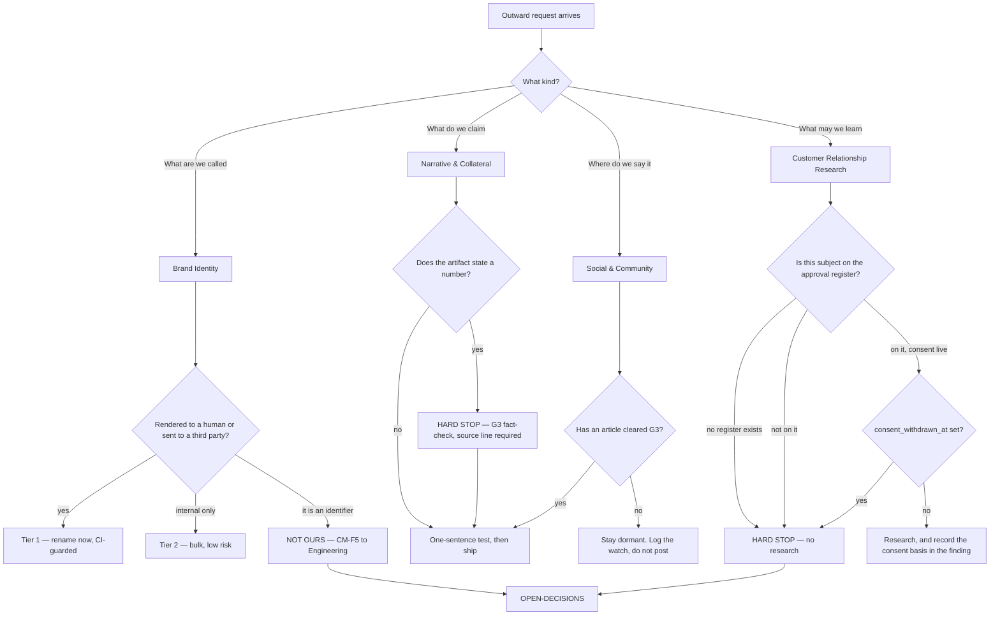

# Media & Brand — Directive

How *this* department decides. The shape is a **routing gate followed by two hard stops**,
because the department's two worst outcomes — publishing a false claim, and touching a
person who did not consent — are both irreversible, and both are cheap to prevent at the
point of routing.

## The graph

## Decision rights

| Decision | Decided by | Not decided by |
|---|---|---|
| The name, the marks, the wordmark | M1, founder confirms | Anyone editing a string in passing |
| Whether a string is tier 1, 2, or 3 | M1, using the rendered/transmitted/identifier test | The person who wants it renamed |
| The one sentence | M2, once. Changing it is a founder decision | Per-artifact authors |
| Whether an artifact may state a number | G3, not M2 | M2 |
| Whether a research subject may be touched | The approval register, mechanically | Anyone's recollection of an approval |
| The legal shape of the consent mechanism | Compliance & Privacy | M4 |
| Adopting a tool or a visual reference | M1, only after identity verification and a named need | Enthusiasm |

## The two hard stops, stated plainly

**A number without a source line does not leave this department.**
[YC_WEDGE_PLAN.md:31-33](../../YC_WEDGE_PLAN.md) establishes that "dollars recovered"
currently means *we asked*, not *we received*. That distinction is load-bearing and it is
the kind of thing a reader checks.

**A person without a recorded approval is not researched.** Public availability of the data
is not an argument. The gate is the register.

## Escalation trigger

Escalate to [OPEN-DECISIONS.md](../../../decisions/OPEN-DECISIONS.md) when:

- a change crosses the Design boundary in either direction (see [[media-brand-charter]]);
- a rename candidate is an identifier rather than a display string (CM-F5);
- the one sentence would need to change;
- M4 is asked to research a subject who is not on the register — including a Sales prospect;
- an advisory function files a finding against this department. Advisory output is
  findings-only ([ORG_STRUCTURE §3](../../../foundation/ORG_STRUCTURE.md)); it does not
  block, and it does not get quietly absorbed either.

## One inherited inconsistency, flagged not resolved

[[commercial]] §4 assigns review of M4's work to **Ethics & Responsible AI (advisory)**.
[ORG_STRUCTURE §3](../../../foundation/ORG_STRUCTURE.md) records that function as
**considered and not adopted**, with agent-autonomy limits and guest-data use falling to
Compliance & Privacy in the line. So the review the division document assigns has no owner.
This directive routes it to Compliance & Privacy and raises the discrepancy rather than
silently rewriting either document.
