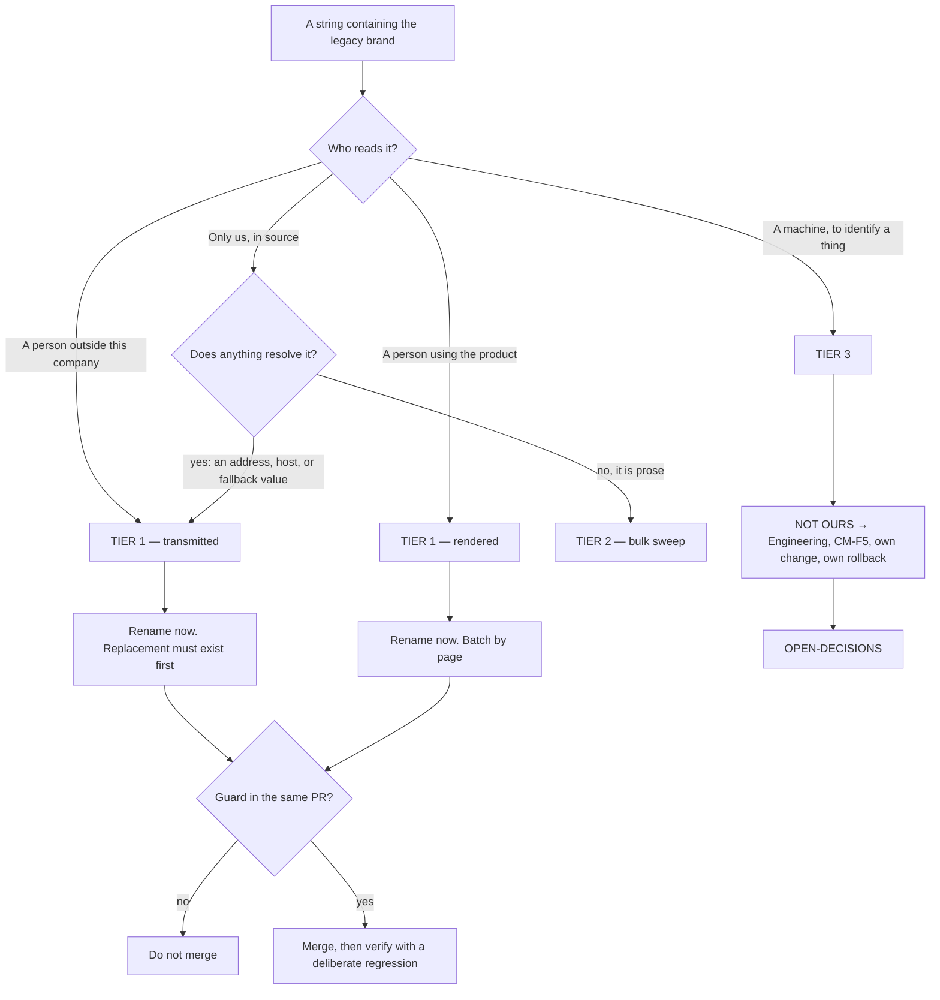

# Brand Identity (M1) — Directive

How *this* team decides. The shape is a **three-way classifier**, because the team's whole
job right now is deciding which of three very different things a given string is — and
because getting that classification wrong is what breaks the product rather than the brand.

## The classifier

## The three questions, in order

**1. Who reads it?** If the answer is anyone outside this company, it is tier 1 and it is
urgent, because we do not control their copy of it. A vendor's inbox keeps a `From:` header
forever. A crawled site's access log keeps `WineOpsBot/1.0` forever. An operator's phone
keeps the app label until they uninstall.

**2. Does anything resolve it?** A comment mentioning WineOps is prose. A fallback string
like `apps/web/src/pages/Help.tsx:18` (`VITE_SUPPORT_EMAIL || 'support@wineops.ai'`) looks
like configuration and behaves like a live address. When in doubt, it resolves.

**3. Is it identifying a thing, or naming it to a human?** `"name": "WineOps"` on
`apps/mobile/app.json:3` is a label. `"slug": "wineops-ai"` on line 4 is an identity.
They are adjacent lines in the same file and they belong to different teams.

## Decision rights

| Decision | M1 decides | M1 does not decide |
|---|---|---|
| Which tier a string is | Yes, using the three questions | — |
| Whether a tier-1 string is renamed | Yes | — |
| What the replacement address or host is | Proposes | Founder confirms; the mailbox must exist first |
| Whether tier 3 happens at all | No | Engineering, via CM-F5 |
| Whether the guard blocks a merge | Yes | — |
| The voice guide's content | Yes | — |
| Whether a given draft violates it | No | G3 applies it |
| Adopting anything from the reference shortlist | Yes, after verification and a named need | — |

## Standing rules

- **The replacement exists before the string changes.** Renaming
  `support@wineops.ai` before the new mailbox receives mail turns a brand defect into a
  support outage.
- **The guard ships with the cleanup, never after it.** A cleanup without a recurrence guard
  is a cleanup that gets undone — the same rule
  [README §2.3](../../../../../foundation/README.md) applies to Security's first assignment.
- **Generated artifacts are rebuilt, not edited.** `apps/api-gateway/openapi.json` and
  `dist/` are outputs. Editing them hides a source defect and passes the audit.
- **Two numbers or it is a failed run.** A single-figure report of this metric is treated as
  a broken scan, because a single figure has already hidden half the problem twice.
- **Identifiers never travel with display strings.** Not in the same commit, not in the same
  PR.

## Escalation trigger

To [OPEN-DECISIONS.md](../../../../../decisions/OPEN-DECISIONS.md) when:

- a string is genuinely ambiguous between tier 1 and tier 3;
- the rename would require a new domain, mailbox, or host that does not exist;
- the voice guide would constrain a unit outside Media & Brand's boundary;
- someone proposes adopting a reference or tool whose identity is still unverified;
- an advisory finding lands against this team. Findings-only
  ([ORG_STRUCTURE §3](../../../../../foundation/ORG_STRUCTURE.md)) — it does not block, and
  it does not get absorbed silently either.
