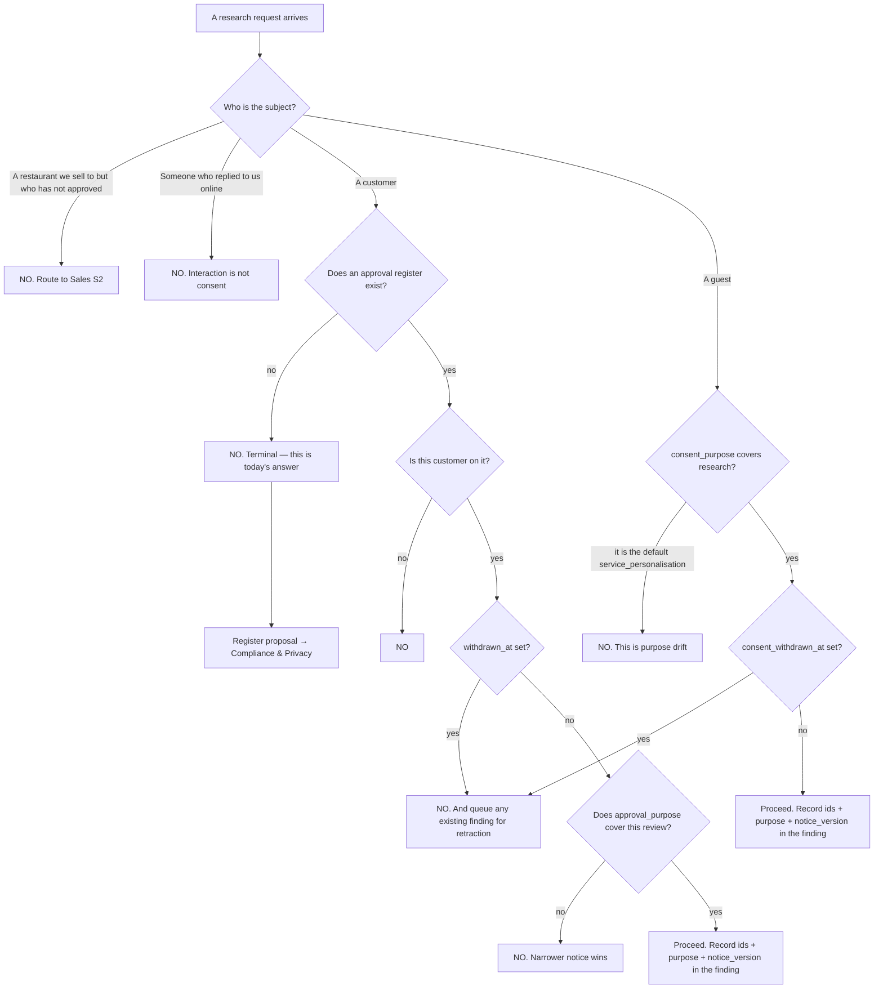

# Customer Relationship Research (M4) — Directive

How *this* team decides. The shape is a **refusal-by-default gate**: every path leads to
"no" unless a specific recorded fact says otherwise. That is unlike every other directive in
this department, and deliberately so — the other teams fail by producing the wrong thing,
this one fails by producing anything it should not have.

## The gate

## The rule the graph encodes

**A "no" is a complete answer.** It does not need to be softened, escalated, or accompanied
by a partial alternative. "I can't research them, but I could look at their menu" is the
same failure with a smaller scope.

**The gate is the register, not the data.** Publicness of the information is irrelevant to
whether the person agreed to be studied. This is the exact argument premortem mechanism 3
predicts, and it will be made sincerely.

## Decision rights

| Decision | M4 decides | M4 does not decide |
|---|---|---|
| Whether a subject is eligible | Yes — mechanically, from the register | Never by recollection or judgement |
| The research questions | Yes | — |
| The findings and their wording | Yes | — |
| The register's **operational** shape | Proposes | Compliance & Privacy decides the legal shape |
| The notice text | Proposes | Compliance & Privacy and the founder |
| Whether an exception is possible | **No. There are no exceptions** | — |
| Whether a prospect may be researched | No | Sales S2, under their own rules |
| Whether a finding ships as a product feature | No | Product |

## Standing rules

1. **No register, no research.** Terminal, not a warning.
2. **Every finding names its subject ids, its purpose, and its notice version** — as fields.
   Without ids, withdrawal cannot be enforced, because a finding that cannot be located
   cannot be retracted.
3. **Withdrawal propagates to findings**, not only to data. `consent_withdrawn_at`
   (`…guest_identity_minimal_slice.sql:64`) puts every dependent finding into the retraction
   queue that week.
4. **Guest consent captured under `service_personalisation` never becomes research consent.**
   The schema records a purpose at `:58` precisely so this cannot happen by accident; doing
   it anyway would be deliberate and permanent in migration history.
5. **A friend's informal yes is still recorded.** The design partner being a friend makes an
   unrecorded approval more likely, not more acceptable.
6. **Refusals are logged.** A gate whose refusals are invisible cannot be audited, and
   cannot show that it held.

## Escalation trigger

To [OPEN-DECISIONS.md](../../../../../decisions/OPEN-DECISIONS.md) when:

- anyone proposes an exception. The proposal is the escalation — it is not weighed here;
- Compliance & Privacy and this team disagree on the register's shape. They win on legal
  basis; the disagreement still gets written down;
- a request arrives that the routing rules do not cover;
- the Ethics & Responsible AI discrepancy needs resolving: [[commercial]] §4 assigns review
  of this team to a function
  [ORG_STRUCTURE §3](../../../../../foundation/ORG_STRUCTURE.md) records as considered and
  not adopted. **The review of the highest-risk team in Commercial currently has no owner.**
