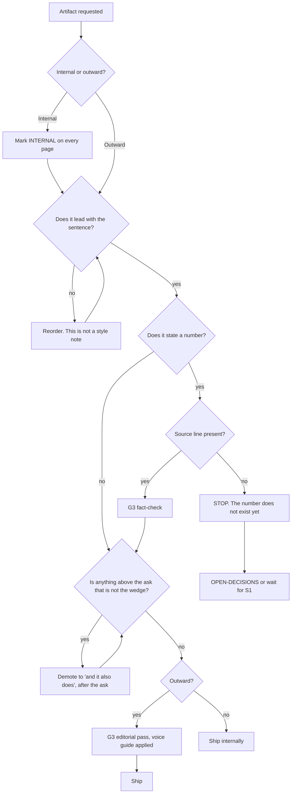

# Narrative & Collateral (M2) — Directive

How *this* team decides. The shape is a **pre-flight sequence** rather than a branching tree,
because every artifact this team produces passes the same four checks in the same order, and
the value is in refusing to skip one under deadline.

## The sequence

## Decision rights

| Decision | M2 decides | M2 does not decide |
|---|---|---|
| The order of the argument | Yes — this is the core craft | — |
| Which room an artifact is built for | Proposes | Founder / Strategy & Fundraising confirm |
| The sentence | Applies it | Changing it is a founder decision |
| Whether a number may be stated | No | G3 verifies; S1 produces |
| Whether an artifact is internal or outward | Yes, at the start | Reclassifying an internal artifact as outward requires a full pre-flight, not a re-label |
| Visual treatment | Yes, once the reference arrives | — |
| Whether to apply to YC | No | Strategy & Fundraising |

## Standing rules

- **The sentence goes first, or the artifact is not finished.** Leading with anything else
  is a structural defect, not a preference.
- **Everything that is not the wedge goes after the ask**, one line each. This rule exists
  because [YC_WEDGE_PLAN.md:323](../../../../YC_WEDGE_PLAN.md) already diagnosed the failure
  in the product and the collateral will inherit the instinct.
- **An internal artifact cannot be promoted to outward by re-labelling it.** It runs the
  whole sequence, including G3, or it stays internal.
- **A missing input is a wait, not a guess.** The visual reference is blocked; structure
  continues, styling waits.
- **A demo of a demo says so.** Until `DEP-06` is checked
  ([PROJECT.md:101](../../../../../PROJECT.md)) any recording is of a demo build and is
  labelled as one.

## Escalation trigger

To [OPEN-DECISIONS.md](../../../../../decisions/OPEN-DECISIONS.md) when:

- the sentence would need to change;
- a deadline would require shipping a number without a source line — the correct output is
  an escalation, never a softened claim;
- an artifact is needed for a room nobody has named;
- Strategy & Fundraising and this team disagree on artifact scope. They own the path; we own
  the craft, and the seam between "what we send" and "how it is built" is exactly where that
  disagreement will appear;
- the blocked visual reference stays blocked past a production deadline. That is a founder
  decision — wait, or accept a first version that will be rebuilt.
