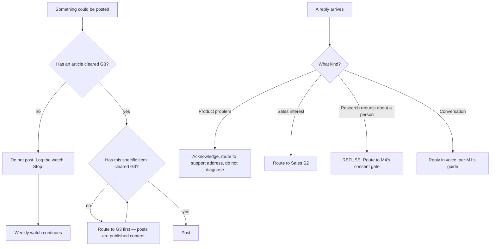

# Social & Community (M3) — Directive

How *this* team decides. The shape is a **single gate followed by a routing rule**, because a
dormant team has exactly one decision to make and a live one has exactly two.

## The graph

## The one rule that matters while dormant

**"We should post something" is not an argument against a written entry condition.** The
trigger exists because the pressure to break it is predictable, comes from a good instinct,
and always arrives at a moment when posting feels overdue. If the trigger should change, it
changes in [OPEN-DECISIONS.md](../../../../../decisions/OPEN-DECISIONS.md), in writing,
before the post — not by exception afterwards.

## Decision rights

| Decision | M3 decides | M3 does not decide |
|---|---|---|
| Whether the trigger has fired | Yes — it is a factual check | — |
| Whether to break the trigger | No | Founder, via OPEN-DECISIONS |
| Which platform | Proposes, on evidence | Founder confirms |
| Posting rhythm and content shape | Yes | — |
| Whether an item may be published | No | Growth G3 — a post is published content |
| Reply routing | Yes | The support address itself is M1's |
| Handle reservation | Proposes | Founder |
| Whether follower counts substitute for the real metric | **No, and this is not a judgement call** | — |

## Standing rules

- **A post is published content.** It clears G3 like an article does. Shorter is not looser.
- **Never diagnose a product problem in public.** Acknowledge, route, stop. A public thread
  about a bug is a support channel forming.
- **Never research a person because they interacted with us.** A reply, a follow, or a
  mention is not consent. That request routes to
  [[customer-relationship-research-charter|M4]]'s gate, where the answer today is no,
  because the approval register does not exist.
- **Report nothing rather than report followers.** While the real metric is unmeasurable,
  the honest output is "not measurable yet". Substituting the available vanity metric for
  the unavailable real one is how a distribution surface becomes an engagement surface.

## Escalation trigger

To [OPEN-DECISIONS.md](../../../../../decisions/OPEN-DECISIONS.md) when:

- someone proposes posting before the trigger fires;
- the trigger itself should change — for instance to the first verified recovery number,
  which would tie this team to Sales rather than Growth;
- CM-F6 is revisited: chartered dormant, or not chartered at all;
- a reply asks for something the routing rule does not cover;
- the handle for the new company name is found to be unavailable. That is a naming problem,
  not a social problem, and it belongs to [[brand-identity-charter|M1]] immediately.
