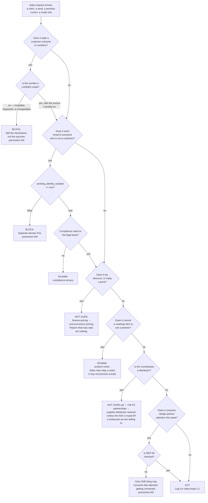

# Sales — Directive

How *this* unit decides. Sales' decision shape is unusual in one respect: **almost every
decision it faces is gated on a claim it is not yet entitled to make.** So the graph is
built around a single question asked before anything else — *what evidence entitles this?*

## Decision rights

**Sales decides alone:**

- Who the design partner talks to, when, and about what.
- Whether a conversation is *qualified* — the rubric is ours, and so is the judgement
  under it.
- How a reply is routed and inside what window it is answered.
- Whether a given account is a design partner, a pilot, or a customer. The words mean
  three different things and Sales owns the definitions before there are three of them.
- Whether to walk away from a prospect.

**Sales decides with a named partner:**

| Decision | Co-owner | Sales' half |
|---|---|---|
| What the case study says | [[media-brand-charter]] | We supply verified facts and a real quote. They write it. We may veto an inaccuracy; we may not add a claim. |
| What the recovery number *is* | Intelligence → [[analytics-bi-charter]] | We report it. They define it. We do not get to choose the definition that flatters us. |
| Legal basis for cold outbound | [[compliance-privacy-charter]] | They rule on lawfulness. We own the sending mechanics and the suppression list. |
| Distributor feed asks | [[supplier-distributor-network-charter]] | See CM-F3 in [[sales-charter]]. Ours only when the restaurant is the one asking. |

**Sales never decides:**

- **Price, packaging, discount, or contract value.** Founder-deferred *and*
  [[finance-pricing-charter]]'s. A sales function that sets price sets it to whatever
  closes, which is the reason this is a hard rule rather than a convention.
- **What gets built.** Sales relays a need; [[product-vision-charter]] decides. A feature
  promised at a table is a roadmap written by whoever was in the room.
- **Whether a claim is true.** Evidence decides. Sales' only right is to stop using a claim.
- **The target list.** Founder-deferred, unassigned, and deliberately not sketched.

## The three standing gates

These are not guidelines. Each has a boolean behind it and each maps to a named premortem
mechanism.

1. **The evidence gate.** No outbound artifact — sequence, landing copy, demo script,
   investor paragraph — may contain a recovery figure unless
   `sales.verified_dollars_recovered > 0` and the figure traces to a **credit memo that
   landed on a later invoice** (`.planning/YC_WEDGE_PLAN.md:31-33`). *"We asked"* is not
   recovery. → [[sales-premortem]] M3
2. **The identity gate.** No cold email leaves the transactional sender. Today
   `sales.sending_identity_isolated == false`
   (`apps/api-gateway/src/communications/gmail.service.ts:76-78`), so today the answer to
   every send request is no. → [[sales-premortem]] M4
3. **The attention gate.** While `DEP-06` is unchecked (`.planning/PROJECT.md:101`),
   exactly one thing may consume design-partner attention: getting connected. Not a
   feature walkthrough, not a research interview, not a testimonial request.
   → [[sales-premortem]] M2

## Escalation trigger

Escalate to `OPEN-DECISIONS.md` via [[decision-office-charter]] when:

- A gate above would need to be waived. **Gates are waived by the founder in writing, or
  not at all** — a gate that a department can waive for itself is a preference.
- A boundary in [[sales-charter]] §Explicit non-goals is contested by the unit on the other
  side. CM-F3 is already in this state and is filed, not assumed.
- The design partner asks for something that changes the roadmap.
- Three consecutive weeks of `sales.unprompted_sessions_7d == 0` alongside positive
  sentiment. This escalates **automatically**, because [[sales-premortem]] M1 is precisely
  the failure that nobody escalates voluntarily — it feels fine from the inside.
- **2026-11-24 arrives** with `DEP-06` unchecked and `verified_dollars_recovered == $0`.
  The escalation is pre-written: fold Sales into [[growth-charter]].

## One decision this department will get wrong if it is not written down

When the founder is asked *"can it do X?"* by the design partner, the honest answer is
often *"not yet, but it could."* That sentence closes friendly conversations and creates
roadmap. **The rule:** Sales may say what the product does today, and may say *"I will ask
whether we can build that."* It may not say *"we will build that"* or attach a date.
Written here because the failure is social, happens in real time, and cannot be caught in
review — only pre-committed to.
