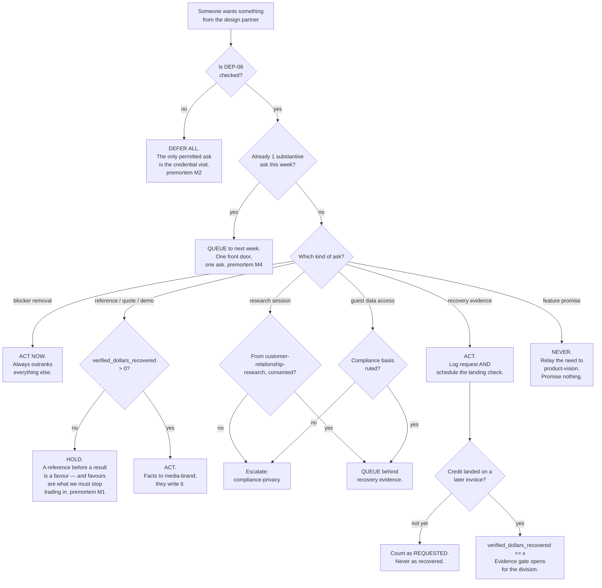

# Design Partner Operations — Directive

How *this* team decides. Its decision shape is governed by one scarce resource that no
other unit can replenish: **a single willing restaurant's attention.** Every branch below
is really a question about spending it.

## Decision rights

**This team decides alone:**

- What the design partner is asked for **this week**, and in what order. Including the
  right to say no to another unit's request, or to hold it.
- Whether a contact counted as a touch. It counts only if it produced an observed usage
  moment or a named blocker.
- Whether a blocker is real, and its priority. Blockers always outrank evidence-gathering.
- When to stop asking. If the relationship shows strain, this team pauses all asks
  unilaterally and tells the org why.

**Decides with a named partner:**

| Decision | Co-owner | Our half |
|---|---|---|
| Research session timing | [[customer-relationship-research-charter]] | They own protocol and output. We own **when**, and whether the account has room this week. |
| Guest data access | [[guest-experience-charter]] + [[compliance-privacy-charter]] | We own the conversation with the owner. They own the lawful basis and the schema. |
| Adapter faults | [[pos-bridge-charter]] | We report symptoms and hold the customer relationship while it is fixed. We do not fix it. |
| The recovery number's definition | [[analytics-bi-charter]] | We produce the raw events. They define what counts. |

**Never decides:**

- **Whether a feature will be built.** Relay to [[product-vision-charter]]. The permitted
  sentence is *"I will ask whether we can build that."* Never *"we will."*
- **Price**, including whether this account ever pays.
- **What the case study says.** Facts and a real quote go to [[media-brand-charter]]; the
  prose is theirs. We may veto an inaccuracy. We may not add a claim.
- **Whether a credit counts as recovered.** The invoice decides.

## The four standing rules

1. **One front door, one ask.** Every unit's request routes through this team, capped at
   one substantive ask per week, ordered: connection → recovery evidence → reference
   permission → research → guest data. → [[design-partner-operations-premortem]] M4
2. **Two counters, never one.** `credits_requested` and `credits_landed` are tracked
   separately from the very first claim, and **only the second is ever published**
   (`.planning/YC_WEDGE_PLAN.md:31-33`). → M3
3. **No reference before a result.** No permission, quote, or demo ask until
   `verified_dollars_recovered > 0`. → M1
4. **Blockers outrank everything.** If the restaurant is stuck, nothing else is asked of
   them that week. A blocked customer being asked for a testimonial is how relationships
   end quietly.

## Escalation trigger

Escalate to [[sales-directive]], and onward to `OPEN-DECISIONS.md` via
[[decision-office-charter]], when:

- **Automatically:** three consecutive weeks of `sales.unprompted_sessions_7d == 0` with
  positive sentiment. Automatic because [[design-partner-operations-premortem]] M1 is the
  failure nobody escalates voluntarily — it feels fine from inside the friendship.
- **2026-09-24** arrives with `DEP-06` unchecked.
- A blocker passes **14 days** open. The restaurant will not chase us; silence is not
  patience.
- The design partner asks for something that changes the roadmap.
- Another unit disputes a queued or refused ask. The queue is this team's call, but a
  contested call belongs in writing rather than in a quiet override.
- The owner declines, defers, or goes quiet on **two consecutive** asks. That is the
  earliest honest reading of relationship strain, and reading it late is irreversible.

## One thing that will go wrong in real time

The owner will, at some point, say something warm that sounds like validation — *"this is
exactly what we need"* — in a week where `unprompted_sessions_7d` is zero. The instinct is
to record the quote. **The rule: a quote is only usable alongside its week's usage
number.** Warm words with a flat line are not a testimonial; they are
[[design-partner-operations-premortem]] M1 arriving with a smile, and the quote is the
single most misleading artifact this team can produce.
