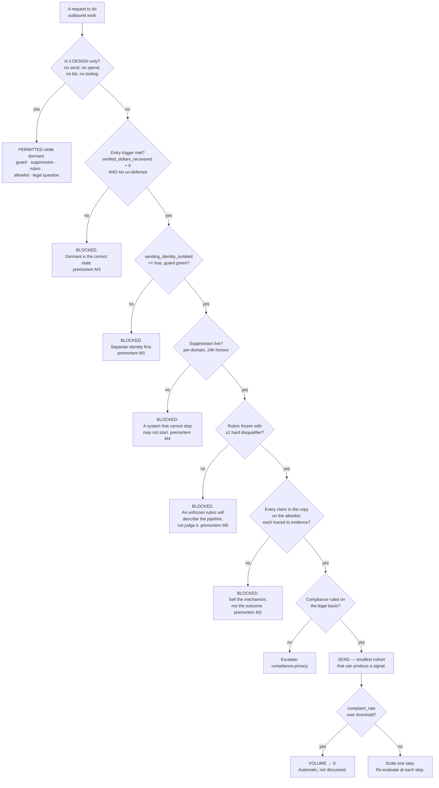

# Outbound Engine — Directive

How *this* team decides. Its decision shape is a **series of gates rather than a tree**,
because everything it might do is currently forbidden and the only interesting question is
what unlocks what. Gates are evaluated in order; the first failure stops the request.

## Decision rights

**This team decides alone:**

- Sending identity, backend, warmup schedule, and volume ramp.
- Sequence structure — steps, timing, stop conditions.
- Suppression policy and its scope (per-domain is this team's call, and it is made).
- The qualification rubric and its disqualifiers.
- **Whether a claim may be asserted.** Not how it is phrased — whether it is permitted.
- **To cut volume to zero unilaterally.** No consultation, no notice. The safety dial is
  never a negotiation.

**Decides with a named partner:**

| Decision | Co-owner | Our half |
|---|---|---|
| Copy | [[media-brand-charter]] | They write it. We hold the allowlist and the identity. Craft is theirs; assertion is ours. |
| Legal basis for cold contact | [[compliance-privacy-charter]] | They rule on lawfulness. We own mechanics and suppression. |
| Which claims are true | [[design-partner-operations-charter]] | They verify a credit landed. We may only use what they verified. |
| Transactional deliverability | [[reliability-sre-charter]] | We own **not damaging it**. That is a boundary, not shared ownership. |

**Never decides:**

- **The target list.** Founder-deferred, unassigned. Not chosen, not inferred, not
  "provisionally sketched for testing". → [[outbound-engine-premortem]] M3
- **Price.** Deferred, and [[finance-pricing-charter]]'s regardless.
- **Whether a claim is true.** Evidence decides; the team's only right is to refuse one.
- **To waive its own gates.** Waivers come from the founder in writing, or not at all — a
  gate a team can waive for itself is a preference.

## The five gates, stated plainly

| # | Gate | Boolean today | Guards |
|---|---|---|---|
| G1 | Entry trigger — landed credit **and** list un-deferred | **false** | M3 |
| G2 | `sending_identity_isolated == true`, CI guard green | **false** (`gmail.service.ts:76-78`) | M1 |
| G3 | Suppression live: per-domain, 24h honour | **false** | M4 |
| G4 | Rubric frozen, ≥1 hard disqualifier | **false** | M5 |
| G5 | Every claim on the allowlist, each cited | allowlist **empty** | M2 |

**All five are false. Therefore every send request today is answered no**, and that is not
a temporary embarrassment — it is the design. The gates are ordered by cost of failure, not
by convenience.

## The volume dial

Once sending begins, `sales.complaint_rate` is a **safety** metric rather than a
performance one, and it operates in one direction only:

- Above threshold → **volume to zero, automatically.** Not reviewed, not discussed, not
  weighed against pipeline targets. The asymmetry is deliberate: a lost week of sending is
  recoverable, a burned domain is not.
- Below threshold → volume may scale **one step**, then re-evaluate. No compounding ramps.

## Escalation trigger

Escalate to [[sales-directive]], and onward to `OPEN-DECISIONS.md` via
[[decision-office-charter]], when:

- Any gate would need waiving.
- Anyone proposes sending from the transactional identity "just for a test". There is no
  such thing as a test send from a shared identity — the reputation effect is identical.
- Any target-list artifact appears — spreadsheet, script, segment, or count.
  **The first row escalates**, not the first send. → M3
- A stop request is not honoured within 24 hours. That is an incident, not a bug.
- `qualified_conversation_rate` exceeds 60% in the first cohort. A rate that high is
  evidence of a broken rubric, not a good one, and it escalates **upward** — which is
  unusual enough to state explicitly, because nobody escalates a number that looks good.
- 2026-11-24 arrives with the entry trigger still unmet.

## One thing that will go wrong quietly

Dormancy is uncomfortable. The pressure will not arrive as *"let's ignore the trigger"* —
it will arrive as *"let's just put together a small list so we're ready"*, which sounds like
preparation and is the first row of M3. **The rule: readiness is measured in machinery, not
in names.** This team may build anything that has no restaurant in it, and nothing that
does.
