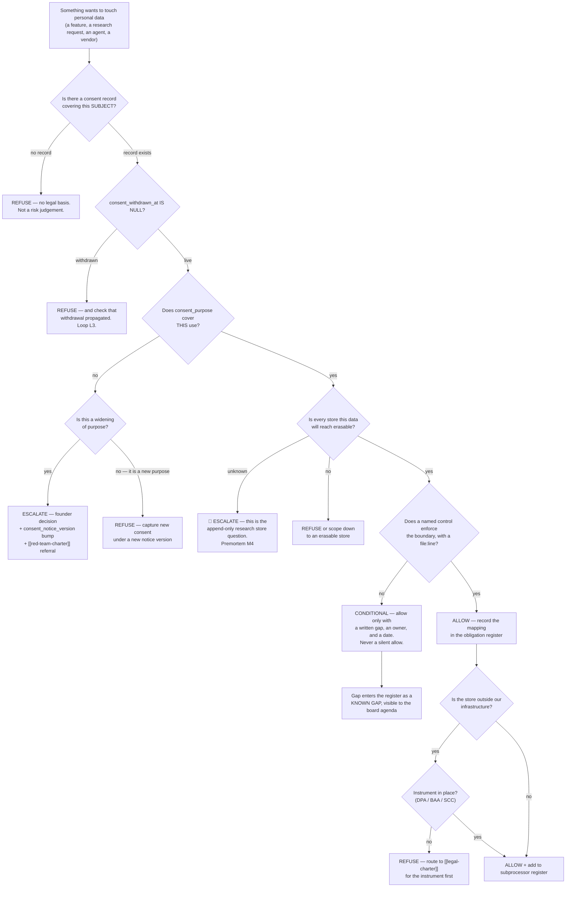

# Compliance & Privacy — Directive

How *this* department decides. The shape is a **legal-basis test with an asymmetric
tie-break**, because the two error types here are not comparable and must never be
summed into one score.

## The gate

## Decision rights

**Decided here, no escalation:**

- Whether a given use is covered by an existing `consent_purpose`. This is a
  reading of a record, not a business judgement, and it does not get negotiated.
- The definition of PII — one definition, one module, binding on every guard.
- Whether an erasure is complete, and what the receipt may claim.
- Whether a control is evidenced. *"We believe it is handled"* is not evidence; a
  `file:line`, a test, or a named owner with a date is.
- Whether a host in [`EXTERNAL_CONNECTIONS.md`](../../../foundation/EXTERNAL_CONNECTIONS.md)
  receives personal data.
- **Refusing to sign off a data-protection exhibit clause we cannot evidence.** The
  refusal is always accompanied by the two acceptable alternatives: strike the
  clause, or accept the gap in writing.
- Whether a research request passes the consent gate
  ([[customer-relationship-research-charter]] is a consumer, never an owner).
- Whether the [[regulated-operations-charter]] entry trigger has fired.

**Not decided here — escalates to `OPEN-DECISIONS.md`** (CLAUDE.md §0.1: nothing is
decided until it is written in `.planning/decisions/`):

| Escalation | Why it is not ours |
|---|---|
| **NF-B erasability vs the append-only research store** | It trades a legal right against ML value across three departments. A privacy function that quietly picks the ML-cheapest option has failed; one that picks the ML-most-expensive option has overreached. Founder call, paired to OD-11. |
| **Any widening of `consent_purpose`** | Ethics scope sits in this line, so we are not independent here ([[compliance-privacy-premortem]] M5). Founder decides; [[red-team-charter]] attacks the decision first. |
| **What the recommender may condition on** | Inherited Ethics scope, same independence defect. We frame the question and the fairness failure mode; we do not adjudicate our own division's product. |
| **OD-C2** — DPA/BAA instrument vs obligation split | Named open decision, cross-department with [[legal-charter]]. |
| **OD-C4** — is Regulated Operations Corporate's? | Named open decision. |
| **Whether a signature may proceed over our refusal** | A veto over a revenue event belongs to the founder, not to the department holding it. What we own is making the gap explicit *before* the signature. |
| **Schema columns on NF-A/NF-B** | Owned by [[neural-footprint-instrumentation-charter]] / OD-11. We are a requesting consumer. |
| **Retention periods** that trade against product value | We state the obligation floor; the ceiling is a product decision. |

## Escalation trigger

Escalate immediately, without waiting for a review cycle, when **any** of these fire:

1. **A store is discovered that erasure cannot reach.** [[compliance-privacy-premortem]] M3.
   This escalates the moment it is *discovered*, not the moment it is confirmed —
   confirmation is what the escalation is for.
2. **The first NF-B row is written while erasability has no dated decision.** M4.
   The store's emptiness is a wasting asset; this trigger expires by accumulation
   rather than by event, which is why it must be armed now.
3. **An inbound DPA, MSA data-protection exhibit, or security questionnaire arrives.**
   M2. Escalate on arrival, not on deadline, because the only useful window is before
   the negotiation has a shape.
4. **A guest feature merges while `privacy.consent_call_sites` is still 0.** M1. The
   schema being uncalled is tolerable while no guest data flows; it becomes a live
   defect the instant one does.
5. **Two purpose-widenings approved in a row with no recorded dissent.** M5. Report
   to [[red-team-charter]] as well as the founder — a department reporting only to
   itself on its own independence defect is the arrangement [[ORG_STRUCTURE]] §3
   rejects.
6. **A PII guard is edited on one side of the duplicate.** `constraint_engine.py:28`
   and `provider_communication_agent.py:40` are byte-identical today; the first
   one-sided edit is the divergence, and nothing in CI currently notices.
7. **The [[regulated-operations-charter]] trigger fires** — first licensed
   jurisdiction, or excise in a signed MSA.

## Tie-break rule

When allow and refuse are genuinely balanced, **refuse.**

The asymmetry is not caution, it is arithmetic, and the repository already argues it
in this exact domain: `scripts/check_no_guest_name_matching.sh` states that a false
guest merge *"is a DISCLOSURE: one person's dining history, spend, allergies and
companions become visible to another… No un-merge reverses that."* The same shape
holds for every decision in this directive.

- **A use that should have been allowed and was refused** costs one feature delay
  and one uncomfortable conversation. It is fully reversible by a later decision.
- **A use that should have been refused and was allowed** costs a disclosure, and a
  disclosure has no inverse operation. There is no threshold at which it becomes
  recoverable, which means there is no threshold at which the two errors can be
  traded against each other.

These are not two values of one variable. Any process that scores them on one axis —
"risk-weighted", "expected cost" — has already made the mistake. The department
refuses on ties, states that it is refusing on a tie, and lets the escalation path
overturn it in writing if the business judgement says so. **An overturned refusal is
a working department; an unrecorded allow is not.**

## One rule about how controls get written

Wherever a grep is sufficient, the control is a grep — not a review, not a
convention, not a paragraph in a charter. The repo has proved this works for privacy
specifically: two guard scripts run on push, PR and a daily cron
(`.github/workflows/schema-parity.yml:19-27, 152-154`), and their headers carry the
argument rather than just the rule, so a future contributor learns *why* before they
add an allowlist entry.

The corollary is uncomfortable and load-bearing: **a control this department cannot
express as a check is a control this department cannot claim in a register.** It
goes in as a known gap with an owner, which is the honest form and the only one that
survives a security questionnaire.
