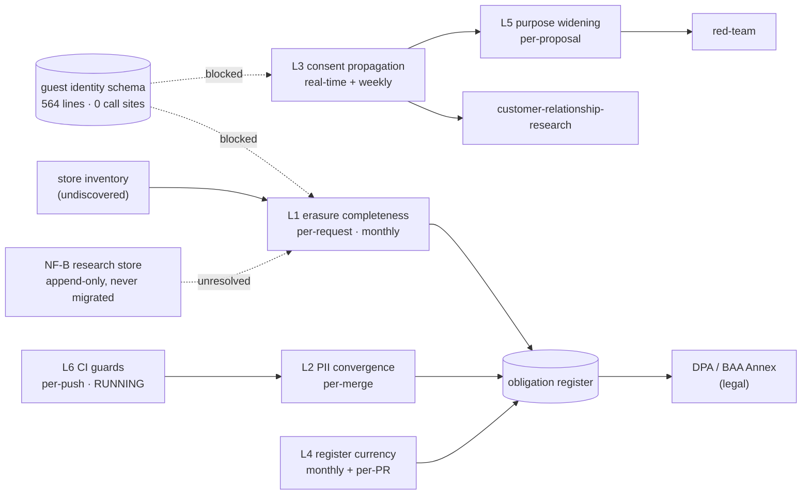

# Compliance & Privacy — Loops

Every loop names its close-time. A loop that cannot state how fast it closes is a
diagram, not a loop ([[ORG_STRUCTURE]] §5).

> **Honest status:** six loops, **one closing**. L6 — the two guest guards in CI —
> is the only feedback loop in this department that actually runs today, and it
> guards a code path with no callers. Everything else is proposed or blocked, and
> two of them are blocked on the same missing thing: a store inventory that is
> discovered rather than declared.

---

## L1 — Erasure request → proven absence

The department's core loop, and the one its primary metric is defined on.

```yaml
type: loop
id: erasure-completeness
owner: compliance-privacy
measures: [privacy.erasure_completeness, privacy.erasure_receipt_count]
changes: [privacy.erasure_runbook, privacy.store_inventory, schema.erasure_receipts]
inputs_from: [privacy-engineering, guest-identity-consent, data, reliability-sre]
outputs_to: [regulatory-posture, legal, customer-relationship-research]
close_time: per-request, reviewed monthly
status: blocked
```

**Blocked on three things, all cheap today:** no erasure function exists, no receipt
table exists (`erasure_receipt_id` at
`20260819000000_guest_identity_minimal_slice.sql:82` is a bare `uuid` with no FK),
and the store inventory is undiscovered.

**The rule that makes this loop honest:** the denominator is **discovered, not
declared**. Enumerate stores from a live catalogue (`information_schema` plus the six
sinks named in `scripts/check_no_raw_guest_channels.sh`: `pos_checks.raw`, `events`,
`notifications`, `decision_log`, `event_store`, `analytics_cache.data`). A
completeness metric over a hand-written list is a tautology
([[compliance-privacy-premortem]] M3).

---

## L2 — PII definition → guard convergence

```yaml
type: loop
id: pii-definition-convergence
owner: compliance-privacy
measures: [privacy.pii_definition_count, privacy.guard_divergence_events]
changes: [privacy.pii_module, ci.guard_scripts]
inputs_from: [privacy-engineering, security, ai-orchestration]
outputs_to: [security, ai-orchestration, data]
close_time: per-merge
status: proposed
```

**Close-time is per-merge, deliberately.** A convergence loop that closes weekly lets
a week of divergent guards ship first. Today's count is **3 distinct definitions
across 4 guards**, two of which (`constraint_engine.py:28`,
`provider_communication_agent.py:40`) are byte-identical copies with no shared
import — so the divergence event is a single one-sided edit, and nothing observes it.

**Enforcement target:** a `check_single_pii_definition.sh` in the shape of the five
`check_*.sh` guards already in CI. Target value **1**, and 1 is the only acceptable
value: two definitions is not redundancy, it is a disagreement nobody has had.

---

## L3 — Consent state → downstream propagation

```yaml
type: loop
id: consent-propagation
owner: compliance-privacy
measures: [privacy.consent_call_sites, privacy.consent_gate_denials, privacy.withdrawal_propagation_lag]
changes: [privacy.consent_gate, media.research_cohort, product.personalisation_scope]
inputs_from: [guest-identity-consent, privacy-engineering]
outputs_to: [customer-relationship-research, taste-fingerprint, guest-experience]
close_time: real-time on the gate, weekly on the audit
status: blocked
```

**Blocked on:** `privacy.consent_call_sites` is **0**. Nothing in `apps/` or
`services/` reads or writes `consent_purpose`, `consent_withdrawn_at`, or calls
`guest_link_identifier()`. The gate cannot deny what it is never asked about.

**Two close-times on purpose.** The gate must answer in the request path, because a
gate consulted asynchronously is advice. The *audit* — did every consumer honour the
answer — closes weekly, because that is a sweep over consumers rather than a check on
one call.

**Health test:** `privacy.consent_gate_denials` must be **greater than zero** once
running. A gate whose denial count is zero over a quarter is either unused or
misconfigured, and both look identical from a dashboard — the same failure shape as a
stub agent that consumes events and produces nothing
(`services/agent-orchestrator/agents/compliance_agent.py:11-15`).

---

## L4 — Code behaviour → obligation register → notice

The paper loop. Its input is other people's commits.

```yaml
type: loop
id: obligation-register-currency
owner: compliance-privacy
measures: [compliance.obligation_coverage, compliance.notice_accuracy, compliance.subprocessor_classification]
changes: [compliance.obligation_register, web.privacy_notice, compliance.subprocessor_register]
inputs_from: [engineering, data, platform-api, partnerships-integrations, ai-orchestration]
outputs_to: [legal, sales, regulatory-posture]
close_time: monthly, plus per-PR for changes touching a registered control
status: proposed
```

**Why two close-times again:** a monthly sweep catches drift; a per-PR trigger
catches the specific change that invalidates a claim. `apps/web/src/pages/Privacy.tsx`
already states the standard in its own header — *"If any of those change, this page
has to change with them"* — which is a per-PR obligation written as a comment and
enforced by nothing. Today the page's brand is stale at `:23`, `:31`, `:43`, which is
the loop failing before it has been built.

**Raw material already exists:** [`EXTERNAL_CONNECTIONS.md`](../../../foundation/EXTERNAL_CONNECTIONS.md)
enumerates 50 hosts, 8 SDKs and 80 env vars. Classifying which receive personal data
converts an artifact generated for another purpose into a subprocessor register.

---

## L5 — Guest-data use proposal → decision → notice version

The independence loop. It exists because Ethics scope sits in this line rather than
in an advisory function ([[ORG_STRUCTURE]] §3, struck row).

```yaml
type: loop
id: purpose-widening-review
owner: compliance-privacy
measures: [privacy.purpose_widenings, privacy.recorded_dissent_rate, privacy.notice_version_bumps]
changes: [privacy.consent_notice_version, product.personalisation_scope, privacy.obligation_register]
inputs_from: [taste-fingerprint, guest-experience, customer-relationship-research, analytics-bi]
outputs_to: [red-team, decision-office, legal]
close_time: per-proposal, audited quarterly
status: proposed
```

**The mechanism that makes it auditable:** every widening produces a
`consent_notice_version` bump (schema column at `:59`). If a use change does not
require a new notice version it is not a widening; if it does, the bump is a record
a self-review cannot suppress.

**Failure indicator:** two consecutive approvals with `recorded_dissent_rate` = 0.
That is [[compliance-privacy-premortem]] M5 arriving, and it routes to
[[red-team-charter]], not to this department's own review.

---

## L6 — Guest identity guards in CI

**The only loop in this department that closes today.** Documented here so its scope
is not overstated.

```yaml
type: loop
id: guest-identity-ci-guards
owner: compliance-privacy
measures: [privacy.guard_pass_rate, privacy.guard_allowlist_size]
changes: [ci.guard_scripts, privacy.pii_module]
inputs_from: [engineering, guest-identity-consent]
outputs_to: [privacy-engineering, security]
close_time: per-push and per-PR, plus daily cron
status: running
```

**Running, verified:** `.github/workflows/schema-parity.yml:19-27` (push to
`main`/`develop`, pull_request, `cron: "0 6 * * *"`, `workflow_dispatch`), executing
`scripts/check_no_guest_name_matching.sh` and `scripts/check_no_raw_guest_channels.sh`
at `:152-154`, alongside `scripts/eval_guest_merge_policies.py` at `:149`.

**Scope caveat, stated rather than buried:** both guards protect the *correct* path.
Nothing calls that path yet. A green check here proves no code violated a rule about
writing guest channels; it does not prove any guest data is handled correctly,
because no code handles guest data at all. This is
[[compliance-privacy-premortem]] M1 in loop form — the guard and the gap coexist, and
the guard is not evidence against the gap.

---

## Loop dependency



**Read this as: one absent caller blocks two of six loops, and one locked
architecture decision quietly threatens the department's primary metric.** L6 closes
today and guards an unused path. L2 and L4 can start immediately — neither needs the
schema to have callers. L1 and L3 wait on the first consent write. The dotted line
from NF-B is the one that gets more expensive every day it stays dotted.
