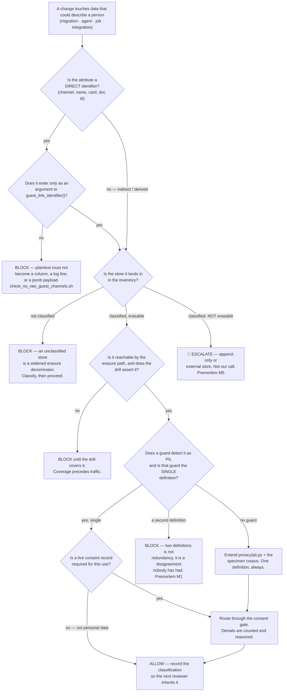

# Privacy Engineering — Directive

How *this* team decides. The shape is a **construction review**: it is applied to a
proposed change to code or schema, not to a business request, and its output is a
build that passes or a guard that fails.

## The gate

## Decision rights

**Decided here, no escalation:**

- **Whether an attribute is personal data.** A classification call, made once and
  recorded so the next reviewer inherits it rather than re-deciding.
- **The single PII definition** — its patterns, its version constant, its specimen
  corpus. Binding on every consumer including [[security-charter]]'s.
- **Blocking a migration that puts a plaintext identifier in a column.** This is not
  a preference; `check_no_raw_guest_channels.sh` already enforces it in CI and the
  review right is the human form of the same rule.
- **Whether a store is in the inventory and whether it is erasable.**
- **What an erasure receipt may claim.** A receipt asserting a store the drill does
  not cover is a false statement, and this team refuses to sign it.
- **Whether the consent gate allows a given request** — a reading of a record, not a
  negotiation.
- **Guard mechanics**: patterns, breadth, allowlist entries and their expiry.
- **Refusing to certify a control as evidenced** for [[regulatory-posture-charter]]'s
  register. *"We believe it is handled"* is not evidence; a `file:line`, a passing
  test, or a named owner with a date is.

**Not decided here — escalates to [[compliance-privacy-directive]], then
`OPEN-DECISIONS.md`:**

| Escalation | Why it is not ours |
|---|---|
| **NF-B research-store erasability** | A controls team that unilaterally imposes an ML cost has overreached; one that quietly accepts an unerasable store has failed. We insist a mechanism is chosen; we do not choose it. [ADR 0006](../../../../decisions/0006-neural-footprint-architecture.md), paired to OD-11. |
| **Widening `consent_purpose`** | A legal-basis question, not a controls question. |
| **Retention periods that trade against product value** | We state the obligation floor; the ceiling is a product call. |
| **Whether guest consent *capture* is ours or Product's** | Contested seam, [[compliance-privacy-charter]]. Named, not claimed. |
| **Whether this team may hold a migration** | A review that cannot hold a change is advice. Needs founder backing to be otherwise. |
| **Adding a field to NF-A/NF-B** | Owned by [[neural-footprint-instrumentation-charter]] / OD-11. We are a requesting consumer. |
| **Access control, RLS, tenant isolation defects** | [[security-charter]] — same consequence, different discipline. |

## Escalation trigger

Escalate immediately, without waiting for a review cycle:

1. **A store is found that erasure cannot reach.** Escalate on *discovery*, not on
   confirmation — confirmation is what the escalation is for. (M2, M5)
2. **A second PII definition is proposed**, however locally reasonable. (M1)
3. **A one-sided edit lands on one of the two duplicate pattern lists.** Today they
   are byte-identical; that is a fact with an expiry date. (M1)
4. **`privacy.guard_allowlist_size` crosses 5**, or an entry ages two quarters
   unreviewed. (M3)
5. **A person-shaped column appears outside the identity spine.** (M4)
6. **The first NF-B row is written** while erasability has no dated decision. (M5)
7. **A guest feature merges while `privacy.consent_call_sites` is 0.** The schema
   being uncalled is tolerable with no guest data; it is a live defect the instant
   there is any.
8. **Anyone asks for an erasure receipt covering a store the drill does not
   enumerate.** Say no in writing, then escalate if it recurs — this is where a
   controls team gets eroded by kindness.

## Tie-break rule

When allow and block are genuinely balanced, **block** — and the repository has
already written the argument for us, in this exact domain.

`scripts/check_no_guest_name_matching.sh` states its own tie-break: *"a false
positive is one line in the allowlist below, a false negative is a disclosure."*
That asymmetry generalises to every decision in this directive:

- A blocked change that should have shipped costs one review cycle and is reversed by
  a comment.
- An allowed change that should have been blocked costs a disclosure, and a
  disclosure has no inverse. There is no threshold at which it becomes recoverable.

**Therefore the two errors cannot be summed.** Any process that scores them on one
axis — "risk-weighted", "expected cost", a single severity number — has already lost
the property that makes the rule work. The same file makes the same argument about
guest merges: *"Name similarity therefore has arch §3.2's distribution-overlap defect
in its worst form — there is no threshold, not even a very high one."*

## Two working rules that are not tie-breaks

**1. A control that cannot be expressed as a check is not a control we may claim.**
It goes to [[regulatory-posture-charter]] as a *known gap with an owner*, which is
the honest form and the only one that survives a security questionnaire. This costs
register coverage in the short term and is the reason the register will be true.

**2. Every guard ships with its argument in the header, not just its rule.**
Both existing guards do this and it is why they have survived. A contributor hitting
`check_no_raw_guest_channels.sh` reads *why* plaintext must not spread — six named
sinks, and *"once a year of payloads has absorbed phone numbers, no grep un-absorbs
them"* — before deciding whether to add an allowlist entry. A rule without its
argument gets exempted by the first person in a hurry, which is
[[privacy-engineering-premortem]] M3.
