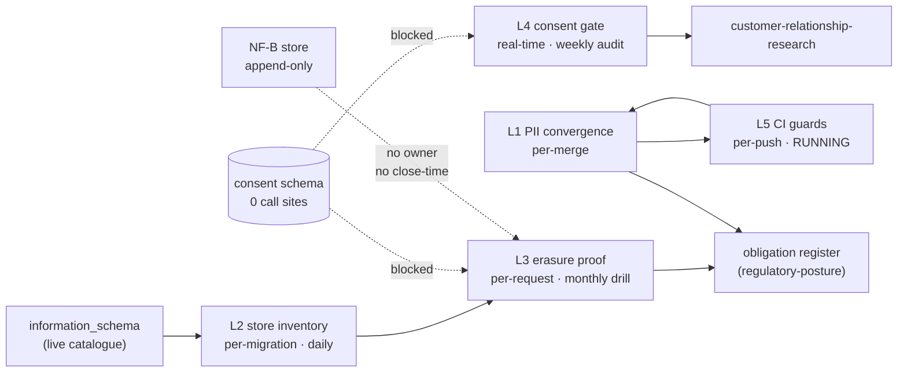

# Privacy Engineering — Loops

Every loop names its close-time. A loop that cannot state how fast it closes is a
diagram, not a loop ([[ORG_STRUCTURE]] §5).

> **Honest status:** five loops, **one running.** L5 is real, closes per-push, and
> guards a code path with zero callers. L1 and L2 are startable this week with no
> external dependency. L3 waits on a Product negotiation. L4 waits on a founder
> decision that gets more expensive every day it waits.

---

## L1 — PII definition → guard convergence

```yaml
type: loop
id: pii-definition-convergence
owner: privacy-engineering
measures: [privacy.pii_definition_count, privacy.guard_divergence_events, privacy.specimen_corpus_pass_rate]
changes: [privacy.pii_module, ci.guard_scripts, agents.constraint_engine, agents.provider_communication, jobs.research_tasks]
inputs_from: [security, ai-orchestration, data]
outputs_to: [security, ai-orchestration, regulatory-posture]
close_time: per-pr
close_time_note: "per merge"
status: proposed
```

**Close-time is per-merge because divergence is a single commit.** A weekly loop lets
a week of inconsistent guards ship. Today's value is **3 distinct definitions across
4 guards**: `constraint_engine.py:28-36` and `provider_communication_agent.py:40-48`
are byte-identical with no shared import; `research_tasks.py:101-102` is disjoint
(email/phone only); `20260805000000_baseline_from_production.sql:1080` consumes a
boolean set by the second.

**Two measures, not one, and the second is the real one.** `pii_definition_count`
proves the merge happened. `specimen_corpus_pass_rate` — one fixture of PII specimens
asserted against every consumer — proves it *stayed* merged, and immediately surfaces
the current gaps: a guest name and a hashed channel fail on all four guards today.

---

## L2 — Schema catalogue → store inventory → erasure denominator

The loop that makes the team's primary metric mean anything.

```yaml
type: loop
id: store-inventory-currency
owner: privacy-engineering
measures: [privacy.store_inventory_coverage, privacy.unclassified_table_count]
changes: [privacy.store_inventory, privacy.erasure_runbook, ci.inventory_job]
inputs_from: [schema-migrations, data, reliability-sre, partnerships-integrations]
outputs_to: [privacy-engineering, regulatory-posture]
close_time: per-event
close_time_note: "per migration, swept daily"
status: proposed
```

**The forcing function is failure, not review.** An unclassified table **fails the
job**, so a new migration breaks the inventory until someone classifies its tables.
That is the same mechanism `schema-parity.yml` applies to hand-applied DDL and for
the same stated reason: *"drift is usually introduced outside a PR"* (`:23-25`).

**Seeded from an artifact that already exists:** the six sinks named in
`check_no_raw_guest_channels.sh` — `pos_checks.raw`, `events`, `notifications`,
`decision_log`, `event_store`, `analytics_cache.data` — are the known-dangerous side
of the classification, written down by someone who had already thought about it.

---

## L3 — Erasure request → proven absence → receipt

```yaml
type: loop
id: erasure-proof
owner: privacy-engineering
measures: [privacy.erasure_completeness, privacy.erasure_receipt_count, privacy.uncovered_store_count]
changes: [schema.guest_erasure_receipts, privacy.erasure_runbook, privacy.store_inventory]
inputs_from: [guest-identity-consent, privacy-engineering, data]
outputs_to: [regulatory-posture, legal, customer-relationship-research]
close_time: per-event
close_time_note: "per request; drill monthly"
status: blocked
```

**Blocked on three things, all inside this team's control except the first:** no
consent record has ever been written (`privacy.consent_call_sites` = 0), no
`erase_guest()` function exists, and no receipt table exists —
`erasure_receipt_id` at `20260819000000_guest_identity_minimal_slice.sql:82` is a
bare `uuid` pointing at nothing.

**Two close-times on purpose.** A real request closes in the request's own time.
The **monthly drill** is what keeps the loop honest when there are no requests, which
is the current and likely-persistent state: a loop that only runs on real traffic
degrades silently while there is none, and then runs for the first time under the
worst possible conditions.

**Definition discipline:** the denominator is discovered from L2, never declared.
A completeness metric over a hand-written list is a tautology
([[privacy-engineering-premortem]] M2).

---

## L4 — Consent state → gate decision → consumer behaviour

```yaml
type: loop
id: consent-gate
owner: privacy-engineering
measures: [privacy.consent_gate_denials, privacy.consent_call_sites, privacy.withdrawal_propagation_lag]
changes: [media.research_cohort, product.personalisation_scope, privacy.consent_gate]
inputs_from: [guest-identity-consent]
outputs_to: [customer-relationship-research, taste-fingerprint, guest-experience]
close_time: per-event
close_time_note: "real-time in the request path; weekly audit sweep"
status: blocked
```

**Blocked on:** nothing reads or writes the consent record, so the gate has nothing to
read and no caller to answer.

**Real-time is not a performance target, it is a correctness one.** A gate consulted
asynchronously is advice — the consumer has already acted by the time it answers.
The **weekly audit** is a different question (did consumers honour the answer?) and
is a sweep, so it gets its own cadence.

**Health test:** `privacy.consent_gate_denials` must exceed zero once running. A
quarter of zero denials means the gate is unused or misconfigured, and those are
indistinguishable from a dashboard — the identical failure shape
`services/agent-orchestrator/agents/compliance_agent.py:11-15` describes for stub
agents: *"reads identically to a working one from every dashboard and health check."*

---

## L5 — Guest identity guards in CI

**The only loop this team owns that closes today.** Its scope is stated rather than
flattered.

```yaml
type: loop
id: guest-identity-ci-guards
owner: privacy-engineering
measures: [privacy.guard_pass_rate, privacy.guard_allowlist_size, privacy.allowlist_entry_age_max]
changes: [ci.guard_scripts, privacy.pii_module, privacy.allowlist_policy]
inputs_from: [engineering, guest-identity-consent]
outputs_to: [privacy-engineering, security, regulatory-posture]
close_time: per-pr
close_time_note: "per push and per PR, plus daily cron"
status: running
evidence: ".github/workflows/schema-parity.yml:19-27 (push, pull_request, daily cron) runs scripts/check_no_guest_name_matching.sh and scripts/check_no_raw_guest_channels.sh at :152-154, alongside scripts/eval_guest_merge_policies.py at :149 — which refuses to run without its DB secret rather than passing vacuously (:143-147)."
```

**Running, verified:** `.github/workflows/schema-parity.yml:19-27` (push to
`main`/`develop`, pull_request, `cron: "0 6 * * *"`, `workflow_dispatch`) executing
`check_no_guest_name_matching.sh` and `check_no_raw_guest_channels.sh` at `:152-154`,
alongside `eval_guest_merge_policies.py` at `:149` — which refuses to run without its
DB secret rather than passing vacuously (`:143-147`), a detail worth copying into
every job this team builds.

**The measure that matters here is the allowlist, not the pass rate.** Pass rate will
be ~100% forever; that is what a working guard looks like. `guard_allowlist_size` and
`allowlist_entry_age_max` are the erosion signals, both zero today, and the cheapest
tripwires the team has ([[privacy-engineering-premortem]] M3).

**Scope caveat, deliberately repeated:** these guards protect the *correct* path, and
nothing calls that path. Green proves no code violated a rule about writing guest
channels; it does not prove guest data is handled well, because no code handles guest
data at all.

---

## The loop this team does not own and cannot close

> Owner assigned 2026-08-27, founder via ADR 0035 (was `UNASSIGNED — escalated`).
> *The note lives here, not in the YAML: the loop-index generator lifts `owner`
> verbatim, so an inline comment pollutes the value in `loops.json`.*

```yaml
type: loop
id: nfb-research-store-erasability
owner: privacy-engineering
measures: [nf_b.research_store_erasability, nf_b.row_count]
changes: [nf_b.schema, nf_b.retention_policy, privacy.erasure_runbook]
inputs_from: [taste-fingerprint, neural-footprint-instrumentation, privacy-engineering]
outputs_to: [decision-office]
close_time: one-shot
close_time_note: "UNDEFINED — ownership unresolved, deliberately visible; must be set by the decision that creates this loop · escalated — blocked on ownership, not started"
status: blocked
```

Recorded here **because a loop with no owner and no close-time is exactly the thing
[[ORG_STRUCTURE]] §5 says is not a loop** — and writing it in that form is the
clearest possible way to say so. [ADR 0006](../../../../decisions/0006-neural-footprint-architecture.md)
locks the research store as append-only and never migrated; guest taste fingerprints
are personal data; erasure has no defined mechanism there. This team's contribution
is to insist the loop gets an owner and a close-time **before the store has rows**,
not to assign either.

---

## Loop dependency



**Read this as: two loops need nobody's permission, two need a caller that does not
exist, and one has no owner at all.** L1 and L2 can start this week. L3 and L4 wait
on the first consent write, which is a scheduling negotiation with Product. The
dotted NF-B edge is the one that silently raises the cost of L3 every day it stays
dotted.
