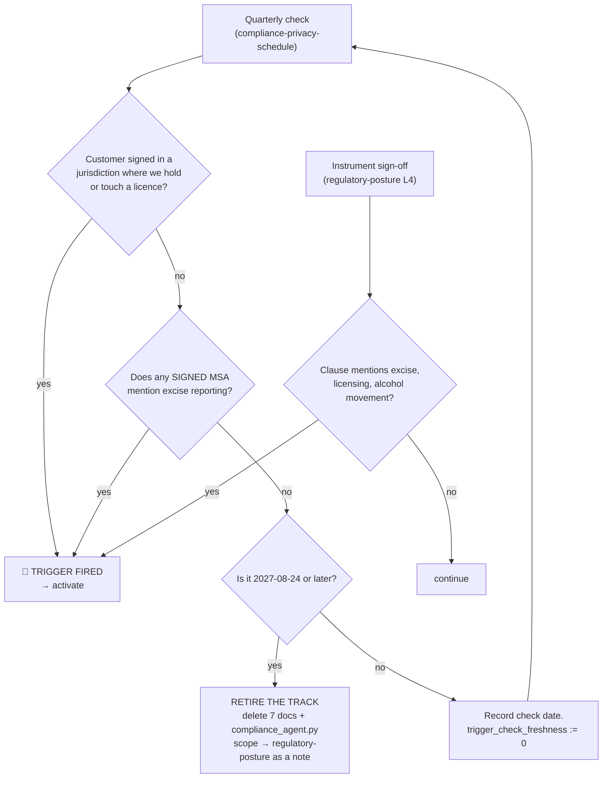
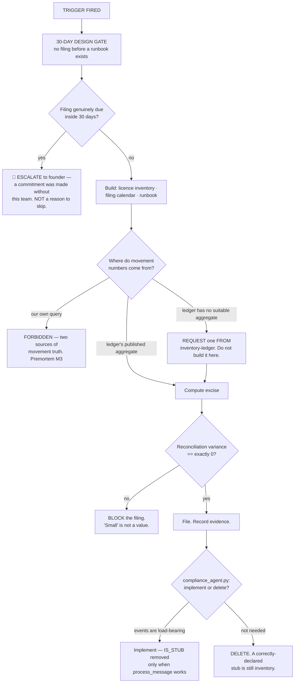

# Regulated Operations — Directive

How *this* team decides. The shape is **a gate with two states**, because the team's
only live decision today is *has the trigger fired?* — and the second state's
decisions are written now precisely so an emergency cannot invent them later.

## State 1 — dormant: the only decision that exists

**Two sensors on purpose.** The quarterly check is a backstop; the sign-off checklist
is the primary sensor, because the triggering event passes through a sign-off *before
execution* and past a quarterly review *months later*. A gate with one slow sensor is
[[regulated-operations-premortem]] M1.

**Neither branch is a judgement call.** Both entry conditions are events with a date
and a document; the sunset condition is a date. A trigger that requires
interpretation is a trigger that never fires, because interpretation under deal
pressure always resolves toward "not yet."

## State 2 — activated: decisions pre-made so the emergency cannot make them

## Decision rights

**Decided here while dormant:**

- **Whether the trigger has fired.** A reading of two facts, not an assessment.
- **Nothing else.** A dormant team with discretionary decision rights is not dormant.

**Decided here on activation:**

- The filing calendar, the evidence standard, and the runbook.
- Whether a jurisdiction is in scope.
- Whether a filing may proceed — including blocking one on non-zero reconciliation
  variance.
- The three-tier control's patterns and its live-fire fixture (C-19,
  `constraint_engine.py:38-41`), once it transfers here.
- Whether `compliance_agent.py` is implemented or deleted.

**Not decided here, ever:**

| Escalation | To whom | Why |
|---|---|---|
| **Movement volumes** — what moved, when, how much | [[inventory-ledger-charter]] | Excise consumes the ledger. Two answers means a regulator picks one. This is a permanent non-goal, not a phase-one simplification. |
| **Whether to enter a licensed jurisdiction** | Founder + Product | We report on the consequence; we do not choose it. |
| **The licence application or the MSA clause as documents** | [[commercial-workforce-agreements-charter]] | Legal drafts; we own the obligation and the filing. Same split as CORP-F2. |
| **CORP-F4 — is this scope Corporate's or Product's?** | Founder | [[corporate]] §7. If excise becomes a *feature*, the team follows the feature. |
| **The sunset decision** | Founder + [[decision-office-charter]] | A team must not decide its own continuation. |
| **Privacy obligations of any kind** | [[regulatory-posture-charter]] / [[privacy-engineering-charter]] | Shares a word, nothing else. |
| **Agent runtime and fleet mechanics** | [[agent-fleet-charter]] | We own the obligation; they own the process. |

## Escalation trigger

1. **Either entry condition fires.** Escalate the same day — activation is a
   department-level event, not a team-level one, because the team has no staff to
   receive it.
2. **`regops.trigger_check_freshness` exceeds one quarter.** The gate has lost its
   sensor. Currently **unbounded**, so this is live on day one.
3. **A filing is due inside the 30-day design gate.** Escalate the *commitment*, not
   the deadline — something was promised without this team.
4. **Reconciliation variance is non-zero.** Block and escalate; never file a number
   we cannot reconcile to the ledger.
5. **C-19's hit rate is zero over a quarter with non-zero outbound draft volume.**
   The control is dead or the traffic changed, and both need a human. (M4)
6. **2027-08-24 arrives with the trigger unfired.** Escalate the sunset, do not let
   the date pass quietly. (M5)
7. **Anyone proposes preparatory excise work before the trigger.** Refuse and
   escalate if it recurs — speculative work on an unentered regime is exactly what a
   gated team exists to prevent.

## Tie-break rule

**Two tie-breaks, pointing in opposite directions, and the asymmetry is the point.**

**On the trigger: if it is arguable whether the trigger fired, treat it as fired.**
A false activation costs a design gate nobody needed — reversible in a week, and the
design keeps. A missed activation means the first excise obligation is discovered by
a customer's accountant, which is a filing failure with a statutory deadline already
behind it. Not symmetric, therefore not summable.

**On the work: if it is arguable whether preparatory work is needed before
activation, do not do it.** The failure that produces a dormant team full of
speculative artifacts is the one this gate exists to prevent, and the cost of being
wrong is one week of catch-up inside a 30-day design gate that was built for exactly
that.

**These two rules are consistent, and the consistency is worth naming:** *be eager
about noticing, reluctant about building.* Sensitivity costs a check; anticipation
costs inventory that accretes, and inventory nobody uses is what
[[regulated-operations-premortem]] M5 is made of.

## One inherited rule

The stub's own reasoning is this team's governing principle and applies to every
dormant thing it owns — including these seven documents:
`compliance_agent.py:11-15` declares `IS_STUB = True` because an event-consuming
no-op *"reads identically to a working one from every dashboard and health check,"*
and `orchestrator.py:245-250` refuses to boot it because *"failing loudly at boot is
the only version of this that cannot be mistaken for working."*

**Applied here:** every document in this directory opens with the ⏸ banner, the board
agenda states the doc-to-staff ratio as 7:0, and the charter's grade is `new`. A
dormant function that looks active is worse than an absent one — that is not a
stylistic choice, it is the same argument the codebase already makes, carried up a
level.
