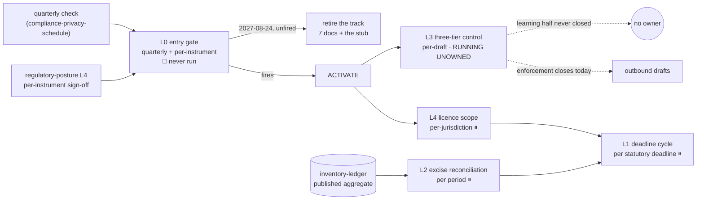

# Regulated Operations — Loops

Every loop names its close-time. A loop that cannot state how fast it closes is a
diagram, not a loop ([[ORG_STRUCTURE]] §5).

> **Honest status:** one loop is live and it is not about excise — it is the loop that
> decides whether this team should exist. Four more are **dormant by design**,
> documented now so they are not invented under deadline pressure
> ([[regulated-operations-premortem]] M2).

---

## L0 — The gate loop

**The only loop this team owns today, and it is currently open.** L0 rather than L1
because it is not part of the mandate; it decides whether the mandate activates.

```yaml
type: loop
id: regops-entry-gate
owner: compliance-privacy
measures: [regops.trigger_check_freshness, regops.jurisdiction_count]
changes: [regops.staffing_state, org.team_roster]
inputs_from: [design-partner-operations, sales, regulatory-posture, commercial-workforce-agreements]
outputs_to: [compliance-privacy, decision-office, red-team]
close_time: per-event
close_time_note: "per instrument (primary) + quarterly (backstop)"
status: proposed
```

**Two close-times because there are two sensors with very different latency.**
The per-instrument sensor lives inside [[regulatory-posture-loops]] L4 — every MSA is
already read clause by clause *before execution*, so adding *"does this mention
excise, licensing, or alcohol movement?"* sees the trigger at the moment it is
created. The quarterly check is the backstop for the path that does not go through an
instrument: a customer simply operating in a licensed jurisdiction.

**Current value: `trigger_check_freshness` is unbounded — never checked.** A dormant
team's first failure state is its default state, which is why this loop is written at
the top rather than as an appendix.

**The loop has an exit as well as an entry.** At 2027-08-24 with the trigger unfired,
the same quarterly check produces *retire the track* rather than *check again*. Entry
is an event; exit is a date. An exit phrased as an event never occurs.

---

## L1 — Filing calendar → filing → evidence ⏸ dormant

```yaml
type: loop
id: regulatory-deadline-cycle
owner: regulated-operations
measures: [regops.deadline_miss_count, regops.filing_evidence_completeness]
changes: [regops.filing_calendar, regops.runbook]
inputs_from: [inventory-ledger, regulatory-posture, legal]
outputs_to: [legal, finance-pricing, founder]
close_time: per-event
close_time_note: "per statutory deadline — set by the jurisdiction, not by us"
status: dormant
```

**The close-time is the one loop property this team does not get to choose.** Every
other loop in this org picks a cadence that suits the work; a statutory filing deadline
is set by a regulator and missing it has a defined penalty. `deadline_miss_count`
therefore has a hard target of **0**, and it is the only metric here that cannot be
traded against anything.

**Event vocabulary already reserved:** `compliance.deadline.created` and
`compliance.report.requested` (`compliance_agent.py:24-27`). Nothing produces or
consumes them.

---

## L2 — Inventory movement → excise computation → reconciliation ⏸ dormant

The loop with the pre-made decision inside it.

```yaml
type: loop
id: excise-reconciliation
owner: regulated-operations
measures: [regops.excise_reconciliation_variance]
changes: [regops.excise_records, inventory.published_aggregate]
inputs_from: [inventory-ledger]
outputs_to: [regulated-operations, finance-pricing, legal]
close_time: per-event
close_time_note: "per reporting period, reconciled before filing — never after"
status: dormant
```

**Input is a single source, permanently.** Excise consumes
[[inventory-ledger-charter]]'s **published aggregate**. If the ledger's shape does not
serve excise, the fix is a new published aggregate *in the ledger*, owned by that
team. This team never writes its own movement query — which is written here, in a
loop definition, so that a deadline cannot quietly re-decide it
([[regulated-operations-premortem]] M3).

**Target variance is exactly zero, not "small."** A tolerance band is how two sources
of truth get normalised into one report; a hard zero forces the divergence to be
explained rather than absorbed. **Reconcile before filing** is part of the close-time
for the same reason.

---

## L3 — Three-tier control → outbound drafts ⏸ dormant, but the control is running

```yaml
type: loop
id: three-tier-constraint
owner: UNOWNED — transfers here on activation
measures: [regops.c19_trigger_count, regops.c19_fixture_pass_rate]
changes: [constraint_engine.three_tier_patterns, ci.three_tier_fixture]
inputs_from: [ai-orchestration, supplier-distributor-network]
outputs_to: [regulated-operations, regulatory-posture]
close_time: per-event
close_time_note: "per draft (enforcement) · quarterly (pattern review) · the enforcement half (constraint_engine C-19) executes on production traffic today; the loop itself is unowned and unmeasured, so it is not running"
status: proposed
```

**This is the uncomfortable one.**
`services/agent-orchestrator/services/constraint_engine.py:38-41` — C-19
`THREE_TIER_COMPLIANCE` — blocks phrases such as *"direct-from-winery"* in outbound
provider drafts. It executes on production traffic today, in the same engine as the
C-21 PII guard, and it has no charter behind it and no owner.

**The enforcement half of the loop closes per-draft and always has. The learning half
has never closed at all** — nobody reviews the patterns, and nobody measures the hit
rate. `c19_trigger_count == 0` over a quarter with non-zero draft volume means the
control is dead or the vocabulary moved, and a dead pattern-matcher is
indistinguishable from a perfect one from any dashboard — the identical property
`compliance_agent.py:11-15` describes for stub agents.

**Interim placement, stated so it is somebody's problem now:** recorded in
[[regulatory-posture-charter]]'s register as *"an operating control with no owner."*
On activation it moves here with a live-fire fixture asserted in CI, in the shape of
the PII specimen corpus [[privacy-engineering-charter]] needs for the same reason.

---

## L4 — Licence inventory → jurisdiction scope ⏸ dormant

```yaml
type: loop
id: licence-jurisdiction-scope
owner: regulated-operations
measures: [regops.jurisdiction_count, regops.unmapped_obligation_count]
changes: [regops.licence_inventory, regops.filing_calendar]
inputs_from: [sales, design-partner-operations, legal]
outputs_to: [regulated-operations, regulatory-posture, product-vision]
close_time: per-event
close_time_note: "per new customer jurisdiction; swept quarterly"
status: dormant
```

**Feeds L1.** A jurisdiction with no mapped obligations is the same defect as an
unclassified table in [[privacy-engineering-loops]] L2 — an unknown that reads as a
zero.

---

## Loop dependency



**Read this as: one loop is open and unrun, one is half-running with no owner, and
three are correctly dormant.** L0 is the only loop that matters this year, and its
metric is at its worst possible value on the day it is written. L3 is the finding
worth surfacing outside this directory: a compliance control has been executing on
production traffic with nobody measuring whether it still catches anything.
