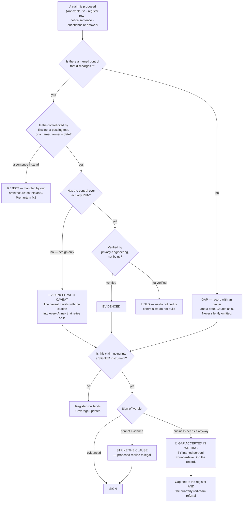

# Regulatory Posture — Directive

How *this* team decides. The shape is an **evidence test applied to a claim** — a
clause, a register row, a notice sentence, a questionnaire answer. Its output is
never "approved"; it is *evidenced*, *strike it*, or *gap accepted in writing by
[name]*.

## The gate

## Decision rights

**Decided here, no escalation:**

- **Whether a claim is evidenced.** This is the team's core act and it is not a
  negotiation: a citation exists or it does not.
- **What counts as evidence.** A `file:line`, a passing test, or a named owner with a
  date. Nothing else, including confident prose.
- **Whether a control that has never run may be cited** — yes, *with a caveat that
  travels*. Two of the five currently-evidenced duties are in this state: the consent
  record has zero call sites, and the erasure design has no function, no receipt
  table and no test.
- **The register's structure and counting rule**, including the rule that an honest
  gap and a vague mapping both count as 0.
- **Whether a subprocessor receives personal data** — classified by what a payload
  can contain, never by what the vendor is called.
- **The wording of every claim in the privacy notice.**
- **The content of a DPA/BAA Annex** — what it may say. Legal owns whether and how it
  is drafted.
- **Proposing a redline.** Striking a clause we cannot evidence is a proposal to
  Legal, not an instruction, and it is always accompanied by the alternative.
- **Refusing to answer a security questionnaire from anything but the register.**

**Not decided here — escalates:**

| Escalation | To whom | Why |
|---|---|---|
| **Whether to sign over an unevidenced clause** | Founder | A veto over a revenue event does not belong to the team holding it. Our right is to make the gap explicit *before* signature and to name who accepted it. |
| **Jurisdictions in scope for v0** | Founder | Determines the register's row count and the notice's content. Guessing wide produces a register nobody maintains. |
| **Controller vs processor posture** | Founder + [[legal-charter]] | Currently implied only by a schema comment (`20260819000000_guest_identity_minimal_slice.sql:99-105`). It determines who owes the guest a notice and who answers a subject-access request. |
| **Disclosure posture on gaps** | Founder | An honest gap column is an asset in a security review and a liability in discovery. Decide once, rather than implicitly per row. |
| **CORP-F2** — DPA/BAA instrument vs obligation split | `OPEN-DECISIONS.md` | Named open decision, cross-department with [[commercial-workforce-agreements-charter]]. |
| **Building or changing a control** | [[privacy-engineering-charter]] | We request; they build. A register row is not a work order we may execute. |
| **Retention periods that trade against product value** | [[compliance-privacy-directive]] → founder | We state the obligation floor; the ceiling is a product call. |

## Escalation trigger

Escalate immediately, without waiting for a review cycle:

1. **An inbound DPA, data-protection exhibit, or security questionnaire arrives.**
   Escalate **on arrival, not on deadline** — the only useful window is before the
   negotiation has a shape. (M1)
2. **A clause is proposed that we cannot evidence** and the business wants it anyway.
   That is not a team decision at any severity.
3. **A register evidence cell is filled with a sentence rather than a citation.** One
   cell. It is the moment the register becomes decorative. (M2)
4. **A claim in the privacy notice is discovered to be false.** Already true today —
   `Privacy.tsx:23,31,43`. (M3)
5. **A host is classified "no personal data" on vendor category rather than payload
   analysis.** (M4)
6. **A quarter closes with `unevidenced_clause_count` > 0 and zero written objections
   filed.** Report to [[red-team-charter]] as well as the founder — a team that
   documents gaps and never objects is building an audit trail against its own
   employer. (M5)
7. **A control this register cites changes without notice.** The register's citations
   are load-bearing; a silent edit to `constraint_engine.py:28` invalidates an Annex
   clause.

## Tie-break rule

When *evidenced* and *gap* are genuinely balanced, **record the gap.**

The asymmetry is specific to this team's product and runs opposite to the intuition
that a compliance function should look prepared:

- **A gap recorded that was actually covered** costs one hour of re-verification and
  a slightly lower coverage number. It is fully reversible, and a low number starts a
  useful conversation.
- **A mapping asserted that was actually a gap** becomes a sentence in a signed
  Annex, then an answer in a questionnaire, then a discovered breach of contract
  found by the counterparty. It is not reversible, and — uniquely — **it is worse
  than having no register at all**, because a wrong number ends the conversation that
  a low number starts.

That last clause is the reason the tie-break points where it does. Everywhere else in
this company an incomplete artifact is merely incomplete. Here, an over-stated one is
actively load-bearing in the wrong direction.

## Two rules that make the register survive contact

**1. We do not certify what we do not build.** Every evidence cell is verified by
[[privacy-engineering-charter]] before it counts. The team writing the mapping must
not also attest that the control exists — the same independence argument
[[ORG_STRUCTURE]] §3 makes for the advisory layer, applied inside a department where
it costs one handoff.

**2. The caveat travels with the citation.** A control that exists in schema but has
never run is cited *with that fact attached*, permanently, in every downstream
artifact. Today that applies to the two most attractive citations this team has: the
versioned consent record and the erasure tombstone. Both are excellent designs. Both
have been exercised zero times. An Annex that quotes the first and omits the second
half of that sentence is how [[regulatory-posture-premortem]] M1 happens.
