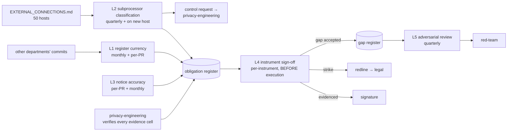

# Regulatory Posture — Loops

Every loop names its close-time. A loop that cannot state how fast it closes is a
diagram, not a loop ([[ORG_STRUCTURE]] §5).

> **Honest status:** five loops, **none running.** Unlike its sibling, this team has
> no inherited machinery — no CI job, no script, no artifact of its own. Two of the
> five loops need nothing but a week; one has already failed before being built.

---

## L1 — Code change → register currency

The team's core loop. Its input is other departments' commits, which is what makes it
hard: nobody who breaks it is trying to.

```yaml
type: loop
id: obligation-register-currency
owner: regulatory-posture
measures: [compliance.obligation_coverage, compliance.stale_citation_count]
changes: [compliance.obligation_register, compliance.records_of_processing]
inputs_from: [privacy-engineering, engineering, data, platform-api, ai-orchestration, partnerships-integrations, security]
outputs_to: [commercial-workforce-agreements, sales, design-partner-operations]
close_time: monthly sweep, plus per-PR for any change touching a cited control
status: proposed
```

**Two close-times, and the second is the load-bearing one.** A monthly sweep finds
drift after the fact; the per-PR trigger catches the specific edit that invalidates a
claim. The register's citations are load-bearing in a way ordinary documentation is
not — a silent edit to `constraint_engine.py:28` can falsify a sentence in a signed
Annex.

**The counting rule is part of the loop, not a preamble to it.** A row counts only
when evidenced by a `file:line`, a passing test, or a named owner with a date;
*"handled by our architecture"* counts as 0, and so does an honest gap. Without that
rule the loop optimises the number rather than the truth, which is
[[regulatory-posture-premortem]] M2.

**Independence clause:** evidence cells are verified by
[[privacy-engineering-loops]] L1–L3, not by this team. The team writing the mapping
does not attest that the control exists.

---

## L2 — Runtime hosts → subprocessor classification

```yaml
type: loop
id: subprocessor-classification
owner: regulatory-posture
measures: [compliance.subprocessor_classification, compliance.unclassified_host_count]
changes: [compliance.subprocessor_register, compliance.dpa_annex_content]
inputs_from: [partnerships-integrations, engineering, ai-orchestration, platform-api]
outputs_to: [commercial-workforce-agreements, privacy-engineering, security]
close_time: quarterly, plus on any new outbound host
status: proposed
```

**Input already exists:**
[`EXTERNAL_CONNECTIONS.md`](../../../../foundation/EXTERNAL_CONNECTIONS.md) — 50
hosts, 8 SDKs, 80 env vars, with per-service reference counts. The loop's job is the
classification column, not the enumeration.

**Classify by payload, never by vendor.** The methodology column is a required field
precisely so that M4 is visible at classification time rather than a year later. The
worked example that makes the rule concrete: Anthropic and Gemini are called over raw
HTTP/axios with no SDK, so no shared middleware inspects those bodies, and the guard
on that path (`constraint_engine.py:113-117`) detects SSNs and card numbers but not
names, emails or phone numbers. On today's evidence the honest classification is
*"receives personal data — no control"*, which then becomes a control request into
[[privacy-engineering-loops]] L1.

**The loop's output feeds a control request, not just a register row.** That is what
distinguishes it from an inventory.

---

## L3 — Code behaviour → notice accuracy

**The loop that has already failed once, before being built.**

```yaml
type: loop
id: notice-accuracy
owner: regulatory-posture
measures: [compliance.notice_accuracy, compliance.false_claim_count]
changes: [web.privacy_notice, compliance.obligation_register]
inputs_from: [engineering, client-surfaces, security, brand-identity]
outputs_to: [regulatory-posture, standards-verification]
close_time: per-PR on the four asserted claims; monthly read-through
status: proposed
```

**Evidence that the loop is necessary rather than theoretical:**
`apps/web/src/pages/Privacy.tsx` says "WineOps" at `:23`, `:31`, `:43` — a false
identity claim on a pre-login page, live since the rename, caught by nothing. The
page's own header (`:5-12`) states the obligation — *"If any of those change, this
page has to change with them"* — and enforces it with nothing.

**Four claims are testable and should be tests, not reviews:** no cookies set;
session token in localStorage rather than a cookie; interaction telemetry disabled by
default; partner sharing off by default. Each maps to an assertable code fact. Per
[[regulatory-posture-charter]] §non-goals the staleness *machinery* is consumed from
[[standards-verification-charter]] rather than rebuilt here — this team owns the
claim, not the tooling.

---

## L4 — Instrument arrives → sign-off → gap register

The commercial loop. It is the only one with an external clock, and the clock is
always someone else's.

```yaml
type: loop
id: instrument-signoff
owner: regulatory-posture
measures: [compliance.unevidenced_clause_count, compliance.written_objection_count, compliance.signoff_turnaround_days]
changes: [legal.instrument_redlines, compliance.obligation_register, compliance.gap_register]
inputs_from: [sales, design-partner-operations, commercial-workforce-agreements]
outputs_to: [commercial-workforce-agreements, red-team, decision-office]
close_time: per-instrument, before execution — never after
status: proposed
```

**"Before execution — never after" is the close-time, not a preference.** A sign-off
that lands after signature is a record, not a control.

**Three permitted verdicts, and only three:** *evidenced* · *strike this clause* ·
*gap accepted in writing by [name]*. The third is what makes the loop survivable
commercially — it lets the founder overrule on the record in one line — and it is
what converts an unrecorded risk into a dated decision.

**The health test runs against this team, not against the business:**
`written_objection_count` of zero across a quarter in which
`unevidenced_clause_count` was positive means the loop is not closing, however many
sign-offs were issued ([[regulatory-posture-premortem]] M5).

---

## L5 — Accepted gaps → adversarial review

The independence loop, and the reason it exists is structural rather than
procedural.

```yaml
type: loop
id: gap-adversarial-review
owner: regulatory-posture
measures: [compliance.gap_count, compliance.gap_age_max, compliance.gaps_closed_per_quarter]
changes: [compliance.gap_register, privacy.control_backlog]
inputs_from: [regulatory-posture, privacy-engineering]
outputs_to: [red-team, decision-office, founder]
close_time: quarterly
status: proposed
```

**Why an outside reviewer.** Ethics & Responsible AI was considered and not adopted
([[ORG_STRUCTURE]] §3), so this department sits in the line it reviews. A gap this
team recorded, accepted, and re-reads quarterly will be re-accepted quarterly —
that is not cynicism, it is what a review by the author always does.
[[red-team-charter]]'s scope is *attacking decisions*, and *"we accepted this gap"* is
a decision.

**`gap_age_max` is the metric that matters here**, not `gap_count`. A young gap is a
backlog item; a gap that has survived four quarters is a decision that was never
made, wearing a backlog item's clothes.

---

## Loop dependency



**Read this as: three loops feed one register, the register gates one signature, and
one loop exists solely to stop the gaps that signature creates from becoming
permanent.** L1, L2 and L3 need nothing but time. L4 needs a founder decision about
whether the sign-off gates anything. L5 needs [[red-team-charter]] to accept a
standing referral. Without L4 and L5, the first three loops produce an accurate
description of risks nobody is obliged to act on — which is
[[regulatory-posture-premortem]] M5 in loop form.
