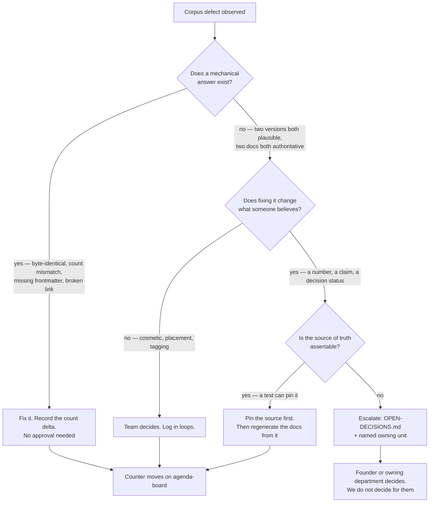

# Knowledge & Documentation — Directive

How *this* unit decides.

The department's decisions are almost all of one shape: **something in the corpus is
wrong, and the question is whether we fix it, escalate it, or record it as accepted.**
The graph below is that triage, and its one distinctive feature is the
**mechanical-answer test** — because this department's most expensive mistake is a human
adjudicating something a script could have decided, and its second-most-expensive is a
script silently deciding something only a human could.

## Decision rights

**This department decides outright:**

- Where a document lives, what it is named, and whether it is archived.
- Whether a document meets the frontmatter and link contract.
- Whether a claim is *pinned* — i.e. whether a number in a document has an assertable
  source. It does **not** decide what the number should be.
- Whether a doc has passed the 60-day rule and is fiction rather than finished.

**This department never decides:**

- **What the truth is in someone else's domain.** When `LLM_INSTRUCTION_PROMPTS.md` and
  `YC_WEDGE_PLAN.md` disagree about the insight count, this department's output is *"these
  three documents disagree, here is the source, here is why the source is unassertable"* —
  and the fix lands with the owning unit. Deciding the number ourselves would make this
  department an authority on analytics, which it is not.
- **Whether a decision is open or closed.** [[decision-office-charter]] owns that. When
  [[OBSIDIAN_VAULT]]:3 says LOCKED and `OPEN-DECISIONS.md` says Open, we report the
  contradiction; we do not resolve it.
- **Whether to change code so a document becomes true.** We change the document, or we
  raise the discrepancy. We never patch someone's source to match our prose.

## The retire-to-write rule

**This department may not add a document to `.planning/` without naming, in the same
change, a document it archives, merges, or deletes.**

It applies to this department alone, and only to durable documents — not to a loop entry, a
counter update, or an ADR (ADRs are append-only by
[ADR 0002](../../decisions/0002-documentation-first-operating-mode.md) and are exempt).

It exists because of [[knowledge-documentation-premortem]] M1: the department chartered to
shrink a corpus is the department best positioned to grow it while feeling productive. The
28 documents this department was founded with are the opening debt, and
`kd.docs_added_vs_retired_ratio` is currently **∞**.

Whether this rule should be org-wide rather than department-only is staged as **OD-C8**.
The department's own recommendation is *department-only for now* — an org-wide version
would be enforcing a constraint on 18 other departments before this one has demonstrated
it can hold it itself.

## Escalation trigger

Escalate to `OPEN-DECISIONS.md` (and name the owning unit) when **any** of these is true:

1. Two documents make incompatible claims and **neither** has an assertable source.
2. A fix would delete content whose provenance cannot be established — the 3 diverged
   duplicates are the live instance.
3. A document's status contradicts the decision register (the [[OBSIDIAN_VAULT]] OD-21
   case).
4. A convention in a locked foundation document is **already violated at the moment it is
   written** — 45 `README.md` files against [[OBSIDIAN_VAULT]] §3's uniqueness rule. This
   is a distinct trigger because it is not drift; it is a contract that never held, and
   fixing it downstream is far more expensive than amending the contract now.
5. A correction would change a number that appears in an **external-facing** document. The
   573-insight-type figure sits in the YC narrative (`YC_WEDGE_PLAN.md:324`), which means
   correcting it is a Strategy decision with a documentation input, not a documentation
   decision with a Strategy footnote. Route to
   [[positioning-fundraise-readiness-charter]].

## Escalation to advisory

[[red-team-charter]] is scoped to attacking *decisions*. This department's escalations are
usually not decisions, so the default route is [[decision-office-charter]]. The exception:
when a corpus defect exists **because** a decision was written in a way that could not be
verified — trigger 4 above — that is a decision defect and Red Team is the right reader.
