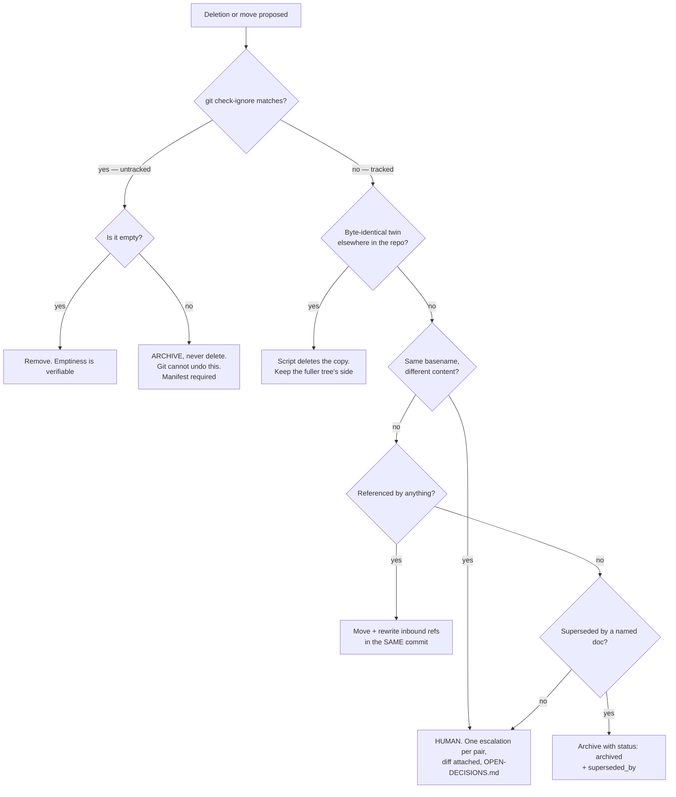

# Corpus & Archive — Directive

How *this* unit decides.

Two questions dominate: **may this file be deleted?** and **where does a new file go?**
The first is dangerous and gets a strict graph. The second is routine and gets a rule.

## Decision rights

**This team decides outright:**

- Deletion of a **byte-identical** duplicate. `cmp` is the authority; no review needed.
- Removal of **verifiably empty** directories, including the path-shaped ones.
- The path a new document takes, and the archive location of a finished one.
- Whether a document is "finished" for archive purposes — but not whether it is *true*
  ([[standards-verification-charter]]) or *findable* ([[graph-retrieval-charter]]).

**This team never decides:**

- **Which of two diverged documents is authoritative.** There is no mechanical answer, and
  inventing a tiebreak (newest mtime, largest file) is [[corpus-archive-premortem]] M2 in
  one line of code.
- **Deletion of untracked content.** Git is the undo for tracked files. For gitignored
  files there is no undo, so the strongest available action is archive-with-manifest.
- **OD-01's target shape.** The founder picks it (`OPEN-DECISIONS.md:24`); this team
  executes it.

## The three hard rules

**1. Byte-identical is a script's decision; anything else is a human's.**
Two counters exist for this reason. `corpus.duplicate_basename_count` may fall from 38 to 3
mechanically. It may **not** fall below 3 without a recorded decision per pair. Any commit
that reduces it by more than 35 is the alarm state described in
[[corpus-archive-premortem]] M2, and L-CA-1 watches for exactly that shape.

**2. Gitignored content is archived, never deleted.**
`md/Agent_Chat_History/` (gitignored at `.gitignore:92`) holds 5.4 MB of chat log,
duplicated across both trees. It may look like junk. If it is deleted and it mattered, git
cannot bring it back. A file that is large and ugly is not the same as a file that is
recoverable, and this rule is the only thing that keeps those two ideas apart under cleanup
pressure.

**3. A move and its inbound-reference rewrites land in the same commit.**
Never as a follow-up. The corpus is overwhelmingly relative-path links, not `[[wikilinks]]`
— **40 of 1,118 files** carry a wikilink — so Obsidian's name-based resolution
([[OBSIDIAN_VAULT]] §3) protects almost nothing today. A move without rewrites is
[[corpus-archive-premortem]] M3.

## Placement rule for new documents

In priority order, first match wins:

1. **Does an existing document own this subject?** Extend it. The default action for new
   knowledge is *edit*, not *create* — and this is the rule most often skipped.
2. **Is it a decision?** → `.planning/decisions/` as an ADR, or an entry in
   `OPEN-DECISIONS.md`. Never a standalone essay.
3. **Is it about a unit?** → that unit's directory under `01-org/` or `02-advisory/`, as
   one of the seven artifacts. Never a new artifact type.
4. **Is it a generated companion doc?** → `foundation/`, marked regenerated-not-hand-edited.
5. **Is it a reference to an external resource?** → `.planning/library/` (OD-22).
6. **None of the above** → it goes in a subdirectory, and the top-level `.planning/*.md`
   namespace stays at **28**. `CLAUDE.md` §3 already says this; the CI check is what makes
   it true.

## Escalation trigger

To `OPEN-DECISIONS.md`, naming the founder:

1. Two documents share a basename and differ — one entry per pair, diff attached.
2. A deletion would remove content git cannot restore.
3. A document is a candidate for archive but nothing supersedes it — meaning it is either
   still live or was never needed, and this team cannot tell which.
4. The OD-01 "for now" deferral passes **90 days** with no target shape chosen. A deferral
   without a date becomes a permanent state, and that is worth an escalation on its own.
