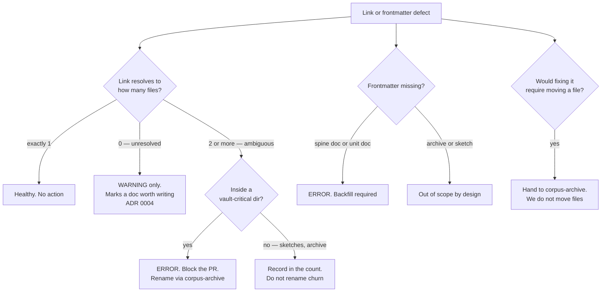

# Graph & Retrieval — Directive

How *this* unit decides.

The recurring decision is **what to do about a link or a tag that does not behave** — and
the distinctive rule is that *unresolved* and *ambiguous* are treated as opposites, not as
degrees of the same problem.

## Decision rights

**This team decides outright:**

- The frontmatter contract's required keys and their allowed values.
- Lint severity — which defects block a PR and which only warn.
- Vault configuration: which plugins are enabled, how Dataview queries are written.
- Whether a retrieval mechanism is adequate for **both** audiences (see the dual-audience
  rule).

**This team never decides:**

- **Where a file lives, or what it is called.** A rename is a placement act and belongs to
  [[corpus-archive-charter]]. This team measures ambiguity and specifies the target; it does
  not move files. That seam is stated here so the 45 `README.md` problem does not become an
  argument later.
- **Whether the content behind a resolved link is true.** [[standards-verification-charter]].
- **Whether an open decision is actually closed.** The OD-21 register contradiction gets
  reported to [[decision-office-charter]], not resolved here.

## The four hard rules

**1. Unresolved is a warning. Ambiguous is an error.**
This asymmetry is the team's central design choice.
[ADR 0004](../../../../decisions/0004-obsidian-as-backlink-layer.md) explicitly states that
an unresolved `[[link]]` *"marks a doc worth writing, not an error"* — the vault is meant to
carry them. An **ambiguous** link is the opposite: it resolves silently to the wrong
document and is visually indistinguishable from a correct one, which is why
[[graph-retrieval-premortem]] M3 takes a year to surface. A lint that treated both as
"link problems" would be tuned to the wrong risk.

**2. Ambiguity is checked before links are created, never after.**
Order matters more than effort here. Measuring `graph.ambiguous_basename_count` is cheap
now and expensive once thousands of links exist. The check ships before the campaign that
would otherwise cause the damage.

**3. Dual-audience rule — every retrieval mechanism has an agent-readable form.**
The primary reader of this corpus is an agent with `Grep` and `Read`, not a human with a
desktop app. Frontmatter is greppable YAML; wikilinks are greppable text; **Dataview
queries are not**. So query results are materialised into the board files by a scheduled
job. If a proposed improvement cannot be stated as "this makes `grep` find the right thing
faster," it is aimed at the smaller audience — [[graph-retrieval-premortem]] M5.

**4. No bulk backfill of the legacy corpus while OD-01 is open.**
New documents link freely: they are being written anyway, and `[[wikilinks]]` survive moves
by design ([[OBSIDIAN_VAULT]] §3). The 1,082 legacy documents are overwhelmingly
relative-path linked, and relative paths do **not** survive a restructure. Backfilling them
before the tree settles is [[graph-retrieval-premortem]] M2, which is why
`graph.linked_file_ratio` is reported split new/legacy — a single number would reward
exactly the activity this rule forbids.

## Scope of the frontmatter contract

Scoped by **importance, not by date** — a date cutoff exempts the documents that matter
most, which is [[graph-retrieval-premortem]] M4.

| Scope | Contract | Enforcement |
|---|---|---|
| 45 spine docs (`.planning/*.md`, `foundation/`, `decisions/`) | `type`, `division` where applicable, `updated`, `links` | CI error after backfill |
| All `01-org/` + `02-advisory/` unit docs | Full contract per [[ORG_STRUCTURE]] §5 | CI error immediately |
| `loops.md` specifically | Plus `measures`, `changes`, `inputs_from`, `outputs_to`, **`close_time`** | CI error — OD-12's "executable later" depends on it |
| `.planning/archive/` | `status: archived` + `superseded_by` only | Owned by [[corpus-archive-charter]] |
| `.planning/sketches/`, legacy `md/`, `md_files/` | Out of scope | None |

## Escalation trigger

1. A convention in a locked foundation document is violated by the corpus **at the moment
   it is written** — the 45 `README.md` case. Routes to [[red-team-charter]] as a decision
   defect per [[knowledge-documentation-directive]] trigger 4, because the fix is an
   amendment to the contract, not a cleanup.
2. A document claims a decision status the register contradicts — the OD-21 case. Routes to
   [[decision-office-charter]].
3. A tooling adoption would add a dependency the vault cannot function without (Graphify).
   Founder call: a plugin that becomes load-bearing is a lock-in decision, and
   [ADR 0004](../../../../decisions/0004-obsidian-as-backlink-layer.md) chose Obsidian
   partly *because* it had none.
