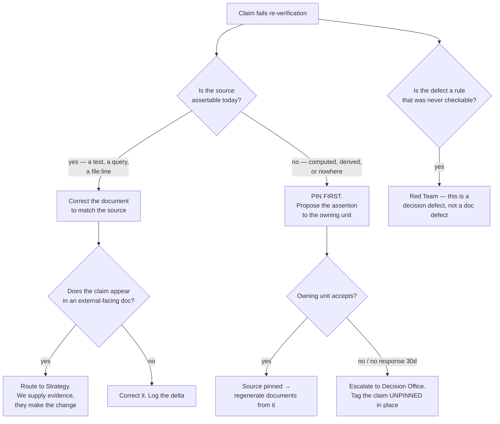

# Standards & Verification — Directive

How *this* unit decides.

The recurring decision is **what to do with a claim that fails verification** — and the
defining constraint is that this team is almost never allowed to fix it itself.

## Decision rights

**This team decides outright:**

- Whether a claim **fails verification** — i.e. whether the document matches the source it
  cites.
- Whether a source is **assertable** — whether some mechanism could make the claim fail
  loudly when it stops being true.
- Whether a document has passed the 60-day rule.
- Corrections to **documentation-internal** facts: file counts, dates, cross-references,
  brand strings in prose.

**This team never decides:**

- **What a domain value should be.** It proves that 375, 573, and 348 cannot all be right
  and that the source cannot currently settle it. Choosing belongs to whoever owns
  `insight-catalog.ts`. Deciding it here would make this team an authority on analytics —
  [[standards-verification-premortem]] M2.
- **Whether a decision is open or closed.** [[decision-office-charter]] owns that; we report
  contradictions like OD-21.
- **Changes to external-facing narrative.** 573 sits in `YC_WEDGE_PLAN.md:324`; the
  correction is [[positioning-fundraise-readiness-charter]]'s to make with our evidence.
- **Brand in code and product surfaces.** Ours stops at prose;
  [[media-brand-charter]] owns `wineops.ai` in source.
- **Style.** Deliberately unowned. A style guide is what this team must not become.

## The five hard rules

**1. The team may not publish a standard it cannot check.**
Every standard ships with its mechanism in the same change, or it does not ship. This is
the direct counter to [[standards-verification-premortem]] M1, and it is stated as a
prohibition rather than a preference because writing guidance always feels like progress.

**2. Prove disagreement and unassertability. Never adjudicate domain truth.**
The output of a contradiction finding is: *these documents disagree · here is each
`path:line` · here is the source · here is why the source cannot settle it · here is what
would pin it.* The number is set by the owning unit.

**3. Pin before correcting.**
Correcting a document whose source is unpinned buys one correct document and no protection.
The insight count would drift again the next time `DIMENSIONS` is edited, because
`insight-catalog.spec.ts:10` asserts only `>= 200`. Pinning first is the only step that
changes the future.

**4. Every number is reported with its scope.**
"28 documents say wineops" and "216 documents say wineops" are both true and describe
different populations — spine versus tree. A figure without its denominator is the exact
defect this team audits, and publishing one would be self-refuting.

**5. No exemption for this department.**
The 60-day sweep runs over `01-org/` and `02-advisory/` with no exclusions. This
department's own 21 provisional agendas fire **2026-10-23** and will be the oldest entries
in the report. An exemption requires a **written founder decision**, never a team judgement
— [[standards-verification-premortem]] M4.

## Verification method

Sampling, not exhaustive review — an exhaustive pass over 1,118 documents is a project, and
a project that runs once produces a number that decays from the day it is published.

| Element | Choice | Why |
|---|---|---|
| Population | Spine docs + all `01-org/`/`02-advisory/` unit docs | The documents agents actually read |
| Unit of sampling | A **claim**, not a document | A 400-line doc with one wrong number is not 100% stale |
| Priority | Claims repeated in ≥ 2 documents first | Repetition is how a wrong number becomes consensus |
| Verdict | `verified` · `stale` · `unpinnable` | `unpinnable` is a distinct verdict, not a soft fail — it points at a missing mechanism, not a wrong sentence |
| Cadence | Weekly | Slow enough to be real work, fast enough that a finding is still actionable |

## Escalation trigger

1. A claim's source is unassertable and the owning unit has not responded in **30 days** →
   [[decision-office-charter]], and the claim is tagged `UNPINNED` in place so readers see
   it.
2. A rule exists in a locked document with **no possible mechanism** to check it →
   [[red-team-charter]]. That is a decision defect: the rule was drafted in a form that
   could never bind, and amending it is worth more than policing it.
3. A document's status contradicts the decision register → [[decision-office-charter]].
4. A correction would change an external-facing number →
   [[positioning-fundraise-readiness-charter]], never unilateral.
5. This team's own artifacts trip the 60-day rule → reported like everyone else's, on the
   same board, in the same table.
