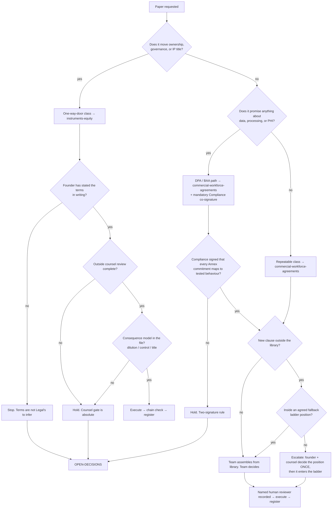

# Legal — Directive

How *this* department decides. Shape differs per unit by design.

Legal's decision graph splits on the same axis as its team structure: **can this be
unwound?** Everything else — counterparty type, dollar size, who asked — is secondary.
A $0 advisor agreement is a one-way door; a six-figure MSA is renegotiable at renewal.
Sorting by importance would put those in the wrong lanes.

There is a second, non-negotiable rule sitting above the whole graph: **Legal does not
decide terms, and Legal does not give advice.** It routes, prepares, gates and records.
The founder decides terms; outside counsel decides what the law says (`corporate.md:505-506`).

## Decision rights

| Level | Decides | Examples |
|---|---|---|
| **Team** | Assembly, sequencing, and anything already inside a decided fallback ladder position | Which reviewed clauses compose this NDA; turnaround order across three open requests; recording a redline that lands on an agreed position |
| **Department** | Which lane an instrument belongs in; whether a chain is complete; whether the counsel gate applies to a novel document type; the register's state machine | Is a "consulting agreement" a PSA or a contractor agreement? Does an advisor grant with no equity still need consent? |
| **Founder** | **Every term.** Valuation cap, discount, vesting, cliff, grant size, liability ceiling, IP ownership posture, walk-away positions | The SAFE's cap. The advisor's grant. The indemnity ceiling in the standard MSA |
| **Outside counsel** | What the law requires and whether the drafted text achieves the founder's stated intent | Anything in the one-way-door class, without exception |
| **Compliance & Privacy** | Whether an Annex commitment is satisfiable by the system as built | Every DPA and BAA ([[regulatory-posture-charter]], `corporate.md:99-103`) |
| **OPEN-DECISIONS** | Department shape, gate exemptions, and the trim question | CORP-F2; the one-team-or-two question; any proposal to relax the counsel gate |

## Standing rules

**R1 — The counsel gate is absolute for the one-way-door class.** Six documents
(`corporate.md:67-69`) are never executed without outside-counsel review, regardless of
how standard the form appears or how fast the counterparty wants it. Measured as
`legal.counsel_gate_compliance`; the target is 100% and there is no acceptable second
number. A "standard form" is precisely the object [[legal-premortem]] M2 describes.

**R2 — No same-day execution in the one-way-door class.** A named waiting period between
request and execution, enforced by the register rather than by willpower. The floor exists
for the day it is inconvenient — that is the only day it does anything.

**R3 — Terms arrive in writing or the request stops.** If a request into
[[instruments-equity-charter]] does not carry the founder's stated terms, Legal does not
infer them, does not "use the usual", and does not proceed. Inference is how a team ends
up deciding its own terms.

**R4 — Two signatures on DPA and BAA.** Legal signs that the instrument is sound;
[[regulatory-posture-charter]] signs that each Annex commitment maps to implemented,
tested behaviour, with [[privacy-engineering-charter]] naming the test. Signing an Annex
we cannot satisfy is a two-signature failure by construction (`corporate.md:99-103`), and
the erasure path is currently graded untested end-to-end (`corporate.md:31`) — so this
gate is live from day one, not aspirational.

**R5 — Library first, and concessions are recorded.** A new draft is assembled from
reviewed clauses. Writing fresh text is allowed; writing it *without logging why the
library failed* is not. That log is what makes `legal.clause_library_hit_rate` a
diagnostic rather than a scold.

**R6 — A named human reviewer, on every executed instrument.** No instrument is executed
whose reviewer field is empty or reads "AI". Model-assisted assembly is permitted in the
repeatable class only; the one-way-door class carries **no generative drafting skill at
all** ([[legal-premortem]] M5).

**R7 — Nothing in this vault is drafted legal text.** These documents charter a function.
If a file under `01-org/corporate/legal/` starts producing clause-shaped prose, it is
rewritten. This rule is enforced at the quarterly sweep in [[legal-schedule]].

## Escalation trigger

Escalate to `OPEN-DECISIONS.md` when **any** of these holds:

1. A request needs a term the founder has not stated, and waiting would miss a real
   deadline — the *tension* escalates, never the inference.
2. Any proposal to exempt an instrument from R1 or R2. The **first** such request
   escalates, not the tenth — the same reasoning [[engineering-directive]] applies to its
   `@Public()` hatch.
3. A counterparty redline lands outside every agreed fallback position.
4. A DPA/BAA Annex commitment that Compliance cannot sign, on a deal the company wants.
   This is a business decision about scope or about the roadmap; it is never a Legal call.
5. A novel document type not in the founder's fifteen (`corporate.md:54-57`) — the lane
   assignment is a department call, but *adding a sixteenth standing type* is not.
6. The merge condition in [[legal-loops]] L-LEG-5 fires.

**Advisory is findings-only** ([[ORG_STRUCTURE]] §3). [[red-team-charter]] and
[[decision-office-charter]] do not approve or block instruments; they produce written
findings against a named team, and Decision Office is what makes the resulting decision
close rather than drift.
