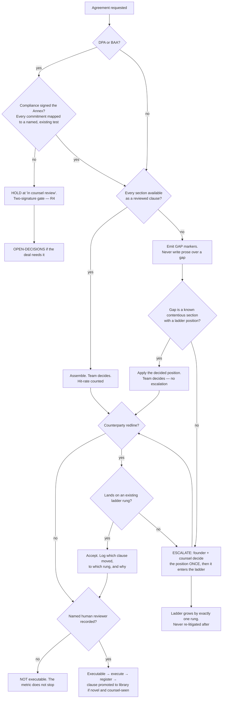

# Commercial & Workforce Agreements — Directive

How *this* team decides. Shape differs per unit by design.

Its sibling's graph is a set of refusals. This one is the opposite shape: a **routing
graph optimised for speed**, with exactly three places it is allowed to stop. Speed is the
mandate — the second NDA must be cheaper than the first — so every gate here has to earn
its cost, and only three do.

Inherits [[legal-directive]]. R5 (library first, concessions recorded), R4 (two signatures
on DPA/BAA) and R6 (named human reviewer) apply directly.

## Decision rights

| Level | Decides | Explicitly not |
|---|---|---|
| **Team** | Assembly; sequencing across open requests; accepting any redline that lands on a decided ladder rung; promoting a counsel-seen clause into the library | Setting a ladder rung. Signing an Annex. Executing without a reviewer |
| **Department** ([[legal-charter]]) | Lane assignment; whether a novel document type belongs here or next door; the register's state machine | Terms |
| **Founder + counsel, once per section** | Every ladder rung — preferred, acceptable, walk-away | — |
| **[[regulatory-posture-charter]]** | Whether an Annex commitment is satisfiable by the system as built | What the instrument says |
| **OPEN-DECISIONS** | A redline outside every rung on a deal the company wants; any relaxation of R4 or R6 | — |

## Standing rules

**CW-1 — Library first; fresh writing is logged, not forbidden.** Writing new text is
allowed and often necessary. Writing it *without recording why the library failed* is not.
That log is what makes `legal.clause_library_hit_rate` a diagnostic rather than a scold,
and it is where next quarter's library sections come from.

**CW-2 — The ladder is decided once and applied thereafter.** A rung set by the founder and
counsel is not re-argued per counterparty. Conceding within the ladder is routine and needs
no permission; conceding outside it escalates and then **grows the ladder by exactly one
rung**. Re-litigating a rung is the behaviour [[commercial-workforce-agreements-premortem]]
M1 is made of.

**CW-3 — "Executable" is defined against something the team does not control.** An
agreement is executable when **a named human has reviewed it and no `[GAP]` remains** —
never when it was sent. This definition is fixed *before* the first measurement, because a
metric definition settled after the first reading is settled favourably
([[commercial-workforce-agreements-premortem]] M2).

**CW-4 — `legal-doc-draft` is retrieval-shaped.** It assembles reviewed clauses and emits
explicit `[GAP]` markers where the library is empty. It is **not permitted to compose prose
over a gap.** A run emitting zero `[GAP]` markers is treated as a defect until proven
otherwise — a library covering every section of a novel counterparty's paper is far less
likely than a model filling holes ([[commercial-workforce-agreements-premortem]] M4).

**CW-5 — A named human reviewer on every executed agreement. "AI" is not a name.**
`legal.named_reviewer_coverage` targets 100%, permanently. On assisted drafts,
`nf_a.doneability_verdict` means *"a named human reviewed it"* and never *"the agent
completed"*.

**CW-6 — Two signatures on DPA and BAA, as a register gate.** Not a convention, not a
checklist item. The instrument cannot advance past `in counsel review` without
[[regulatory-posture-charter]]'s signature that each Annex commitment maps to implemented,
tested behaviour with [[privacy-engineering-charter]] naming the test.

**CW-7 — The library grows from executed paper.** A clause becomes "reviewed" once counsel
has seen it in a real agreement. Inventing library sections ahead of executions produces
text nobody will defend under pressure ([[commercial-workforce-agreements-premortem]] M5).
A section uncited for six months is reviewed for deletion — the same anti-sprawl rule the
org applies to skills and agendas.

**CW-8 — No clause language in this vault.** [[legal-directive]] R7 applies here most
sharply, because this is the team whose subject matter most invites it. These documents
charter a function; they contain no drafted text and are not legal advice.

## Escalation trigger

Escalate to `OPEN-DECISIONS.md` when **any** of these holds:

1. A redline lands outside every rung on the ladder, on a deal the company wants. The
   *tension* escalates — the team never invents a rung to avoid escalating.
2. An Annex commitment Compliance cannot sign, on a deal the company wants. This is a
   business decision about scope or roadmap, never a Legal call.
3. Any proposal to relax CW-5 or CW-6. The **first** request escalates, not the tenth.
4. A section written fresh for the **second** time — that is M1's earliest signal and it
   belongs in front of a decision-maker, not in a backlog.
5. Turnaround improves in a month where hit rate does not. That pair has no innocent
   explanation ([[commercial-workforce-agreements-premortem]] M4) and it escalates as a
   *metric* finding, before any incident exists.
6. The Workforce Paper split trigger fires — first W-2 hire, or first contractor in a
   second jurisdiction (`corporate.md:126`).
