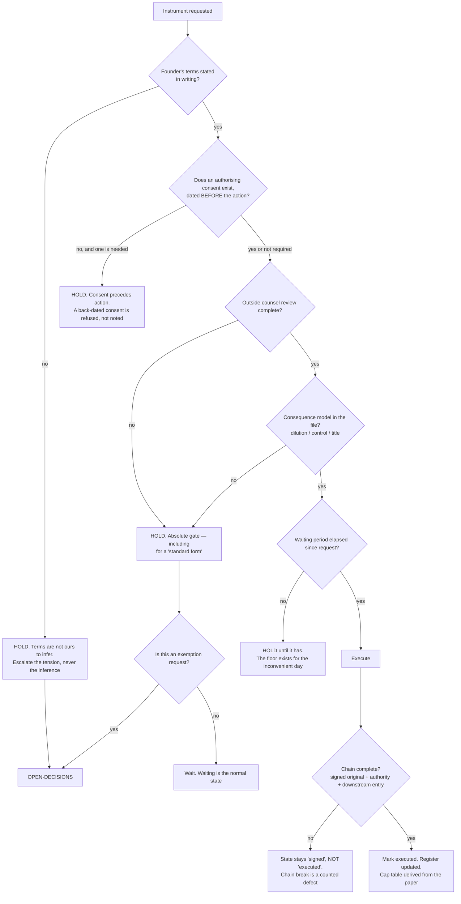

# Instruments & Equity — Directive

How *this* team decides. Shape differs per unit by design.

This team's decision graph is unusual in one respect: **it is mostly a set of refusals.**
It has no authority to decide a term, no authority to say what the law requires, and no
legitimate fast path. What it decides is whether an instrument may *advance a state* — and
almost every branch below ends in "hold" rather than "act". That is correct for a class of
document where the cost of acting wrongly is unbounded and the cost of waiting is a delay.

Inherits every standing rule in [[legal-directive]]. R1 (counsel gate), R2 (no same-day
execution) and R3 (terms in writing) apply to this team without exception — they were
written for it.

## Decision rights

| Level | Decides | Explicitly not |
|---|---|---|
| **Team** | Whether a state may advance; whether a chain is complete; whether a consent precedes its action; what a request needs before it can move | Any term. Any legal question. Any waiver of a gate |
| **Department** ([[legal-charter]]) | Lane assignment for a novel document type; whether the counsel gate applies to something not in the six | Terms |
| **Founder** | **Every term** — cap, discount, grant size, vesting, cliff, board composition, title scope | — |
| **Outside counsel** | What the law requires; whether the text achieves the founder's stated intent | — |
| **[[positioning-fundraise-readiness-charter]]** | Whether and when to raise; who the counterparty is; sequencing of requests | What the instrument says |
| **OPEN-DECISIONS** | Any gate exemption; any addition to the six; the merge condition firing | — |

## Standing rules

**IE-1 — No same-day execution. Ever.** A named waiting period between request and
execution. This team has no legitimate hour-scale work, so an hour-scale request is itself
a finding: it means the decision was taken elsewhere and Legal is being asked to ratify it
([[instruments-equity-premortem]] M1).

**IE-2 — A consequence model is part of the chain, not an attachment to it.** Dilution,
control, or title effect, in the file, before execution. `legal.instrument_chain_integrity`
counts its absence as a break. This is what makes "we should model this" a failed check
rather than a good intention.

**IE-3 — Consent precedes action; back-dating is refused, not noted.** The register does
not accept a consent dated after the action it authorises. `legal.consent_record_completeness`
is defined on the **ordering** property precisely so that a complete-but-retroactive record
cannot score 100% ([[instruments-equity-premortem]] M5).

**IE-4 — The cap table is derived from executed paper, never the reverse.** No cap-table
entry is created from a term sheet, an email, or a conversation. The chain check is a state
transition, so the paper always comes first by construction
([[instruments-equity-premortem]] M3).

**IE-5 — Engagement opens a request the same day.** Any advisor, any equity conversation,
any promise — the request opens immediately and may then sit in `requested` indefinitely.
The register is the only artifact that can tell the founder what has already been committed
verbally ([[instruments-equity-premortem]] M4).

**IE-6 — This team owns no generative drafting skill.** Its entire skill surface is
checkers ([[instruments-equity-schedule]]). Drafting in the one-way-door class is counsel's
work. This is structural, not cautionary: the class of document where a plausible draft does
the most damage is the class where no draft should be generated
([[legal-premortem]] M5).

**IE-7 — "Standard form" is not a category.** An instrument arriving as a familiar template
gets the same gate as one drafted from nothing. Familiarity is the specific feeling that
[[instruments-equity-premortem]] M1 describes as the failure.

## Escalation trigger

Escalate to `OPEN-DECISIONS.md` when **any** of these holds:

1. A term is needed that the founder has not stated, and waiting would miss a real
   deadline. The **tension** escalates; the inference never does.
2. Any request to waive IE-1, IE-3, or the counsel gate. The **first** such request
   escalates, not the tenth.
3. A counterparty requires a term outside anything previously accepted — which, for this
   team at v0, means **every** term, since nothing has been accepted yet. In practice this
   makes the first instrument of each type a founder decision by definition.
4. An instrument sits at `signed` but not `executed` for more than one close-time —
   a chain that will not complete is either a missing record or a missing decision, and
   both need naming.
5. A seventh standing instrument type is proposed. Lane assignment is a department call;
   growing the class is not.
6. Diligence, an investor, or counsel asks for a document the register cannot produce.
   That request is a finding about the register, and it goes on the record as one.
