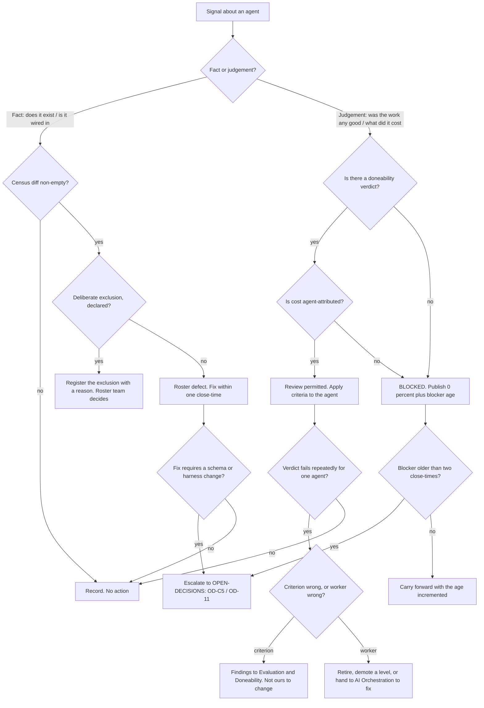

# People & Agent Ops — Directive

How *this* department decides. Shape differs per unit by design.

An HR function's decision graph is normally about people. Ours is about **workers that
are code**, and it splits on a question no other department asks: *is this a fact about
the roster, or a judgement about a worker?* Roster facts are checkable against the
filesystem and close in a day. Judgements about a worker require a verdict we cannot
currently compute. Treating the second like the first is how this department fails
(premortem M3, M4), so the graph refuses to let judgements route through the fast path.

## Decision rights

| Level | Decides | Examples |
|---|---|---|
| **Team** | Anything checkable against the repo inside one team's boundary | Registering an unregistered module; adding a `DEFAULT_AGENT_SPECS` entry; declaring an exclusion; publishing a census reading |
| **Department** | Anything that changes what the roster *means*, or that spans both teams | The maturity ladder's level definitions; the onboarding gate's contents; retiring an agent; whether a repeated failure is a criterion problem or a worker problem |
| **Research & Math** | The **definition** of a doneability criterion and how NF-A is computed | Not ours. We specify what we need graded and apply the result ([[evaluation-doneability-charter]]) |
| **AI Orchestration** | The **runtime** — harness, routing, retry, DLQ, gates | Not ours. We require an agent to use it; they build it ([[ai-orchestration-charter]]) |
| **Founder / OPEN-DECISIONS** | OD-C5; the number of ladder levels; the Human Ops split trigger; any correction to a headcount that appears in external material | Adding `agent` to `SpendLogger.log()`; blessing `recurring_order_agent` as a non-agent |

## Standing rules

**1. No attribution by inference.** Per-agent cost may only be reported from a field that
names an agent. It may not be estimated from model, time window, restaurant, or "which
agent is probably calling Haiku". Today
`services/agent-orchestrator/services/spend_logger.py:41-49` has no such field, so the
correct output is *not derivable* — in every artifact, without softening. This is
premortem M4's counter-pressure and it is a rule rather than a preference because the
temptation arrives precisely when someone senior asks for the number.

**2. Liveness is never reported as success.** `core/base_agent.py:602` records
`success=True` when `process_message()` did not raise. In this department's artifacts that
quantity is `nf_a.liveness_rate`. `nf_a.verified_task_success_rate` is a separate field
and is currently **empty**, and is reported as empty. The **first** unqualified use of
`success_rate` in a People & Agent Ops artifact is an escalation, not a style note
(premortem M3).

**3. Absent and correctly-absent must not look the same.** This is `IS_STUB`'s lesson
(`core/orchestrator.py:239-245`) generalized to the roster. A module that is deliberately
not an agent gets an explicit register entry recording *why*; a module that is
accidentally unregistered is a defect. Both produce a census row. The state that is
forbidden is silence — which is exactly what `core/agent_registry.py:337`'s
`DEFAULT_AGENT_SPECS.get(name, {})` produces today for four agents.

**4. A published zero beats an available proxy.** When a metric cannot be computed, the
department publishes the zero and the blocker age. It does not substitute the nearest
number that happens to exist.

**5. Roster work never runs unopposed.** Both teams' primary metrics appear on the same
board ([[people-agent-ops-agenda-board]]). If only one moves for three consecutive
close-times, the department reallocates — the mechanism, not the intention, is what
counters premortem M1.

**6. A failing agent is a decision about the criterion first.** Before an agent is
demoted or retired, the department asks whether the criterion is wrong. Only
[[evaluation-doneability-charter]] can change a criterion; we may only file the finding.
An HR function that can rewrite the exam to fail a worker is not one.

## Escalation trigger

Escalate to `OPEN-DECISIONS.md` when **any** of these holds:

1. A dependency on Research & Math is **older than two close-times** — automatically, on
   the clock, not when someone remembers. OD-C5 is already on this clock.
2. A roster defect cannot be fixed without a schema or harness change owned elsewhere.
3. A headcount that appears in external material (`PROJECT.md:33`, a deck, an investor
   note) disagrees with the census. The first one, not the tenth.
4. An agent is proposed for retirement. Retirement is irreversible in the way a merge is
   irreversible — the code can be restored, the reason cannot be reconstructed.
5. The department is asked for a per-agent cost figure that rule 1 forbids producing.
6. The maturity ladder needs a level defined by prose because no predicate exists — that
   is premortem M5 arriving, and it escalates rather than getting written.

**Advisory is findings-only** ([[ORG_STRUCTURE]] §3). [[red-team-charter]] is explicitly
invited to attack rules 1 and 2 as standing findings — they are the two the department
would most like to relax under pressure. [[decision-office-charter]] owns whether OD-C5
closes or drifts, and premortem M4 is entirely a story about a decision that drifted.
