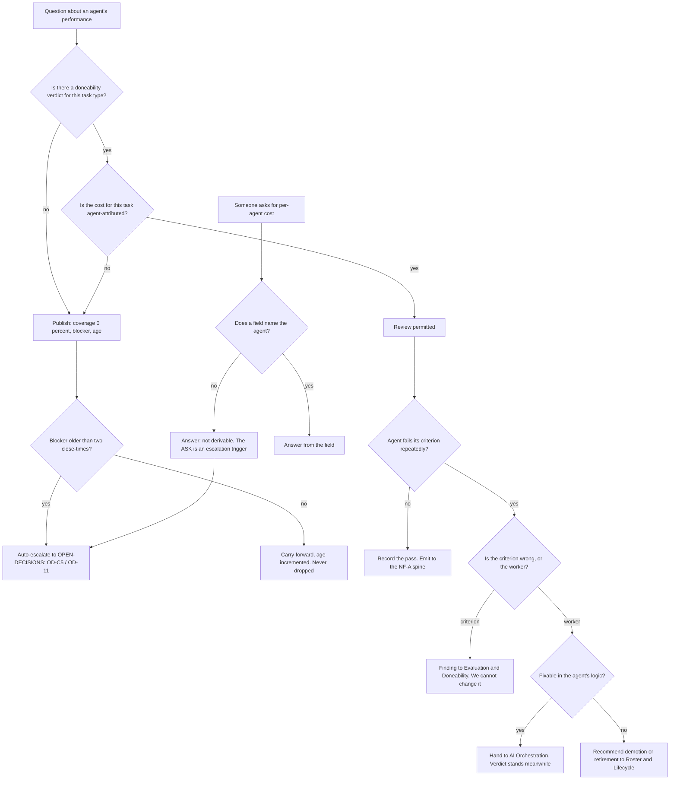

# Performance & Doneability — Directive

How *this* team decides.

The graph is unusual in one respect and it is the important one: **most branches end in
"publish that you cannot answer".** A team whose primary metric is 0% and whose blocker is
owned elsewhere has exactly one way to fail invisibly — by producing a number anyway. Every
gate below exists to make the honest non-answer the path of least resistance.

## Decision rights

| Level | Decides | Examples |
|---|---|---|
| **Team** | What needs grading, and how blocked-ness is reported | Criteria **specifications** for live task types; the weekly published zero; the blocker age |
| **Team** | The consequence of a verdict, once verdicts exist | Recording a pass; escalating a repeated failure; recommending demotion |
| **Department** | Whether a repeated failure is a criterion problem or a worker problem | The judgement call in the graph's `K` node |
| **[[evaluation-doneability-charter]]** | What a doneability verdict **means** and how it is computed | Golden sets, rubrics, adversarial negatives, statistical treatment. **Not ours** |
| **[[neural-footprint-instrumentation-charter]]** | The NF-A schema, the emission path, the join key | Whether `correlation_id` is the join. We ask for a field; we do not design the table |
| **[[ai-orchestration-charter]]** | Fixing an agent that fails | Code changes inside `process_message()` |
| **[[roster-lifecycle-charter]]** | Registration, levels, retirement | We recommend; they execute the roster change |
| **Founder / OPEN-DECISIONS** | OD-C5; where the verdict lives; whether health incorporates the verdict | The signature diff; the schema request |

## Standing rules

**1. No attribution by inference.** Per-agent cost may be reported **only** from a field
that names an agent. Never estimated from model, time window, restaurant, or call volume.
Today `services/agent-orchestrator/services/spend_logger.py:41-49` has no such field and
`api_spend` (`…baseline_from_production.sql:2231`) has no such column, so the correct
output is **"not derivable"**, stated without softening, in every artifact. **Being asked
for the number is itself an escalation trigger** — that is deliberate, so the pressure
lands on OD-C5 instead of on this team's integrity (premortem M4).

**2. Liveness is never reported as success.** `core/base_agent.py:602` sets
`success=True` when `process_message()` did not raise inside its timeout. In this team's
artifacts that quantity is **`nf_a.liveness_rate`**. `nf_a.verified_task_success_rate` is a
separate field and is currently **empty**, and is reported as empty. The **first**
unqualified use of `success_rate` in a People & Agent Ops artifact is an escalation, not a
style note (premortem M1).

**3. Blocked is published, never dropped.** A blocked metric appears **every close-time**
with its blocker and its age. The agenda line may not be deleted for tidiness, and it may
not be carried forward unchanged without the age incrementing. Two close-times without
movement escalates automatically ([[people-agent-ops-directive]] rule 1) — on the clock,
not by memory (premortem M2).

**4. Blocked never means idle.** Criteria specification, `log_decision()` call-site
counting, and the verdict's schema request are all unblocked. If a quarter passes with
"blocked" as the whole report, premortem M3 has already happened.

**5. The verdict's canonical home is the NF-A spine.** A verdict is a field on the event
([ADR 0006](../../../../decisions/0006-neural-footprint-architecture.md)), and the review
is a **read** of it — never the reverse. `nf_a.doneability_verdict_coverage` is defined
over *task completions on the spine*, not *tasks reviewed*, so a rubric with no emission
cannot move the metric (premortem M5).

**6. We never change the exam to save the worker.** When an agent fails repeatedly, the
first question is whether the criterion is wrong — and only
[[evaluation-doneability-charter]] can answer it. We may file the finding; we may not
edit the criterion. An HR function that can rewrite the exam is not one.

**7. We ask for fields, we do not design tables.** Every schema need goes to
[[neural-footprint-instrumentation-charter]] as a requirement with a reason. If both
departments define NF-A it will be defined twice (`corporate.md:509-512`), and the version
that wins will be the one whose owner is less busy.

**8. A review requires both halves.** A verdict without an attributed cost, or a cost
without a verdict, does not constitute a performance review. Reporting *"cannot review;
here is what is missing"* is a valid quarterly output and is preferred to a review built
on liveness.

## Escalation trigger

Escalate to `OPEN-DECISIONS.md` when **any** of these holds:

1. A dependency on Research & Math is **older than two close-times** — automatic, on the
   clock. OD-C5 and the join-key question are both on it from the day they are filed.
2. Anyone asks for a per-agent cost figure that rule 1 forbids producing.
3. `success_rate` appears unqualified in any department artifact. **First instance.**
4. A verdict is proposed to live somewhere other than the NF-A spine.
5. A criterion is proposed to change in response to an agent failing it.
6. A retirement or demotion is recommended — it lands with
   [[roster-lifecycle-charter]] and with the founder, because retirement is irreversible
   in its *reason* even when the code is recoverable.

**Advisory is findings-only** ([[ORG_STRUCTURE]] §3). [[red-team-charter]] is asked to
carry rules 1 and 2 as **standing** findings — they are the two this team would most
plausibly relax under pressure from someone senior, and both relaxations are locally
reasonable at the moment they happen, which is what makes them dangerous.
[[decision-office-charter]] owns whether OD-C5 closes or drifts; premortem M2 and M4 are
both, underneath, stories about a decision that drifted.
