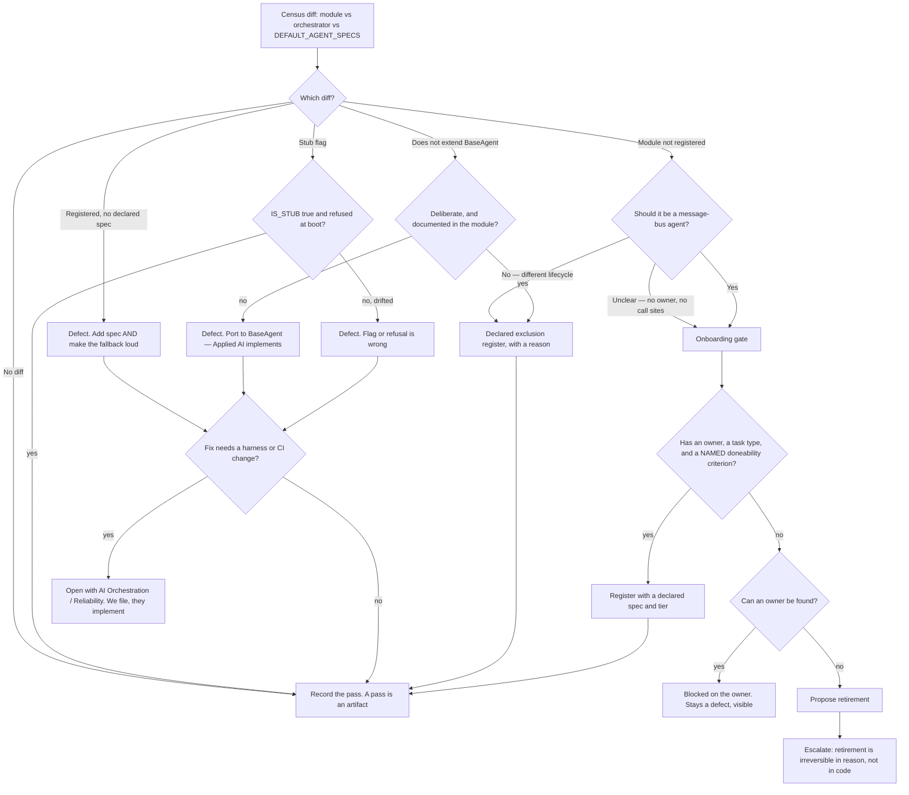

# Roster & Lifecycle — Directive

How *this* team decides.

The graph has one shape, and it comes from `IS_STUB`. `core/orchestrator.py:239-245`
refuses to start an enabled stub because an event-consuming no-op *"looks healthy from
every dashboard"*. Generalized: **the forbidden state is not "absent" — it is
"indistinguishable".** Every branch below sorts a module into a *declared* state. There is
no branch that leaves one silent.

## Decision rights

| Level | Decides | Examples |
|---|---|---|
| **Team** | Anything checkable against the repo that does not change the fleet's behaviour | Publishing a census; adding a `DEFAULT_AGENT_SPECS` entry; writing a declared exclusion; recording a pass |
| **Team, with the gate** | Registering a module — but only through the onboarding gate | `book_scraper_agent` is a gate case, never a reflex fix |
| **Department** | Ladder level definitions; the contents of the onboarding gate; proposing retirement | How many levels; whether a named criterion is required at the gate |
| **Applied AI** | Implementing a port, a harness change, or an agent's logic | Porting `recurring_order_agent` to `BaseAgent`, if that is the decision |
| **Founder / OPEN-DECISIONS** | Retirement; ladder depth; any headcount correction that reaches external material; the Human Ops trigger | Deleting `dataset_creator_agent`; correcting `PROJECT.md:33` |

## Standing rules

**1. Two valid resolutions, weighted equally.** A census diff closes as **registered** or
as **declared out of scope with a reason**. Never as "left as is". `recurring_order_agent`
is the founding exclusion: its docstring (`:17-21`) already argues the case, so a register
entry recording *why* is the likely correct fix — and the exclusion does **not** close the
separate fact that it has no health surface.

**2. Registration is not the default cure.** `roster.truth_pct` improves monotonically
under "register everything", which is exactly why the metric cannot be allowed to drive
the action (premortem M5). Registering a dark module subscribes it to real events, and
this team owns no verdict with which to notice the consequences. Gate first.

**3. Retirement is a first-class outcome, and it escalates.** Code can be restored from
git; the *reason* an agent existed cannot be reconstructed once nobody remembers it. Every
retirement carries a written reason and goes to `OPEN-DECISIONS.md`. A year of zero
retirements alongside falling defect counts is itself a finding.

**4. Publish the table, not the percentage.** `roster.truth_pct` is a summary of a 26-row,
4-predicate table and may not appear without it (premortem M1). Passes appear in the
table alongside defects — the five `IS_STUB` modules are the worked example of correct
behaviour and deleting them from the view would teach the wrong lesson.

**5. Fix the instance and the silence.** A defect caused by a silent fallback is not
closed by fixing the instances. `core/agent_registry.py:337` returns `{}` with no warning;
until that is loud, the four silent-default specs will simply recur under new names.

**6. We file defects; we do not implement agents.** A missing registration is ours. A
`BaseAgent` port, a harness change, or a bug inside `process_message()` belongs to
[[ai-orchestration-charter]] / [[harness-runtime-charter]]. This team is the auditor of
the record, and an auditor that also does the work audits itself.

**7. Ladder levels are predicates or they are not levels.** No adverbs. Write the check
before the descriptor; if the check cannot be written, the level does not exist yet
(premortem M4).

**8. Human HR stays dormant, deliberately.** No human process is written before the
second person on the payroll (`corporate.md:418`). A rubric with no subject is the
department's premortem M5, and preparing for a hire that has not happened is
indistinguishable from it.

## Escalation trigger

Escalate to `OPEN-DECISIONS.md` when **any** of these holds:

1. A retirement is proposed.
2. A census defect requires a change outside this team — a harness port, a registry
   fallback change, a CI workflow — and has not been picked up within one close-time.
3. A headcount in external material disagrees with the census. **The first instance**,
   including `.planning/PROJECT.md:33`.
4. A ladder level cannot be expressed as a check and someone wants to write it in prose
   anyway.
5. A module has no owner and no one will claim it — that is a retirement conversation
   whether or not anyone wants to have it.
6. The second human joins the payroll — the Human Ops trigger, which converts a dormant
   non-goal into this team's scope and opens a request into [[legal-charter]].

**Advisory is findings-only** ([[ORG_STRUCTURE]] §3). [[red-team-charter]] is asked to
attack rules 2 and 4 specifically — the register-everything incentive and the
percentage-without-table shortcut — because both are the kind of rule a team relaxes when
it is behind. [[decision-office-charter]] owns whether the escalations above close or
drift.
