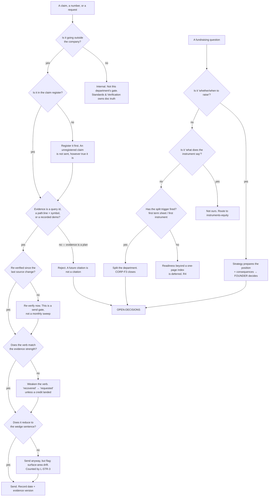

# Strategy & Fundraising — Directive

How *this* department decides. Shape differs per unit by design.

Strategy's decision graph splits on one question: **is this claim leaving the building?**
Not who asked, not how important, not how urgent. An internal number can be wrong and get
corrected next week; the same number in a partner's notebook cannot be recalled. Sorting by
importance would put a throwaway blog stat and a diligence answer in the same lane, and
they have opposite tolerances.

There is a second rule sitting above the whole graph, and it is the one that gives this
department its independence: **Strategy does not decide terms, and Strategy does not build
the paper.** The founder decides whether to raise and on what terms; [[legal-charter]] and
[[instruments-equity-charter]] draft the instruments; Strategy prepares, sequences, gates
and records (`corporate.md:421-422`, `:505-506`).

## Decision rights

| Level | Decides | Examples |
|---|---|---|
| **Team** ([[positioning-fundraise-readiness-directive]]) | Register mechanics, evidence sufficiency for a specific claim, verb choice, re-verification scheduling, the order of readiness work once triggered | Is this demo recording adequate evidence for the four-way-match claim? Is *"catches"* stronger than *"can catch"*? |
| **Department** | Which claims are in force at all; the wedge sentence; what counts as evidence *in general*; whether an outward artifact may ship; the raise **position** as a recommendation | Does *"573 insight types"* ship while the corpus disagrees with itself? Does Track A's ✅ ship with the label or with the scope? |
| **Founder** | **Whether and when to raise, and on what terms.** Also: the answer to OD-23 | The SAFE's cap. The revenue target. Whether to open a YC application this batch |
| **[[instruments-equity-charter]]** | What the instrument says, and its chain | Every equity document, without exception |
| **[[metric-contract-truth-assurance-charter]]** | What a metric **means** | `dollars_recovered` — its definition and its contract. Strategy consumes it and may only weaken it, never strengthen it |
| **[[design-partner-operations-charter]]** | The recovery **number itself** | Credits watched landing. Strategy publishes nothing stronger than S1 produces |
| **[[standards-verification-charter]]** | Whether an internal document is still true | The 375-vs-573 contradiction. Strategy owns not shipping either until it closes |
| **OPEN-DECISIONS** | Department shape, gate exemptions, and any target that drives another department's plan | OD-23; CORP-F3; any proposal to relax R1 |

## Standing rules

**R1 — A published claim uses the weakest verb its evidence supports.** This is the
department's one non-negotiable. The canonical instance is fixed by the company's own
document: `YC_WEDGE_PLAN.md:31-33` — *"dollars recovered"* means **we asked** until an X12
812 credit memo lands on a later invoice. **Investor materials repeating the stronger claim
would be false**, and false is the correct word: the definition is written down, in this
repo, by us. Measured as `strategy.claim_overstatement_count`; the target is **0** and there
is no acceptable second number.

The rule generalises. *"Instrumented"* is not *"designed"*. *"Secured"* is not *"one module
secured"*. *"Complete"* is not *"complete for the scope we chose"* — which is exactly how
`YC_WEDGE_PLAN.md:339`'s Track **A "Security" ✅** row reads correctly in its body and
overstates in its label.

**R2 — Citations are re-verified at the moment of sending, never on a schedule.** A
periodic sweep is what produced `YC_WEDGE_PLAN.md:404` — a claim marked *"all re-confirmed
2026-07-27"* that had inverted by the time it mattered. Every citation in outward material
carries **its own** re-verification date, not the document's. Where a `path:line` is
unavoidable, the **symbol** travels with it, so drift degrades into a search rather than
into a falsehood. Prefer a demo that runs to a line that moves.

**R3 — Evidence is a query id, a `path:line` + symbol, or a recorded demo. Never a plan.**
A claim whose evidence is *"this will be queryable after B5"* is rejected, not deferred.
The grammatical tell is the future tense, and it is the earliest visible form of
[[strategy-fundraising-premortem]] M1.

**R4 — No diligence artifact is built before the split trigger fires**, beyond a one-page
index naming where each artifact would live and who owns it. Readiness work is **triggered**
(first term sheet, or first instrument issued — `corporate.md:457-458`); claim work is
**continuous**. Inverting that ordering is how a one-team department grows the second team
it declined to charter ([[strategy-fundraising-premortem]] M3).

**R5 — One sentence, and everything reduces to it.** The wedge sentence
(`YC_WEDGE_PLAN.md:312`) is a department-owned constant. Every outward artifact reduces to
it in its first paragraph; the rest of the company becomes *"and it also does X"*
(`:324`). Strategy owns what the sentence says; [[narrative-collateral-charter]] M2 owns
that every artifact leads with it. An artifact that describes the company by its
departments rather than by its sentence is flagged, counted, and — per the graph above —
still sent, because blocking on this would make R5 a bottleneck instead of a signal.

**R6 — Spoken claims are claims.** A pitch is a publication with no artifact. After any
external conversation where a number was given, the number is entered in the register with
its evidence. A department that audits only documents audits the least dangerous surface.

**R7 — The rule points upward.** If the founder's own claim outruns the evidence, this
department says so, in writing, before the next send. This is the single hardest rule here
to actually run, and it is written down now, while nobody is invested in defending a
specific claim. [[strategy-fundraising-agenda-full]] Q4 asks the founder to confirm it
explicitly rather than leaving it as an assumption.

**R8 — Nothing in this vault drafts an instrument or lays out a deck.** These documents
charter a function. Clause language belongs to [[legal-charter]] (R7 there says the same
thing from the other side); artifact craft belongs to [[narrative-collateral-charter]].

## Escalation trigger

Escalate to `OPEN-DECISIONS.md` when **any** of these holds:

1. **A claim the company wants to make cannot be evidenced**, and weakening the verb makes
   it commercially useless. That is a *product or roadmap* decision — build the evidence —
   never a Strategy call to publish anyway.
2. **Any proposal to exempt a claim from R1 or R2.** The **first** such request escalates,
   not the tenth.
3. **A target that drives another department's plan is unresolved for two consecutive
   months.** OD-23 is the live instance ([[OPEN-DECISIONS]]:27). Silence is not resolution.
4. **The split trigger fires** — a live term-sheet conversation or an issued instrument.
   CORP-F3 closes at that moment, one way or the other.
5. **The split trigger has not fired in twelve months.** The mirror case, and it is a
   finding too: a deferred team that was never needed is different from a deferred team
   that is waiting, and the org should know which it had.
6. **A metric definition changes** such that a previously published claim is now stronger
   or weaker than what was said. Every affected artifact is listed, and the list goes to
   the founder before it goes anywhere else.

**Advisory is findings-only** ([[ORG_STRUCTURE]] §3). [[red-team-charter]] and
[[decision-office-charter]] do not approve or block outward material; they produce written
findings against a named unit. Red Team is the natural external auditor for this
department specifically — a unit that grades its own claims is the structure
[[ORG_STRUCTURE]] §3 was built to distrust, and it is worth stating that the distrust
applies here too.
