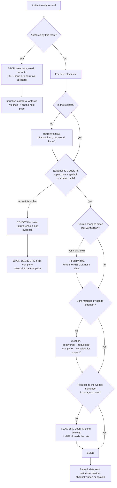

# Positioning & Fundraise Readiness — Directive

How *this* team decides. Shape differs per unit by design.

[[strategy-fundraising-directive]] decides **which lane** a question is in — outward claim,
raise decision, or instrument request. This directive is narrower and more mechanical: given
that a claim is going out, **what happens to it before it leaves.** It is written to be
runnable in five minutes by someone under deadline pressure, because that is the only
condition under which it will ever actually be run.

The graph has one property worth naming: **it never blocks on taste.** Only three things
stop a send — an unregistered claim, evidence that is a plan, and a verb stronger than the
evidence. Everything else flags and passes. A gate that blocks on judgment gets routed
around by the second deadline.

## Decision rights

| Decides | Who | Notes |
|---|---|---|
| Whether a given piece of evidence is **sufficient** for a given claim | **This team** | The judgment call the register exists to make. Recorded, so it can be argued with later |
| Which verb the evidence supports | **This team** | Only ever downward. We may weaken a claim; we may never strengthen one |
| Whether a claim enters the register at all | **This team** | Including the decision to enter it as `BLOCKED` |
| What a metric **means** | [[metric-contract-truth-assurance-charter]] | We consume the contract. We do not negotiate it |
| The **number** behind a recovery claim | [[design-partner-operations-charter]] | Credits watched landing. We publish nothing stronger |
| Whether a source document is still internally true | [[standards-verification-charter]] | The 375-vs-573 contradiction is theirs to close; ours to not ship |
| The wedge sentence itself | [[strategy-fundraising-charter]] (department) | We apply it; changing it is a department decision |
| Who **writes** the artifact | [[narrative-collateral-charter]] | Never us — R5 |
| Whether to raise, and on what terms | **The founder** | We prepare and sequence |
| What an instrument says | [[instruments-equity-charter]] | We request; they draft |

## Standing rules

**R1 — The register is touched only as part of sending.** There is no separate upkeep task,
and its absence is deliberate. A maintenance cadence lets the register be current while the
practice is dead, which is the worst combination and the exact shape of
[[positioning-fundraise-readiness-premortem]] P1. Corollary: **a quiet quarter with an
untouched register is correct**, and the staleness sweep reads it as a true signal.

**R2 — Verification writes a result, not a date.** Every verification event records one of
`holds` · `drifted to :N` · `inverted` · `gone`. A bare timestamp is not a verification —
it is a memory of one. `YC_WEDGE_PLAN.md:404`'s *"all re-confirmed 2026-07-27"* is the
completed instance of this failure sitting in our own founding artifact: sincere when
written, false when read, and indistinguishable from a real check by its format alone.

**R3 — Citations carry their symbol.** `ReceivingWorkspace.tsx:401` alone becomes a
falsehood the moment twenty lines are added above it. `ReceivingWorkspace.tsx → invoiceQty
input, :401` degrades into a search. The founding artifact's `:401` citation drifted exactly
this way — **finding held, coordinates did not** — and a symbol would have made the drift
harmless. Where possible, prefer a **recorded demo**: it is the only evidence type that
cannot silently drift.

**R4 — Nothing readiness-side is built before the split trigger**, beyond a one-page index
of where each diligence artifact would live and who owns it. The trigger is the first live
term-sheet conversation or the first instrument issued (`corporate.md:457-458`). Claim work
is continuous; readiness work is triggered. Inverting that is
[[positioning-fundraise-readiness-premortem]] P4, and it is how a team that was deliberately
not split grows the half it declined.

**R5 — This team never authors an outward artifact.** We supply the sentence, the claims and
the evidence; [[narrative-collateral-charter]] writes. **When they cannot meet a deadline,
the artifact slips — the check does not dissolve.** That trade is written down now, while no
deadline exists, precisely because it will not feel obvious on the day. The same structural
argument keeps generative drafting out of [[instruments-equity-charter]]: the class of
document where a plausible draft does the most damage is the class where the checker must
not also be the author.

**R6 — Spoken claims are claims.** After any external conversation where a number was given,
it is entered in the register within 24 hours with its evidence, tagged `channel: spoken`.
A pitch is a publication with no artifact. Retroactive entry is a weaker control than a gate
and it is the only one this channel admits — which is why **zero spoken rows after a month
with external conversations is a signal, not restraint**
([[positioning-fundraise-readiness-premortem]] P5).

**R7 — Weaken, do not block, wherever weakening is possible.** A claim that cannot be
evidenced at full strength is usually true at lower strength. *"$X in billing discrepancies
identified"* is publishable when *"$X recovered"* is not. Rejection is reserved for claims
that are false at every strength, or blocked by an unresolved contradiction. A gate that
mostly rejects gets routed around; a gate that mostly rewrites gets used.

**R8 — The rule points upward.** If a claim originating with the founder outruns the
evidence, this team says so in writing before the next send
([[strategy-fundraising-directive]] R7). Nothing about this rule is easier to apply
downward, and applying it only downward is P5.

## Escalation trigger

Escalate to the department, and from there to `OPEN-DECISIONS.md`, when:

1. **A claim the company wants cannot be evidenced at any strength**, and weakening makes it
   commercially useless. That is a roadmap decision — build the evidence — never a decision
   to publish anyway.
2. **A source contradicts itself and both readings are in use.** Live instance: 375 vs 573
   insight types (`corporate.md:206-213`). Owner is [[standards-verification-charter]];
   escalation is about the *blocked claim*, not the resolution.
3. **A metric definition changes** such that already-published material is now stronger than
   its evidence. Every affected artifact is listed, and the list goes to the founder before
   it goes anywhere else.
4. **Any request to send without the checklist**, including from the founder. The **first**
   such request escalates, not the tenth.
5. **The split trigger fires** — a term-sheet conversation or an issued instrument. R4's
   deferral ends and OD-C3 closes.
6. **Two consecutive quarters** in which `strategy.diligence_pack_completeness` rose while
   `strategy.claim_to_evidence_coverage` did not — P4, readable as a chart.

**Advisory is findings-only** ([[ORG_STRUCTURE]] §3). [[red-team-charter]] is the natural
external reader for this team in particular: a unit whose independence rests on its own
willingness to be awkward with the person it reports to needs an auditor who does not report
there. [[decision-office-charter]] owns making the resulting decisions close rather than
drift.
