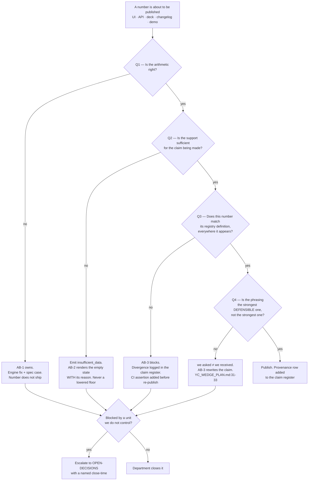

# Analytics & BI — Directive

How *this* department decides. The shape is a **publication gate**, not a backlog
triage, because the department's failure mode is not "we built the wrong thing" — it is
"we said something that was not true."

## The governing question

Every decision here reduces to: **is this number allowed to leave the building?**
Four different tests answer it, and they are applied in order. A number that fails any
test does not get downgraded to a caveat; it gets an `insufficient_data` state or it
does not ship.

## Decision rights

| Decision | Who decides | Who cannot override it |
|---|---|---|
| Whether a computed quantity is arithmetically correct | [[analytics-engine-charter]] | Nobody in this department — it is a test, not an opinion |
| Whether evidence is sufficient to say anything at all | [[insight-narrative-generation-charter]], **against thresholds AB-3 registers** | AB-2 may not lower a support floor unilaterally ([[analytics-bi-premortem]] M3) |
| Whether a shipped number matches its definition | [[metric-contract-truth-assurance-charter]] | **Both siblings.** AB-3's whole purpose is to be able to tell an author their number is wrong (`intelligence.md:443-444`) |
| The wording of any externally published analytics claim | AB-3 holds veto; the founder holds the pen | Marketing, Growth, and the demo calendar |
| Adding a new candidate type to `insight-catalog.ts` | AB-1 proposes; the **satisfiability gate** below decides | — |
| Enabling the consultant layer for a restaurant | AB-2, with a named human and an expiry | A demo is not a reason ([[analytics-bi-premortem]] M4) |

## Standing rules

These are the rules that make the graph above executable rather than decorative.

1. **The satisfiability gate.** No candidate type enters `INSIGHT_CANDIDATES` whose
   `DataRequirement` set is unsatisfied for **every** live restaurant. The mechanism
   already exists (`insight-catalog.ts:557-563`); it is not currently a gate. Blocked
   requirements are an escalation to [[data-charter]], not a reason to add math.

2. **Catalogue size never travels alone.** Wherever `INSIGHT_CANDIDATES.length` is
   published — UI, OpenAPI, deck — `analytics.satisfiable_candidate_share` is published
   beside it. Today that pairing would read **573 types · 25.1% satisfiable without a POS
   feed**. Both numbers or neither.

3. **One count, one source, one assertion.** Any number the product states about itself
   must be derived at runtime from the code that produces it, or asserted by a CI test
   that pins it exactly. `insight-catalog.spec.ts:9-10` asserts only `>= 200`, which is
   why five documents and three source files could drift to 375 / 348 / 573 without
   failing a build.

4. **A lowered threshold requires a changed test.** Every support floor in
   `insight-generator.service.ts` (`:200`, `:550`, `:867`, `:1017`, `:1107`) becomes a
   named exported constant with a spec case. Changing one is then a reviewed change, not
   a one-character diff at line 1017.

5. **`insufficient_data` is a shipped state, not an error.** An empty feed that explains
   why it is empty is the honest form of "we have the right metrics." Precedent is
   already in the corpus (`AGENT_NATIVE_UI_DECISION.md:191-192`, `:332-337`) and already
   in code (`insight-verbalizer.ts` returns `null`; `insight-catalog.spec.ts:94-101`).

6. **Claims degrade to the weaker verb.** Where a measurement supports two readings, the
   published one is the weaker. `"dollars recovered"` means *we asked* until a credit memo
   is modelled (`YC_WEDGE_PLAN.md:31-33`). This rule is the register's first entry.

7. **We do not fix other people's routes; we refuse to stand on them.** OD-20 recorded the
   analytics routes as unguarded, including the consultant toggle and the consult call;
   [[security-charter]] and [[platform-api-charter]] owned the fix, and this department
   owned (a) escalating it every close-time and (b) not demonstrating the consultant layer
   while it stood. *Corrected 2026-09-01: the OD-20 instance is discharged — PR #31
   (2026-08-24) put a class-level `@UseGuards(JwtAuthGuard)` on `AnalyticsController`
   (`analytics.controller.ts:51`) covering every route handler on the file, and OD-20 is
   marked resolved. Neither (a) nor (b) has a subject any more.* **The rule itself stands**
   for the next surface this department is asked to demo behind.

## Escalation trigger

An item leaves this department and enters `OPEN-DECISIONS.md` when **any** of these hold:

- The blocker is another unit's phase. Standing case:
  `analytics.kpi_ground_truth_agreement` cannot be read until §44.7 SimPOS ships
  (`v3.0-TECH-DEBT.md:309`, `:322-325`). Escalated with a close-time, never with a hope.
- Two teams in this department disagree about whether a number is publishable. AB-3
  breaks ties on *definition*; it does not break ties on *priority* — that is the founder's.
- A published claim is found to be false. That is not a bug ticket; it is a decision
  record, because the question "how did it get published" is more important than the fix.
- The `subject_type` gap (**INTEL-F3**) blocks `analytics.insight_acceptance_rate` from having a
  home in the neural footprint. Interacts with OD-11; cannot be resolved inside this
  department.

**Findings-only from advisory** ([[ORG_STRUCTURE]] §3): [[red-team-charter]] can attack
any rule above, and its finding lands in `questions.md` and `OPEN-DECISIONS.md`. It does
not hold a veto over publication. AB-3 does — that asymmetry is deliberate and is the
reason AB-3 sits in the line rather than in advisory.
