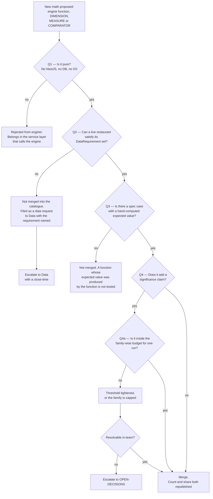

# Analytics Engine — Directive

How *this* team decides. The shape is an **admission test for new math**, because this
team's failure mode is not building the wrong thing — it is building *more* of the right
thing than the data can carry ([[analytics-engine-premortem]] M1).

## Decision rights

| Decision | Held by | Notes |
|---|---|---|
| Whether a computation is arithmetically correct | This team, **by test** | Not by argument. A disagreement about a number is resolved by writing the case, not by seniority |
| Whether a function belongs in `engine/` or in the service layer | This team | The purity line is ours to hold ([[analytics-engine-premortem]] M5) |
| Whether a new candidate family enters `INSIGHT_CANDIDATES` | This team, **gated by Q2** | The gate is data availability, not appetite |
| The significance threshold and any multiple-comparison correction | This team | It is arithmetic. The *presentation* consequence is [[insight-narrative-generation-charter]]'s |
| Whether a shipped number matches its published definition | **Not ours** — [[metric-contract-truth-assurance-charter]] | We are an author; we do not audit ourselves |
| Whether an insight is worth surfacing at all | **Not ours** — [[insight-narrative-generation-charter]] | Correct ≠ worth reading |

## Standing rules

1. **Purity is non-negotiable.** No import in `apps/api-gateway/src/analytics/engine/`
   other than from `./`-relative siblings. Enforced by a CI grep **and** by an
   outcome-side twin: a scheduled bare-`ts-node` script that computes
   `INSIGHT_CANDIDATES.length` outside any Nest context. If the script breaks, purity is
   gone whatever the grep says ([[engineering-premortem]] M4 on grep-shaped guards).

2. **Expected values are computed by hand, not by the code under test.** A spec whose
   expected value came from running the function asserts only that the function is
   deterministic. `association-comparisons.spec.ts:66-72` is the correct pattern — the
   "12% below average Tuesdays" case has an arithmetic answer independent of the
   implementation.

3. **Every `DataRequirement` union member must be claimed by at least one candidate.**
   Red today: `goals` is declared at `insight-catalog.ts:38` and claimed by **zero**
   candidates, so 22 goal-pace types report as satisfiable for restaurants with no goals
   ([[analytics-engine-premortem]] M4).

4. **A significance claim requires a tested significance path.** Today `pValue` and `chi2`
   appear in zero assertions across 11 spec files, while `pValue < 0.1`
   (`insight-generator.service.ts:872`) is the only such gate in the product. No new
   statistical gate merges without its test, and the existing one is backfilled first.

5. **Threshold constants are named and exported.** The five live literals —
   `insight-generator.service.ts:200` (`n / 14`), `:550`, `:867`, `:1017`, `:1107` —
   become named constants with spec cases, so changing one is a reviewed decision rather
   than a character edit. Shared rule with
   [[insight-narrative-generation-directive]]; this team owns the constant, that team owns
   the consequence.

6. **Reach is reported with the count, always.** Any statement of catalogue size carries
   `analytics.satisfiable_candidate_share` in the same sentence.

## Escalation trigger

- **A candidate family fails Q2** → data request to [[data-charter]] with the requirement
  named and a close-time. Standing case: `checks` gates 429 of 573 types (74.9%) and
  `tables` gates 241 (42.1%). Those two requirements *are* the department's roadmap
  dependency, and they are not ours to satisfy.
- **A correction changes a previously published number** → this is not a bug fix, it is a
  claim retraction. Hand to [[metric-contract-truth-assurance-charter]], which owns the
  register and decides how the change is communicated.
- **A significance discipline decision cannot be settled by test** (e.g. whether to adopt
  Benjamini–Hochberg across a run, or cap findings) → `OPEN-DECISIONS.md`. It changes what
  the product says, so it is not a private engineering choice.
- **The purity rule is contested** → escalate rather than concede. Losing purity ends the
  countability property that [[metric-contract-truth-assurance-charter]] depends on, so
  the cost is paid by a different team than the one asking for the exception.
